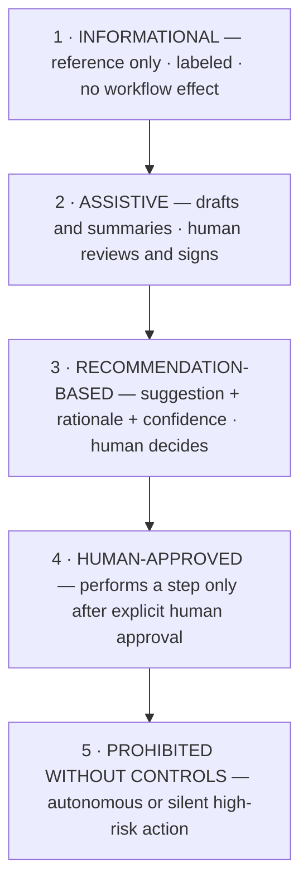

# AI_RULES.md — Swasthya AI Governance Rules

> **Status:** Working baseline · **Owner:** Principal Architect (AI governance ratified with the team and clinical authority)
> **Version:** 1.0
> **Document chain:** This document is the strict governance layer for AI in Swasthya, deepening `MASTER_RULES.md` §33 (AI safety), `CLINICAL_SAFETY.md` §10 (AI) and §9 (CDSS), `PRODUCT_REQUIREMENTS.md` §6.23 (AI), `ARCHITECTURE.md` §28.5 (the inference-service boundary), and `OBSERVABILITY.md` §17 (never-log rules). It specifies **rules** — no AI is implemented here.
>
> **Honesty clause:** Nothing in this document claims that any AI capability exists, is effective, or is clinically validated. The rules govern what *may* be built; any specific capability ships only when it satisfies the rules here, is evaluated with evidence, and is registered (Section 20).

---

## 0. The Foundational Rule

**AI in Swasthya assists clinicians and never silently performs high-risk clinical actions.** Concretely:

- There is **no autonomous-action path** — no code path by which an AI output can order, prescribe, administer, discharge, escalate, or mutate a clinical record without a human decision at the moment of action (`CLINICAL_SAFETY.md` §10).
- **Every AI function is classified** into the five-tier taxonomy (Section 1) at design time — before code — and its tier governs its permitted behavior, UI treatment, and audit.
- **AI never decides; AI proposes.** The clinician decides, signs, and is the accountable party. The product's shape is: propose (labeled, confidence shown) → human reviews → human decides → sign → immutable audit (`CLINICAL_SAFETY.md` §9).
- **Unclassified AI does not ship.** An AI feature without a registered tier, an owner, an evaluation, and a kill-switch is not an AI feature.

---

## 1. The Five-Tier Classification

Every AI function is classified at design time into exactly one tier. Moving a function *up* a tier (more autonomy) requires review and evidence; the tiers are a ceiling, not a ladder to climb casually.



### 1.1 Informational (Tier 1)

- **Allowed:** present reference information clearly labeled as AI-generated and non-authoritative (e.g., a generated explanation of a term, a literature-style summary with sources).
- **Controls:** labeled; no buttons that apply its content to a record; no workflow effect.
- **Audit:** the output and its label are recorded; no clinical record impact.
- **Guardrail:** if an informational output touches a clinical topic, it carries "not a substitute for clinical judgment" treatment — the label is never optional.

### 1.2 Assistive (Tier 2)

- **Allowed:** reduce work with human-verified outputs — documentation drafts, transcription, summarization, structured pre-fill of *known record data*.
- **Controls:** every output is visibly a draft/summary, tied to its source in the record, and **signed by a clinician before it can enter the record**; nothing auto-submits.
- **Audit:** model version, input context, output, review status, reviewer, outcome.
- **Guardrail:** assistive outputs never change the meaning of record data; they reformat, draft, and summarize — they do not invent facts (Section 15).

### 1.3 Recommendation-Based (Tier 3)

- **Allowed:** suggest options with rationale and confidence — candidate diagnoses, suggested next actions, possible interactions to check, treatment-pattern suggestions.
- **Controls:** presented as **recommendations, never directives**; rationale + confidence shown; alternatives shown where they exist; **never auto-applied**; the human decision is the only path forward.
- **Audit:** full recommendation context (input, model, rationale, confidence, whether accepted/rejected, and why if reason captured).
- **Guardrail:** a recommendation whose confidence is below the function's threshold is either refused or labeled low-confidence — never silently presented as reliable (Section 16).

### 1.4 Human-Approved (Tier 4)

- **Allowed:** perform a *step* after explicit human approval — e.g., pre-fill a structured order from a validated template that the clinician then reviews and signs; populate a field set that the clinician confirms.
- **Controls:** the human approval is a distinct, recorded act at the moment of the step; approval is never pre-granted, never remembered as "always accept"; the human sees exactly what will happen before approving.
- **Audit:** the approval act and the executed step are both recorded with the reviewer identity.
- **Guardrail:** Tier 4 does not relax any clinical-safety rule — a pre-filled order still passes all allergy/interaction/dose checks and clinician sign-off (`CLINICAL_SAFETY.md` §3, §16).

### 1.5 Prohibited Without Appropriate Controls (Tier 5)

**Prohibited unless a documented, reviewed, evidence-backed control regime exists (a formal exception via the ADR process, clinically and legally reviewed):**

- Autonomous prescribing, ordering, dosing, administration, or discharge.
- Silent escalation of clinical findings without a human decision.
- Direct-to-patient AI *advice* that acts on the patient's care without a clinician in the loop (patient-facing AI is informational/assistive at most, per policy).
- AI that mutates the clinical record without a human signing it.
- Any AI action that could not be explained or audited (Sections 10–11).
- Any AI that accesses more data than the acting user is authorized to see (privilege rule, Section 13).

**The default is prohibition.** The absence of a documented control regime is a "no"; nothing is autonomous by omission.

---

## 2. AI-Assisted Documentation

- **Drafts are labeled and signed:** an AI-drafted note is visibly a draft, cites its source sections in the record, and reaches the record only when a clinician reviews and signs it (`CLINICAL_SAFETY.md` §1).
- **Structure from known data:** drafts are grounded in the patient's actual record (Identity Spine, vitals, orders) rather than generated from memory — grounding is the primary hallucination defense (Section 15).
- **No auto-completion of clinical facts:** the AI fills nothing that it cannot trace to a record source; a statement without provenance is omitted, not guessed.
- **Sign-off is never automated** and amendments follow the standard discipline (new versions, originals preserved — `CLINICAL_SAFETY.md` §14).

---

## 3. Summarization

- **Labeled, sourced, bounded:** summaries state what they cover, link to the source records, and state their limits ("summary of notes from 2026-07-01 to 2026-07-31; may omit detail — review the record for decisions").
- **Never the record:** a summary is context for a clinician, never a substitute for the full record, never the sole basis for a high-risk decision.
- **Critical facts are called out, not buried:** if a summary surfaces a potentially critical finding, it escalates to the human (Section 18) — it never acts and never hides.
- **Audit:** every summary records its model version, source range, output, and who used it for what.

---

## 4. Analytics

- **Descriptive analytics reflect observed data only** — the AI may *analyze*, never fabricate (`MASTER_RULES.md` P.15); every number drills down to the real data that produced it.
- **AI-generated insights are labeled as AI-generated**, carry their confidence, and are reviewed before they influence operational decisions.
- **Forecasts are labeled as estimates** (Tier 1/3 by use) with their horizon and assumptions shown; a forecast is never presented as a fact (`PRODUCT_REQUIREMENTS.md` §6.23).

---

## 5. Prediction

- **Predictions are probabilistic estimates, never verdicts:** every prediction shows its confidence, its base rate where available, and its uncertainty — a number without its uncertainty is a defect.
- **No autonomous use:** predictions (readmission risk, demand forecasts, deterioration signals) inform humans; they never trigger clinical actions automatically (Tier 5 default).
- **Prospective evaluation before deployment:** a prediction feature ships only with an evaluation plan (calibration, accuracy, bias review) and a review cadence (`MASTER_RULES.md` §33.3).

---

## 6. Clinical Decision Support (AI-Driven)

- **AI-driven CDSS is Tier 3 at most:** AI may *propose* candidate alerts, interactions to check, or pathway suggestions — the decision and the action remain human (`CLINICAL_SAFETY.md` §9).
- **Knowledge-based checks are not model guesses:** drug–drug/allergy/dose checks are driven by the versioned, clinically reviewed knowledge base, not by free-text model reasoning; AI may assist in *surfacing* candidates, but the check result is evidence-based and governed (`CLINICAL_SAFETY.md` §6).
- **Fail-open with loud degradation:** if the AI/CDSS layer is unavailable, care is never blocked; the degradation is visible and logged (`CLINICAL_SAFETY.md` §6, §9; Section 17).

---

## 7. Drug Safety

- **AI's role in drug safety is surveillance and surfacing, not deciding:** it may flag candidates (possible interactions, duplications, range questions) — every flag is checked against the evidence-based knowledge base before it becomes an alert.
- **No AI-generated dosing or medication decisions** without an evidence-based, clinically reviewed rule behind them; a dosing *suggestion* is Tier 3 with rationale and confidence, signed by the prescriber (`CLINICAL_SAFETY.md` §3).
- **Every drug-safety alert follows the alert rules:** tiered severity, recorded context (rule version, triggering facts), override with reason — `CLINICAL_SAFETY.md` §5–6, §12–13.

---

## 8. Recommendations

- **A recommendation is a suggestion with a spine:** what is recommended, why (rationale), how confident (confidence), and what the alternatives are. Any of the four missing → the recommendation is not shown as a recommendation.
- **Presented as options, never directives** — language and UI both enforce this (a recommendation that reads like an order is a defect).
- **Recommendations never auto-apply** and never change workflow state without the human act (Tier 3/4 discipline).

---

## 9. Human Review

- **Mandatory review:** every Tier 2–4 output is reviewed by the authorized human before it can have any record or workflow effect. Review is the default state of the workflow, not a step that can be skipped.
- **No bypass paths:** there is no "accept all drafts" button, no bulk-sign, no hidden auto-submit; a reviewer identity is recorded with every review (`MASTER_RULES.md` §33.2).
- **Review is real, not nominal:** the UI shows what the AI did and its sources; the reviewer's signature is on the outcome, not on a black box.
- **Review delegation** follows the clinical-safety rules (only the authorized clinician signs clinical content — `CLINICAL_SAFETY.md` §14).

---

## 10. Explainability

- **Every AI output is explainable at a useful level:** what input it used, which model (version), what reasoning or rationale, and what confidence. An output that cannot be explained cannot ship (Tier 5 default).
- **Record-level grounding:** high-stakes outputs (Tier 3–4) must point to the record data they relied on — an unexplained suggestion affecting care is a defect.
- **Post-hoc explanations where the model is not natively explainable:** if the model cannot explain itself, the wrapper must (input summary, nearest-evidence, confidence calibration) — opacity is not an acceptable design choice for clinical content.

---

## 11. Auditability

Every AI action is audited with a record like:

```json
{
  "actor_id": "u-…", "tenant_id": "t-…", "facility_id": "f-…",
  "function": "documentation_draft", "tier": 2,
  "model_id": "note-draft-v3", "model_version": "2026-07-15",
  "input_context": { "patient_id": "p-…", "source_notes": ["n-…"] },
  "output_ref": "draft-…",
  "confidence": null,
  "review": { "status": "signed", "reviewer_id": "u-…", "reviewed_at": "…" },
  "correlation_id": "corr-…", "occurred_at": "…"
}
```

- **No AI action without an audit record** (`MASTER_RULES.md` §33.5); the audit is append-only and tamper-evident like all clinical audit (`CLINICAL_SAFETY.md` §15).
- The audit reconstructs: what was proposed, what was shown, what the human did, and what entered the record.

---

## 12. Model Versioning

- **Models are pinned per output:** every AI action records its exact model ID and version (Section 11) — a later model update can never rewrite what happened.
- **Version registry:** every model has a registered version with its evaluation (accuracy, calibration, bias review), its release date, and its owner; a model without a registry entry is not deployable.
- **Evaluation precedes release:** evaluation with evidence precedes any deployment; rollback is always possible (flag + prior version) (`MASTER_RULES.md` §33.3).
- **Version changes are reviewed like code** — a model upgrade is a change with tests (evaluation suite), not a silent swap.

---

## 13. Prompt Security

- **Privilege boundary:** the AI can only access what the acting user is authorized to see — an AI function is never a privilege escalator (an assistant for a doctor cannot read records the doctor cannot, and a patient-facing assistant can never read other patients' data).
- **Injection defense:** system instructions are isolated from user/record content; untrusted text (record fields, external content) is treated as data, never as instructions; outputs are validated against the expected shape (an output that looks like instructions is rejected, not executed).
- **No prompt-based access to code, data, or tooling:** the AI cannot execute operations; its "tools" are the audited, registered functions of its feature — nothing else.
- **Sensitive data minimization in prompts:** only the fields a function needs are sent to the model — never full records by default; prompts and responses are retained per data-privacy policy and are themselves subject to the never-log rules (`OBSERVABILITY.md` §17).

---

## 14. Data Privacy

- **No patient data to unapproved external models, period** (`MASTER_RULES.md` §33.4): inference runs inside the platform's boundary (the Python inference service, `ARCHITECTURE.md` §28.5) — tenant-isolated, no data leaving the platform to third-party model APIs without a reviewed, consented, documented exception.
- **Training data:** any training use of platform data requires documented consent compliance and purpose limitation — training is not an implied side effect of operating the product.
- **Tenant isolation extends to AI:** prompts, outputs, and model caches are tenant-scoped; an AI function never sees another tenant's data (`TENANCY.md` §4).
- **Retention:** prompts, outputs, and audit records retain per policy; deletion of a tenant's data includes its AI-related artifacts per offboarding rules.

---

## 15. Hallucination Mitigation

1. **Ground in the record:** AI-generated clinical content is built from the patient's actual record data, with provenance links — generation-from-memory is prohibited for record content (Section 2).
2. **Provenance or omission:** any statement the model cannot tie to a source is omitted or explicitly marked as uncertain — never presented as fact.
3. **Confidence calibration:** models must be calibrated (a model that says 95 % and is right 70 % of the time is not deployable); calibration is measured, not assumed (Section 16).
4. **Structured outputs:** where possible, AI produces structured fields from known data (doses from the order, values from vitals) rather than prose that must be parsed.
5. **Low confidence → refuse or escalate:** below-threshold confidence outputs are refused with a plain explanation or escalated to a human — never silently emitted (Sections 16, 18).
6. **The human sign-off is the final guard:** every record-entering output is signed by a clinician who reviewed it (`MASTER_RULES.md` §33.2) — the last line of defense is a person, by design.

---

## 16. Confidence

- **Confidence is required for Tier 3+** and shown in the UI; an output without a confidence statement is either informational (Tier 1) or not shown as a recommendation.
- **Confidence is calibrated, not decorative:** thresholds per function are set from evaluation data; outputs below threshold are refused or escalated, never presented as reliable.
- **Uncertainty is a first-class value:** "I don't know" is a valid, expected output — and it is always honest (a model that never says "I don't know" is uncalibrated).

---

## 17. Fallback

- **Every AI feature defines its degraded behavior** when the AI layer is unavailable: assistive documentation → manual entry works fully; summarization → the full record remains readable; recommendations → no recommendations, no blocking.
- **Care is never blocked by AI unavailability** (`CLINICAL_SAFETY.md` §6, §9) and degradation is never silent: the UI shows "AI assistance unavailable" and the platform logs it loudly.
- **Kill-switch per feature** (feature flags, `MASTER_RULES.md` §38): any AI feature can be disabled independently in production; disabling is audited.

---

## 18. Clinical Escalation

- **Escalation is a human event, not an AI action:** when an AI function detects something that warrants attention (a possible critical finding in a summary, a high-risk pattern), it **alerts a human** — it never acts on the finding itself.
- **Escalation follows the alert rules** (`CLINICAL_SAFETY.md` §12): tiered, loud, acknowledged, recorded with context — an AI-raised escalation has the same acknowledgment discipline as a lab critical value.
- **Escalation channels never depend on AI:** if the AI layer is down, the underlying signals (lab values, results) escalate through the non-AI paths (Section 17) — the safety net is never the AI.

---

## 19. The AI Registry (governance)

Every AI capability ships only through its registry entry, reviewed like an ADR:

| Field | Requirement |
|---|---|
| Function, tier, owner | Registered at design time; tier is a ceiling |
| Model + version | Registry entry with evaluation evidence |
| Purpose and boundaries | What it may and may not do (explicit non-goals) |
| Inputs and outputs | Minimum data sent; output shape; provenance rules |
| Confidence threshold | Calibrated; refusal/escalation behavior |
| Fallback and kill-switch | Documented degraded mode; flag name |
| Review cadence | Clinical-authority review on a schedule |
| Audit mapping | Which audit event class records its actions |

A registry entry that cannot be filled in fully is a feature that is not ready.

---

## 20. What This Document Does Not Claim

- **No capability exists:** nothing here states that any AI feature is live, works, or is validated.
- **No clinical validation:** no claim that AI output is clinically effective, accurate, or safe beyond the design controls; evaluation evidence precedes any such claim (`MASTER_RULES.md` §33.3).
- **No regulatory status:** no claim of certification, compliance, or medical-device classification — verified assessment only, per the platform-wide rule (`PRODUCT_REQUIREMENTS.md` §9).
- **The claims that ARE made are design commitments:** no autonomous high-risk action path exists, every output is classified and controlled, every action is auditable, and the clinician is always the accountable party.

---

*These are the rules AI must satisfy in Swasthya: propose and be reviewed, explain and be audited, be versioned and be kill-switchable — and never, ever act where a person must decide. The measure of compliance is simple: at no point in the platform's operation can an AI output change a patient's care without a human being shown, asked, and recorded.*
