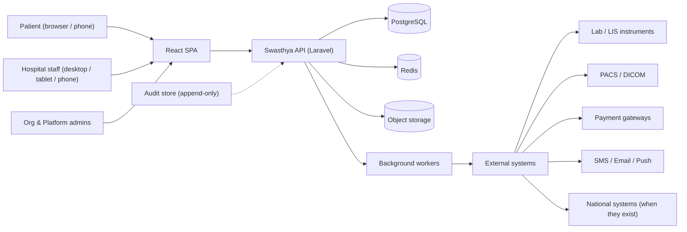
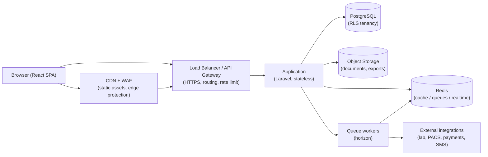
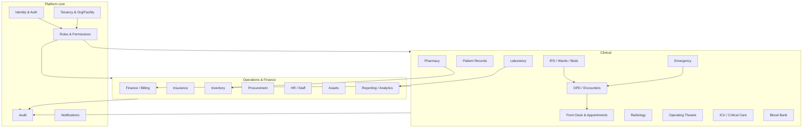
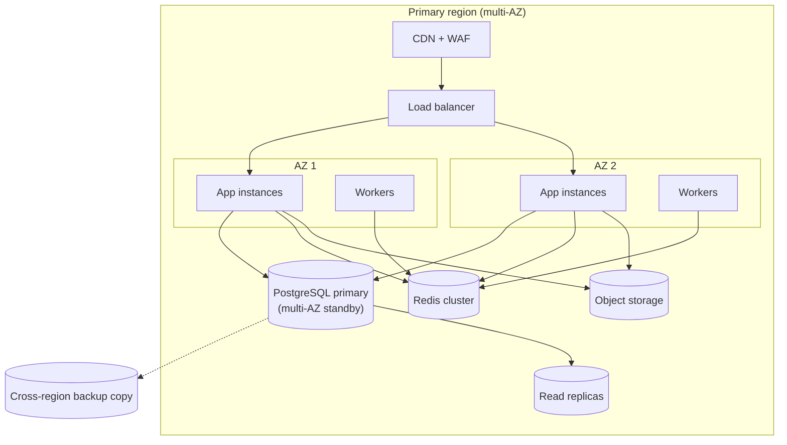

# ARCHITECTURE.md — Swasthya

> **Status:** Working baseline · **Owner:** Principal Architect
> **Version:** 1.0
> **Document chain:** `PRODUCT_REQUIREMENTS.md` defines *what* we build → `MASTER_RULES.md` defines *how* we build → **this document** defines *the shape* of what we build. Where they conflict, this document is subordinate to `MASTER_RULES.md`.

## 0. Scope, Status, and Decisions

This document specifies the production architecture for Swasthya: a nationally scalable, multi-tenant Hospital Management System SaaS. It is written for engineers, reviewers, and operators. It is a **design**, not an implementation — no application code is specified here.

**The single most important decision:** Swasthya begins as a **modular monolith behind one API** — one deployable Laravel application with disciplined domain boundaries — and evolves into services **only when measured load or team structure justifies it**. Microservices are not the starting point; they are a documented destination for specific domains if and when warranted (Sections 28–29).

**Technology decisions (ratified by ADR-001; see Section 2.1):**

| Decision | Choice | Runner-up / rejected |
|---|---|---|
| Frontend framework | **React + TypeScript** (one SPA) | Angular (rejected: no second SPA) |
| Backend framework | **Laravel / PHP** (sole business API) | Node.js (rejected for business logic), CodeIgniter (rejected outright) |
| Database | **PostgreSQL** (only database) | — |
| Cache / queues / realtime | **Redis** | — |
| Files | **S3-compatible object storage** | — |
| Future AI/CDSS inference | **Python (FastAPI)** — inference only | Python for business logic (rejected) |

---

## 1. System Context

Swasthya serves four actor groups through two client surfaces, backed by one platform.



**Actors and surfaces:**

- **Patient portal** — the logged-in patient surface (appointments, results, bills) — *same SPA*, role-gated routes.
- **Staff workspace** — registration, front desk, clinical, pharmacy, lab, billing, admin — *same SPA*, role-gated routes.
- **Platform operations** — tenant lifecycle, entitlements, monitoring — staff workspace with platform roles.
- **External systems** — integrations are always adapter-mediated, contract-tested, and monitored (Section 22). The platform never ships fake or unmonitored integrations.

---

## 2. High-Level Architecture

### 2.1 Technology responsibilities (where each candidate framework lands)

The environment lists React, Angular, Laravel, CodeIgniter, Python, and Node.js. **We do not use all of them.** Each is placed or excluded explicitly:

| Technology | Role in Swasthya | Rationale |
|---|---|---|
| **React + TypeScript** | **Used — the single frontend.** One SPA serves patients and staff, mobile-first. | One SPA = one component library, one auth flow, one design system, one set of tests. Mobile-first PWA story and talent pool are strong. |
| **Angular** | **Not used.** | Angular is a legitimate alternative, but the constraint is *one frontend*. Adopting both means two SPAs, two component libraries, two build pipelines — pure duplication. If the team were decisively stronger in Angular, the decision would be Angular *instead of* React, never both (per `MASTER_RULES.md` §3.3). |
| **Laravel / PHP** | **Used — the sole business API.** All business logic, tenancy, RBAC, billing, clinical workflows, jobs, notifications, audit. | Batteries-included (auth, policies, queues, validation, migrations), fast safe delivery of the huge HMS surface, mature ecosystem, strong PHP talent pool. |
| **CodeIgniter** | **Not used — excluded.** | No defensible role for a national-scale multi-tenant SaaS in 2026: no first-party tenancy story, weaker security defaults, smaller ecosystem. Nothing in Swasthya is built in it. |
| **Python** | **Future, narrow role only:** AI/CDSS inference service (FastAPI) when AI features are funded. | The ML tooling ecosystem lives in Python. The service is *inference only* — no business logic, no CRUD, no direct database access to tenant tables. Its arrival is a documented migration path (Section 28.5), not a current build. |
| **Node.js** | **Not used for business logic.** | The runtime capabilities Node offers (realtime, async I/O) are covered inside Laravel: queues + broadcasting (WebSockets via Laravel Reverb) for realtime, Horizon for queue ops. A separate Node service would duplicate capability. A dedicated realtime/event gateway is a *documented future option* if scale demands it (Section 28.6) — adopted deliberately, never preemptively. |

**The rule in one line:** Laravel owns the product, React owns the screens, PostgreSQL owns the data, Redis owns the waiting, Python is invited only when AI has a budget — and Angular, CodeIgniter, and Node.js are not used unless a documented, measured justification changes the decision through the ADR process.

### 2.2 The request path (Browser → external systems)



**Each hop's job:**

1. **Browser** — the React SPA; static assets served by CDN; all data via HTTPS JSON to the API.
2. **CDN + WAF** — edge caching of static assets, TLS termination at the edge, WAF rules, DDoS protection, bot mitigation.
3. **Load Balancer / API Gateway** — routes `/api/*` to the application, enforces rate limits, TLS, and health-based routing; single entry point; no client ever touches infrastructure directly.
4. **Application** — Laravel, stateless across instances; per request: authenticate → authorize → establish tenant context → run domain logic in a transaction → persist → emit events/jobs.
5. **PostgreSQL** — the system of record; RLS enforces tenant isolation even if application code errs (Section 10).
6. **Cache** — Redis for cache, queues, rate limiting, locks, and realtime fan-out. Never the system of record for clinical truth.
7. **Queue workers** — async execution of notifications, reports, integration dispatch, aggregation (Section 15).
8. **Object storage** — medical documents, exports, images; accessed via signed, expiring URLs (Section 13).
9. **External integrations** — adapter layer with contract tests, circuit breakers, retries, and kill-switches (Section 22).

### 2.3 Layering rules (apply to every feature)

```
HTTP layer (controllers: validate, authorize, delegate — no business logic)
        ↓
Application services (use cases: orchestrate domain objects, transactions)
        ↓
Domain layer (entities, value objects, domain services, policies — no HTTP, no Eloquent leak)
        ↓
Infrastructure (repositories/query layer: Eloquent models, RLS-scoped queries, integrations)
```

- Controllers are thin. Business rules live in the domain/services layers.
- The frontend never implements business rules; it renders API truth.
- Every request path honors the order: **authn → authz → tenancy → domain → persistence**.

---

## 3. Frontend Architecture

**One React + TypeScript SPA (Vite), mobile-first, PWA-installable.** The same app renders the patient portal and the staff workspace; routes and navigation are gated by role and permission.

- **Feature folders:** each feature owns its components, hooks, API slices, and tests; a `shared/` layer holds design-system components, typed API client, auth context, and utilities. No feature code hides in `shared/`.
- **Server state discipline:** a query layer (e.g., TanStack Query) owns fetching, caching, invalidation, and retry; local state holds only UI state. Components never hand-roll `fetch` + `useState` for server data.
- **Typed contract:** client types are generated from the OpenAPI spec (Section 5) so frontend/backend cannot drift silently.
- **Design system:** one token set (color, type, spacing) and one component library for both surfaces; WCAG 2.1 AA; touch targets ≥ 44px; `prefers-reduced-motion` respected.
- **Auth flow:** token-based. The SPA holds the access token in memory, refresh token in an `httpOnly, Secure, SameSite` cookie; silent refresh on expiry; logout revokes server-side.
- **Performance budgets (enforced in CI):** mobile LCP under budget, initial bundle under budget, no render-blocking third-party scripts.
- **PWA scope:** installable; offline limited to safe read-only cache; nothing that mutates clinical data goes offline without a designed reconciliation flow.

**What the frontend is not:** it does not contain business rules, does not talk to the database, does not hold tenant context it did not receive from the API, and does not make decisions about what data is visible — it renders what the API authorizes.

---

## 4. Backend Architecture

**Laravel, organized as a modular monolith.** One deployable application; code is structured into **bounded domains** (Section 6), each with its own namespace, its own models, its own policies, and explicit seams. This is a *structural* modularity (clear ownership, no cross-domain imports of internals), not distributed services. It keeps deployment, transactions, and tenancy simple while preserving the option to extract a domain into a service later (Sections 28–29).

- **Application entry:** PHP-FPM behind the load balancer (default), with **Laravel Octane (RoadRunner)** as a documented, staged evolution for higher request density (Section 28.4).
- **Workers:** Horizon-managed queue workers for async work (Section 15), scaled independently.
- **Scheduler:** Laravel scheduler (single instance in prod) for cron-like work: report generation, stock alerts, reconciliation jobs, metric snapshots.
- **Console / maintenance:** artisan commands for provisioning, data jobs, and operational tasks — all reviewed, all tested.

**What the backend is not:** it is not a microservices fleet, it is not several frameworks cooperating on CRUD, and it does not share business logic with any other runtime. Duplication is prohibited by `MASTER_RULES.md` §3.3.

---

## 5. API Architecture

- **REST, versioned:** `/api/v1/...`; one envelope for success and error shapes; machine-readable error codes; field-level validation errors; pagination/filtering/sorting conventions — all defined once in the API contract (per `PRODUCT_REQUIREMENTS.md` §12 and `MASTER_RULES.md` §12).
- **OpenAPI 3.1** generated from code; the generated spec is the contract the frontend types are built from and the integration tests run against.
- **Idempotency keys** on every create/mutate of clinical or financial records (`Idempotency-Key` header; stored with request hash; replay returns the original result).
- **Versioning policy:** additive changes within a version; breaking changes require a new version with a ≥ 6-month deprecation window; deprecated endpoints return deprecation headers.
- **Security:** strict CORS (one known origin set), rate limiting per route class, input validation in Form Requests, no stack traces or PHI in responses.
- **Public/partner surface (future):** OAuth2/OIDC-secured partner APIs and webhooks, scoped per partner, fully audited (Section 22).

---

## 6. Domain/Module Boundaries

Domains are the monolith's internal architecture. Each domain owns its models and logic; domains cooperate only through public service/event seams.



**Dependency rules:**

- Domains depend on **platform core** (identity, tenancy, audit) but platform core never depends on clinical or operational domains.
- Cross-domain access goes through the owning domain's public interface; importing another domain's models directly is a review violation.
- Events (domain events on an internal dispatcher) decouple domains: Pharmacy publishes `MedicationDispensed`; Finance listens to charge. No service bus is needed while the monolith is one deployable — the internal event dispatcher is the seam, and the *same events* can later cross the service boundary (Section 28.1).

---

## 7. Database Architecture

- **PostgreSQL (16+) — the only database.** Single cluster, single logical schema for tenants (see Section 8 for tenancy mechanics).
- **Keys & types:** UUID primary keys; `timestamptz` everywhere; money as integer minor units; `JSONB` only for genuinely variable clinical/config data; `pgcrypto` for column-level encryption of sensitive identifiers; `pg_trgm` for fuzzy patient search.
- **Constraints live in the database** (NOT NULL, CHECK, FK, unique partial indexes) — not only in application validation.
- **Partitioning (by time) for high-volume tables before they exist:** `audit_event`, `device_reading` (RPM), `notification`/`delivery_attempt`, high-frequency vitals. Partition management is a scheduled maintenance job.
- **Connection pooling:** PgBouncer in **session mode** in front of PostgreSQL (critical detail — see Section 8.5 for why session state matters).
- **Read scalability:** read replicas serve reporting/analytics and hot read paths; the primary serves transactional writes. Replication is physical for failover reads and logical to a dedicated analytics replica where load warrants.
- **Search:** PostgreSQL FTS + `pg_trgm` is the *initial* search engine (Section 17).
- **Migrations:** forward-only, backward-compatible, release-based, verified against a fresh database in CI (`MASTER_RULES.md` §30).

---

## 8. Multi-Tenancy

### 8.1 Model

**Organization (tenant) → Facility (hospital) → Branch (unit/site) → Department.** The tenant is the paying customer; facilities/branches/departments are domain entities scoped inside the tenant.

### 8.2 Isolation strategy — single database + RLS (primary)

- Every tenant-scoped table carries `tenant_id` (UUID, indexed, part of every unique constraint that must be tenant-local).
- **PostgreSQL Row-Level Security** is mandatory and **forced**: tables are created with `FORCE ROW LEVEL SECURITY`, and the application role is a dedicated non-owner, non-superuser role (`swasthya_app`) so RLS cannot be bypassed by ownership privileges.
- Policies use the pattern: `USING (tenant_id = current_setting('app.tenant_id')::uuid)` with corresponding `WITH CHECK` for writes.
- The database is the **last line of defense**: even if application code forgets a `WHERE tenant_id = ...`, RLS blocks cross-tenant reads and writes.

### 8.3 Tenant context flow (never trusted from the client)

```mermaid
sequenceDiagram
    participant S as React SPA
    participant A as Auth middleware
    participant T as Tenant middleware
    participant P as PostgreSQL (RLS)
    S->>A: request + Bearer token (claims org scope)
    A->>A: verify token, resolve principal
    A->>T: principal + requested scope
    T->>T: validate membership in tenant/facility
    T->>P: BEGIN; SET LOCAL app.tenant_id = &lt;validated&gt;
    T->>P: run scoped queries
    P-->>S: only tenant-scoped rows (RLS enforced)
```

- The tenant context is derived **only from the authenticated principal** and their validated memberships — never from headers, query strings, or bodies.
- A user may belong to multiple organizations; the *active* tenant is chosen per request and re-validated each time.
- Facility/branch scoping is layered on top of tenant isolation via application policies (Section 11).

### 8.4 Tenant context in every execution context

- **Requests:** middleware sets the GUC (`SET LOCAL`) at transaction start.
- **Queue jobs:** every job payload carries `tenant_id`; the worker re-establishes the tenant context (and re-validates it) before running the job.
- **Object storage:** tenant-scoped key prefixes plus IAM-level separation and signed URLs (Section 12).
- **Search:** any search index is tenant-scoped; the initial PostgreSQL search inherits RLS automatically.
- **Realtime channels:** channels are namespaced by tenant and authorized server-side.

### 8.5 Production detail: pooling and session state

`SET LOCAL` is transaction-scoped, which is exactly what we want — but it requires that each transaction run on the same session where it was set. Therefore **PgBouncer must run in session mode** (not transaction mode) for the application pool, or per-transaction context must be established via a mechanism that survives pooling. Session-mode pooling with bounded connections and Laravel's connection lifecycle is the default; this is a reviewed operational decision, not an accident.

### 8.6 Escalation path — schema-per-tenant

Documented, not built: if a customer or regulator demands harder isolation, escalate to **schema-per-tenant** (one database, one schema per tenant, search path per session). This is why the application layer routes tenancy through a **central context abstraction** (Section 8.3) rather than scattering `tenant_id` conditions through queries — escalation must not require rewriting business code (`MASTER_RULES.md` §36.5). Database-per-tenant remains reserved for isolated enterprise deals only.

---

## 9. Authentication

- **Token-based, API-first.** Laravel Sanctum personal access tokens: short-lived access tokens (e.g., 15–60 min) plus rotating refresh tokens. Refresh token in an `httpOnly, Secure, SameSite=Strict` cookie; access token in memory in the SPA. Mobile/API clients use the same flow.
- **Token scopes/abilities** carry role context; tokens are revocable instantly (logout, password change, role change, offboarding) and revocation is enforced on every request.
- **MFA (TOTP) mandatory for staff and administrators**; recovery codes; MFA enrollment/removal audited. Patient accounts follow tenant policy (MFA optional but cheap to require).
- **Password discipline:** bcrypt/argon2id hashing, breached-password checking, server-enforced policy, no password hints.
- **Brute-force protection:** rate limiting per IP *and* per account, lockout with backoff, audited failures.
- **Identity classes:** patients, clinical staff, org admins, platform superadmins — separate credential and session policies.
- **Audit:** every auth event (success, failure, lockout, token issue/refresh/revoke, password change, MFA change) is an audited event (Section 21).
- **Future:** OAuth2/OIDC (Keycloak or Passport-based) only for partner/external-system access (Section 22), never a replacement for the internal token flow.

---

## 10. Authorization

Two layers, both mandatory — **application policy + database RLS**:

- **Application layer (what):** Laravel Gates/Policies decide what an actor may do with a resource (create/read/update/sign an encounter, dispense a medicine, void a charge). Policies are the *only* place permission checks live; controllers never scatter `if (auth()->user()->can(...))` ad hoc.
- **Database layer (which):** RLS guarantees the tenant scope of every row the application can reach. Facility/branch/record scoping is applied in policies (a doctor sees their patients; a branch manager sees their branch).
- **Rule of thumb:** the policy layer decides *whether*, RLS decides *which rows*; both must pass. Neither can be bypassed by calling a "trusted" internal path — there are no internal endpoints that skip authorization.
- **Deterministic and tested:** the authorization matrix (every role × every action) is an automated test suite (`MASTER_RULES.md` §16.4).

---

## 11. RBAC

- Role families (seeded, per `MASTER_RULES.md` §9): **platform** (superadmin), **organization** (org admin, org finance), **facility/branch** (facility admin, branch manager, receptionist, billing clerk), **clinical function** (doctor, nurse, pharmacist, lab technician), **patient** (portal).
- Roles carry both **action rights** (`encounter:sign`) and **scope** (org / facility / branch / record). Permissions are namespaced `domain:action` (e.g., `pharmacy:dispense`, `finance:void`).
- Enforcement: middleware for route-level checks → policies for object-level checks → RLS for row-level tenant scope. Role changes take effect immediately (token scopes refreshed) and are audited.
- Segregation of duties where it matters: requester ≠ approver (procurement), charge ≠ void (finance), entry ≠ verification (lab results), prescribe ≠ dispense (pharmacy).

---

## 12. File Storage

- **S3-compatible object storage** for all files: patient documents, consent forms, scanned records, discharge summaries, exports, report artifacts. Not in the database, not on the app server.
- **Access:** signed, expiring URLs generated per request, scoped to the authorizing user's permissions; every document access is audited (`MASTER_RULES.md` §6.7, §19.3).
- **Tenancy:** tenant-scoped key prefixes (`tenants/{tenant_id}/...`) plus IAM-scoped access; a tenant can never address another tenant's prefix.
- **Encryption:** server-side encryption with KMS-managed keys; sensitive uploads additionally protected by application-level rules (no PHI in filenames — IDs, not names).
- **Lifecycle:** versioning + retention policies; backups covered by Section 25 (bucket replication is part of DR).
- **In-application files** (code, config) are never stored here — this is user data only.

---

## 13. Caching

- **Redis** is the cache, co-located with queues and realtime (one Redis cluster, logical separation of databases/namespaces).
- **What we cache** (non-critical, safely derivable): reference data (formulary, catalogs, settings, schedule templates), auth rate-limit counters, session metadata, computed dashboard snapshots.
- **What we never cache** (authoritative): clinical records, prescriptions, charges, stock balances, bed state, audit events. These live in PostgreSQL as the system of record; caching them risks serving stale clinical truth.
- **Patterns:** cache-aside with explicit, typed invalidation on writes (versioned keys); short TTLs for derived data; no unbounded caches.
- **Concurrency correctness:** distributed locks (Redis) protect rare write races (bed assignment, token issuance) — but the *authoritative* serialization for clinical/financial writes is the database transaction with row locks; Redis locks are an optimization, not the correctness mechanism.
- **Cache failure posture:** a Redis outage degrades performance (cache miss storms) but must never corrupt data or leak tenant context; caches are warmable.

---

## 14. Background Jobs

- **Laravel queue workers (Horizon)** execute all async work: notifications, report generation, document processing, stock alerts, analytics aggregation, integration dispatch, audit write-behind for non-critical events.
- **Job discipline:**
  - Every job is tenant-tagged and re-establishes tenant context on execution (Section 8.4).
  - Idempotent where it touches external systems (unique job keys, safe retries).
  - Bounded retries with backoff, job timeouts, and a dead-letter queue that **alerts** — silent job death is prohibited.
  - Priority queues: critical-value escalations and clinical alerts on a high-priority queue that is never starved.
- **Scheduled jobs** (scheduler, single instance): daily reconciliation, expiry sweeps, metric snapshots, retention enforcement.

---

## 15. Queues

- **Redis-backed queue** via Laravel Queues + Horizon (queue monitoring, per-queue limits, retry dashboards).
- Queue topology (logical queues, same broker): `high` (clinical escalations), `default` (feature work), `notifications`, `reports`, `integrations` (rate-limited), `low` (aggregation/cleanup).
- **Rate-limited queues** for external APIs (per-provider limits), with circuit breakers (Section 22).
- **Realtime:** Laravel Broadcasting (Reverb) for live surfaces — queues, tokens, bed occupancy, alert fan-out. Channels are tenant-namespaced and authorized per user.
- **Future:** if and only if the monolith splits (Section 28), these same logical queues become the inter-service messaging boundary (Redis Streams or a broker), preserving the event contracts already defined.

---

## 16. Notifications

- One notification pipeline (Laravel Notifications) consumed by every module: in-app, email, SMS, push.
- **Channels are adapters** (Section 22): mail provider, SMS aggregator(s), push provider — each contract-tested, rate-limited, circuit-broken, and status-monitored. No fake channels in staging/production.
- **Templates** are per-tenant configurable; dispatch respects per-user preference and consent; sensitive content (results, clinical alerts) has explicit consent and transport rules (`MASTER_RULES.md` §10).
- **Delivery integrity:** every dispatch and delivery attempt is recorded (`notification`, `delivery_attempt`); failures retry with backoff, then escalate; a failed critical alert is never silently dropped (Section 14).
- **Volume:** notification traffic is asynchronous by design (queued), so reminder campaigns at national scale never block request handling.

---

## 17. Search

- **Initial engine — PostgreSQL itself:** `pg_trgm` fuzzy matching + FTS for the high-value lookups: patient search (name variants, MRN, phone, phonetic), staff search, item/formulary search. Because search is SQL against the same tables, **RLS applies automatically** — tenant isolation in search is inherited, not bolted on.
- **Duplicate detection** for patient registration runs against this index (threshold candidates, human-confirmed merge — `PRODUCT_REQUIREMENTS.md` §6.1).
- **Scale path (documented, not built):** when query volume or fuzzy-match latency warrants, extract search into a dedicated engine (e.g., OpenSearch/Meilisearch) fed by an **outbox pattern** from the monolith; indices are **tenant-scoped** with explicit tenant context in every query; the extraction is driven by measured latency, not fashion (Section 28.2).

---

## 18. Reporting

- **Transactional path is protected:** all reporting reads hit **read replicas** (or the analytics replica), never the primary's hot tables — reporting workloads cannot degrade clinical writes.
- **Reports across modules:** scheduled and ad-hoc reports (operational, financial, clinical — per `PRODUCT_REQUIREMENTS.md` §6.19); generation is a background job on the reports queue; outputs (PDF/CSV) land in object storage with signed, audited access.
- **Report catalog discipline:** every report has a defined scope, owner, and access level; patient-level drill-down is access-controlled like clinical data; report runs and exports are audited (`MASTER_RULES.md` §19.3).

---

## 19. Analytics

- **Operational analytics (MVP):** live dashboards (census, queues, occupancy, registrations) computed from replica queries with short-TTL snapshots.
- **Financial & clinical analytics (Phase 2):** star-schema materialized views on the replica (facts: charges, payments, encounters, admissions; dims: time, tenant, facility, department, payer, diagnosis), refreshed by scheduled jobs; every metric definition is versioned and agreed (`PRODUCT_REQUIREMENTS.md` §6.19).
- **Executive dashboards (Phase 2):** curated KPI dashboards per role with drill-down; a metric that silently changes meaning is a defect, not a feature.
- **Honesty rule:** analytics reflect observed data only; fabricated or extrapolated metrics are prohibited (`MASTER_RULES.md` P.15).
- **Scale path:** when replica aggregation is insufficient, move to a dedicated OLAP store (e.g., ClickHouse) or time-series store (e.g., TimescaleDB for RPM/device data) — a documented migration with the analytics layer already isolated behind a query service (Section 28.3).

---

## 20. Observability

- **Logs:** structured JSON with a **correlation ID** end-to-end (request → workers → integrations). No PHI in logs (`MASTER_RULES.md` §18.4). Central log pipeline (e.g., Loki/CloudWatch) with retention policy.
- **Traces:** OpenTelemetry instrumentation (API, DB, Redis, queues, external calls) — every request traceable across hops.
- **Metrics:** Prometheus-style counters/histograms (request latency, error rates, queue depth, job failures, cache hit ratio, DB connections) + Grafana dashboards per domain and for platform operations.
- **Errors:** production error tracking (e.g., Sentry) with correlation IDs; frontend errors reported through the same pipeline.
- **Health:** liveness/readiness endpoints on every component, used by the load balancer and orchestrator.
- **SLOs & alerting:** SLOs on critical journeys (login, record retrieval, booking, billing) with error budgets; every alert has an owner, severity, and runbook link; alert fatigue is actively tuned (`MASTER_RULES.md` §20).
- **Synthetics:** synthetic checks on critical journeys run continuously from outside the network.

---

## 21. Audit

- **One central, append-only audit pipeline** (per `MASTER_RULES.md` §19): `audit_event` (partitioned by time, versioned payloads) written through a dedicated audit service inside the monolith — never scattered `logger->info` calls in controllers.
- **Synchronous for the high-sensitivity classes:** clinical mutations, financial mutations, consent changes, data exports, admin actions — the audit write is part of the transaction's correctness. Non-critical events (reads on low-sensitivity data) may be write-behind via the queue.
- **Tamper evidence:** hash-chaining (each event stores a hash of the prior event) with periodic anchor checks; application code has no path to edit or purge audit rows; a dedicated read-only role serves audit queries.
- **Coverage:** auth, authorization denials on sensitive resources, clinical record reads/writes, financial mutations, role changes, consent changes, document access, tenant provisioning/offboarding, AI actions (`MASTER_RULES.md` §19.3).
- **Retention & DR:** audit data is backed up with the same rigor as clinical data and included in RPO/RTO (Section 25).
- **Scale path:** if audit volume outgrows the operational database, the pipeline moves to an append-only external store (object-storage-backed WAL or a dedicated service) behind the same audit API — the application-facing contract does not change (Section 28).

---

## 22. Integration Architecture

- **Adapter pattern:** every external system (payments, SMS, email, lab instruments, PACS, national systems) is behind a typed adapter with a stable internal interface. The domain never knows the provider.
- **Contract tests:** each integration has fixture-based contract tests; payload drift is caught in CI, not by a production incident.
- **Resilience:** every outbound call has timeouts, retries with backoff, circuit breaking, and rate limiting; a down integration degrades a defined workflow — it never hangs a request (`MASTER_RULES.md` §35.2).
- **Kill-switch:** each integration sits behind a feature flag/circuit breaker so it can be disabled independently in production.
- **Webhooks:** inbound webhooks verified by signature, replay-protected, idempotent, and logged; outbound webhooks queued with retries and delivery receipts.
- **Status truth:** an integration registry records actual status (live/degraded/down), monitored continuously — never claimed green without evidence (`MASTER_RULES.md` P.16).
- **No fakes in production:** stubs/mocks exist only in test environments; staging and production are wired to real endpoints with real, secret-store-managed credentials.

---

## 23. Interoperability

- **FHIR R4 readiness:** a projection/mapping layer inside Laravel maps the internal domain model to FHIR R4 resources (Patient, Encounter, Observation, MedicationRequest, DiagnosticReport). The internal schema is *not* reshaped to FHIR; the mapping layer is the seam, with contract-tested fixtures (`PRODUCT_REQUIREMENTS.md` §6.24).
- **HL7 v2 readiness:** message mapping adapters for ADT (admission/transfer/discharge) and lab order/result patterns where the ecosystem uses HL7.
- **DICOM readiness:** modality worklists and study references integrate with PACS; Swasthya manages orders/studies/reports and launches/embeds a viewer — it is not a PACS.
- **Partner APIs:** versioned, OAuth2/OIDC-secured, scoped tokens, fully audited — the same API discipline as internal endpoints.
- **National integrations:** built only when the national system exists and is specified; each is its own contract-tested project with a named owner. Nothing is simulated and nothing is claimed green without monitoring.

---

## 24. Deployment Architecture



- **Environments:** dev (Docker Compose: app + worker + PostgreSQL + Redis + mail catcher + MinIO), staging (production mirror — same topology, versions, config class), production.
- **Compute:** containerized Laravel (PHP-FPM) + Horizon workers on managed containers (e.g., ECS/Fargate), stateless, horizontally scalable. Kubernetes only when operational demands genuinely require it — documented, not assumed.
- **Data plane:** managed PostgreSQL (multi-AZ, automated backups, PITR, replicas), managed Redis (ElastiCache-class), S3 + KMS.
- **Edge:** CloudFront (SPA + assets) + WAF; TLS everywhere; strict security headers.
- **Config & secrets:** environment via the secrets store (KMS/Secrets Manager); `.env.example` with placeholders only (`MASTER_RULES.md` §28–29).
- **CI/CD:** GitHub Actions: lint, static analysis, tests on real PostgreSQL/Redis, scans, image build → staging deploy → green promotion → production via the pipeline (never manual).
- **Zero-downtime releases:** rolling deploys, release-based backward-compatible migrations, health-check gates, and a rehearsed rollback path (`MASTER_RULES.md` §21, §30).

---

## 25. Disaster Recovery

- **Targets (default, from `MASTER_RULES.md` §22):** RPO ≤ 15 minutes, RTO ≤ 4 hours; reviewed annually.
- **Multi-AZ everything:** app, workers, PostgreSQL (synchronous standby), Redis, storage — no single point of failure without a documented, accepted risk.
- **Backups:** automated PostgreSQL backups + WAL archiving (PITR), encrypted, monitored (failure alerts within the hour); object storage versioning + cross-region replication; audit data included.
- **Restore is proven:** **quarterly restore drills** restore into a clean environment and verify critical journeys and data integrity — not just "the backup opens." A failover test (primary database) runs at least annually with evidence.
- **Runbook:** written, current, with contacts and credential access paths — DR is not one person's private knowledge.
- **Compliance note:** restore verification includes RLS policy re-application and tenant-scope checks — an RLS misconfiguration after restore would be a data-leak event.

---

## 26. Scaling Strategy

Scaling is staged and measured. The monolith is deliberately easy to scale vertically and by replicas; services are extracted only when a boundary is *measured* to be limiting (Section 28.1).

| Stage | Trigger (measured) | Action |
|---|---|---|
| **1. Launch** | Baseline | PHP-FPM app, single Redis, single PostgreSQL primary + 1 replica; CDN absorbs static/edge load |
| **2. Read growth** | Replica read latency / load | Add read replicas; route reporting/analytics to a dedicated analytics replica; cache reference data |
| **3. Async growth** | Queue depth / worker saturation | Scale Horizon workers; per-queue limits; rate-limited integration queues |
| **4. Request density** | CPU/session limits on FPM | **Laravel Octane** (RoadRunner) for higher request density per instance; tune PgBouncer pools |
| **5. DB write growth** | Primary write contention | Partitioning rollout on high-volume tables; write-path review; consider write-splitting only where measured |
| **6. Domain extraction** | One domain's deploy cadence / failure blast radius / team size | Extract a hot domain (e.g., notifications, audit, billing) as a service behind the same contracts (Section 28.1) |
| **7. National footprint** | Regional latency / resilience demands | Second-region read replicas + DR; later active-active per tenant-shard only if measured to be needed |

**Guardrail:** no service extraction happens without the criteria in Section 28.1 being demonstrably met. Premature microservices are an architectural failure mode, not a status symbol (`MASTER_RULES.md` §2.1).

---

## 27. Performance Strategy

- **Budgets by layer:** API p95 latency budgets per route class (writes vs reads); frontend LCP/bundle budgets enforced in CI; queue processing-time budgets per queue.
- **Database discipline:** every feature's queries reviewed for indexes and N+1 (Section 7); pagination everywhere; no `SELECT *`; query plans on hot paths reviewed in code review.
- **Caching tiers** with correct invalidation (Section 13): reference data cached, clinical truth never cached.
- **Async by default for slow work:** reports, exports, notifications, integration dispatch are queued — request handlers stay fast.
- **Connection pooling** (PgBouncer session mode) with monitored pool saturation; Redis connection reuse; no per-request connection churn.
- **Load testing with real profiles:** peak-hour OPD rush (registration + booking + queue + billing concurrency), ER arrival spikes, lab result floods, notification campaigns at national scale. Performance regressions fail CI.
- **Warm caches and jitter:** pre-warm reference caches on deploy; request-level jitter to avoid thundering herds on cache expiry.

---

## 28. Scaling to Services — Future Migration Paths

The modular monolith is the design *so that* these paths exist without rewrites. Each path has a trigger, a shape, and a constraint:

### 28.1 Monolith → domain services (strangler, contract-first)

- **Trigger (all must be demonstrable):** one domain's independent scaling need, deploy cadence friction caused by that domain, failure blast radius, or team-size separation of concerns.
- **Shape:** extract the domain behind its existing public service + event contracts (Section 6); the core (identity, tenancy, audit) stays shared; cross-domain calls become the same contracts over HTTP/queues (the internal dispatcher already emits the events).
- **Constraint:** tenancy, authz, and audit remain platform core — a service is never allowed to re-implement them. Extraction order candidates, when measured: notifications → audit → billing.

### 28.2 PostgreSQL search → dedicated search engine

- **Trigger:** measured query latency or volume beyond PostgreSQL FTS/`pg_trgm` budget.
- **Shape:** outbox-fed index (Section 17); tenant-scoped indices; search API behind the same interface the SPA already calls.

### 28.3 Replica aggregation → OLAP store

- **Trigger:** reporting queries exceed replica capacity or freshness targets.
- **Shape:** analytics query service → ClickHouse/TimescaleDB behind it; metric definitions unchanged (`MASTER_RULES.md` §19.6 discipline preserved).

### 28.4 PHP-FPM → Laravel Octane

- **Trigger:** request-density limits of FPM (Stage 4 above).
- **Shape:** Octane (RoadRunner) with stateless discipline already enforced; memory-leak discipline becomes mandatory; connection reuse tuned.

### 28.5 Python AI/CDSS inference service

- **Trigger:** AI/CDSS features funded (`PRODUCT_REQUIREMENTS.md` §6.22–6.23).
- **Shape:** FastAPI service, inference only; no business logic, no direct tenant-table access; versioned models; called over the API with the same idempotency/retry discipline; flagged and kill-switched (`MASTER_RULES.md` §33).

### 28.6 Realtime gateway (if ever needed)

- **Trigger:** measured limits of Laravel's broadcasting/Reverb at national concurrency.
- **Shape:** a dedicated realtime gateway (Node/NestJS is the candidate) *only* as a fan-out edge — never business logic, never database access; it would talk to the same authorized channels. This is the *only* scenario in which Node.js earns a place, and it must clear the same ADR bar as any new technology.

### 28.7 Single-DB RLS → schema-per-tenant

- **Trigger:** enterprise/compliance demand (Section 8.6).
- **Shape:** search-path per session behind the existing tenant-context abstraction; business code untouched.

### 28.8 Single-region → multi-region

- **Trigger:** national latency/resilience requirements (Stage 7).
- **Shape:** second-region read replicas + DR copy first; active-active per tenant-shard later, only if measured to be needed; tenant data residency respected.

---

## 29. Architecture Principles (the non-negotiables)

1. **Start as a modular monolith.** Simplicity is a feature: one deployable, one transaction boundary, one tenancy mechanism, one deploy pipeline. Complexity is earned.
2. **One technology per responsibility.** No framework duplication. A new technology (including Node, a second frontend, an OLAP store) clears the ADR bar and names its measured trigger.
3. **Tenancy is infrastructure, not a feature.** RLS + central context from day one; every execution context (request, job, cache, file, search, realtime) is tenant-scoped.
4. **The database is the last line of defense.** RLS holds even when application code fails. Audit is append-only. Clinical truth is never cached.
5. **Everything async-able is async; everything critical is loud.** Queues keep requests fast; critical failures escalate, never silently die.
6. **Integrations are real or absent.** Contract-tested, monitored, kill-switchable — nothing fake, nothing claimed green without evidence.
7. **Migration paths are documented, not accidents.** Every boundary exists so the monolith can evolve into services *when measured* — and not before.

---

*This document is the architectural contract for Swasthya. It is subordinate to `MASTER_RULES.md` (how we build) and `PRODUCT_REQUIREMENTS.md` (what we build). Architecture changes — including any of the migration paths in Section 28 — are made through the ADR process, with evidence, never by accretion.*
