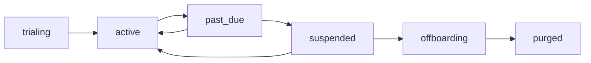

# BILLING.md — Swasthya SaaS Subscription Billing

> **Status:** Working baseline · **Owner:** Principal Architect (billing ratified with the team)
> **Version:** 1.0
> **Document chain:** This document deepens `PRODUCT_REQUIREMENTS.md` §5.7 (subscriptions/entitlements) and §6.13 (patient finance), `DATABASE.md` §3.40–3.41 (subscriptions, entitlements) and §3.33–3.35 (patient billing), `TENANCY.md` §13, §19–20 (suspension, entitlements, subscription boundaries), `MASTER_RULES.md` §37 (billing rules), and `INTEROPERABILITY.md` §13 (payment integrations — planned). It is the SaaS billing **design** — nothing is implemented here.

---

## 0. The Separation Principle

**Swasthya has two billing systems, and they are different domains that must never merge:**

| | **SaaS billing** (this document) | **Hospital patient billing** (separate domain) |
|---|---|---|
| **Who is billed** | The hospital **organization** (the tenant) — for using Swasthya | The hospital's **patients** — for care received |
| **Domain** | Commercial / platform | Healthcare |
| **Risk class** | Revenue and commercial contracts | Clinical-adjacent: insurance, pricing, patient finance law |
| **Actors** | Platform finance; org admin (view own) | Hospital billing staff, cashiers, accountants, patients |
| **Lifecycle** | Per subscription period | Per encounter, admission, or charge event |
| **Money shape** | Plan price, add-ons, prorations, usage meters | Charges, invoices, deposits, refunds, insurance share, tax |
| **Data placement** | Platform commercial domain (per-org subscription rows) | Tenant-scoped data, RLS-isolated, healthcare audit |
| **Audit** | Commercial events | Append-only healthcare audit trail (`MASTER_RULES.md` §19) |
| **Failure severity** | Revenue loss, contract dispute | Patient money truth, insurance claims, regulatory |

**Why they are separate:** patient billing is a *healthcare* domain — it touches clinical events (what care was delivered), insurance, deposits, and patient finance law; SaaS billing is a *commercial* domain — it touches the org's contract with the platform. They have different actors, different risks, different lifecycles, and different audit classes. **A patient's charge must never appear on the org's SaaS invoice, and a subscription payment must never touch a patient account.** The only shared elements are *patterns*: integer minor-unit money, idempotency, gateway adapter discipline, and the audit-before-delete rule apply to both — as separate implementations in separate domains.

**The hard boundary:** no code path, job, or report in the patient-billing domain reads subscription state, and no code path in the SaaS-billing domain reads patient charges. The two domains communicate only through the platform-visible fact that a tenant's subscription state exists (for entitlements — `TENANCY.md` §19), never through financial data.

---

## 1. SaaS Billing Model Overview

- **The customer is the organization (tenant).** The platform sells the organization's right to use Swasthya; the subscription is the org's commercial relationship with the platform (`TENANCY.md` §20).
- **The commercial spine:** `plans` (catalog, platform-owned) → `subscriptions` (one live per org) → `subscription invoices` → `subscription payments`; with `plan_features`/`entitlements` as the operational bridge between money and capability (`DATABASE.md` §3.40–3.41).
- **Status drives everything downstream:** the subscription state machine is the *only* route into tenant lifecycle states (suspended, offboarding) — there is no other way to suspend a tenant (`TENANCY.md` §13, §20).
- **Money discipline is identical to patient billing:** integer minor units, explicit currency frozen on every financial row, idempotency keys on every financial mutation, reversing entries instead of edits, full audit (`MASTER_RULES.md` §37).

---

## 2. Plans

- **The plan catalog is platform-owned** (`DATABASE.md` §3.41): `code`, `name`, `price_minor`, `currency`, `billing_cycle` (monthly, yearly), `status` (active, retired), and its feature matrix via `plan_features` (modules granted + capacity values).
- **Plans are versioned:** a price or feature change creates a new plan version; **existing subscriptions keep their contracted price** — a price change never silently re-prices a live subscription (commercial contracts are honored).
- **Retirement, not deletion:** a retired plan cannot be subscribed to; existing subscriptions on it continue until changed or renewed per contract.
- **Currency:** plans are priced in an explicit currency (e.g., NPR); every SaaS financial row carries its currency frozen at the moment of the transaction.

---

## 3. Subscriptions

- **Lifecycle (the state machine):**

- **Period logic:** the subscription has a billing cycle, `current_period_start`/`current_period_end`, and a renewal model; changes (upgrade/downgrade) prorate per policy (Sections 6–7).
- **One live subscription per org** (partial unique index on live states — `DATABASE.md` §3.40); history is preserved as prior subscription rows.
- **Subscription records are tenant-scoped but platform-operated:** the org sees its own subscription and invoices; only platform finance changes subscription state; every state change is a platform-audited event with actor and reason.

---

## 4. Trials

- **Trial state (`trialing`) grants the plan's entitlements for a trial window** with an expiry; trial → active on conversion (payment method established), or trial → degraded on expiry — the org never loses its data, only its trial entitlements (Section 5).
- **Trial limits are entitlements, not special cases:** a trial is a plan with a `trialing` state; the same server-side enforcement applies, so there is no "trial loophole" path.
- **Trial end is loud:** the org is notified before expiry, at expiry, and the degradation is explained in the UI — never a silent loss of capability (`MASTER_RULES.md` §38 discipline).

---

## 5. Feature Entitlements

- **Chain:** plan → `plan_features` → runtime `entitlements` for the subscription (`DATABASE.md` §3.41); enforcement is **server-side** at API middleware and job dispatch — never client-side (`TENANCY.md` §19; `MASTER_RULES.md` §38).
- **Capacity entitlements** (facilities, users, storage) cap *creation*, never touch existing data: a downgrade below the current facility count blocks adding a facility; it never deletes one (`TENANCY.md` §19).
- **Entitlement changes are audited and effective immediately:** an upgrade activates new capabilities without a redeploy; a suspension revokes effective entitlements at runtime while preserving the records.
- **No entitlement drift:** the effective entitlement state is observable (metering + entitlement denials are metrics — `OBSERVABILITY.md` §12) and is never asserted without measurement.

---

## 6. Upgrades

- **Immediate activation:** an upgrade activates new entitlements immediately (per contract terms) — the org's capability follows the money, without data impact.
- **Proration:** the upgrade produces a prorated charge for the remainder of the period and a credit note for the unused portion of the old plan; both are itemized on the subscription invoice (Section 8).
- **Rules:** upgrades are org-admin initiated, platform-confirmed, audited; no data is migrated, copied, or touched — only entitlements change; idempotency keys make an upgrade retry safe (an upgrade is never applied twice).

---

## 7. Downgrades

- **Effective at the period boundary by default** (per policy), with the new entitlements capping from that moment; immediate-effect downgrades exist only as an explicit, reviewed option.
- **Caps, never deletes:** a downgrade caps new usage (facility/user/storage limits); existing records and workflows continue — nothing is deleted, nothing mid-flight is blocked (`TENANCY.md` §19).
- **Credits:** unused prepaid value for the remainder of the period becomes a credit note applied to the next invoice (Section 10).
- **Rules:** downgrades are audited; the org is shown exactly what will change at the boundary before confirming — the UI never surprises a hospital by quietly removing capability.

---

## 8. SaaS Invoices (Subscription Invoices)

- **Per-period invoices** itemized by: plan price, add-ons, prorations (upgrade/downgrade), credit notes applied, tax — each line frozen at its moment (`DATABASE.md` §0.4 money rules).
- **Lifecycle:** `draft → issued → partially_paid → paid` (or `credited`); a draft is invisible to the org; an issued invoice is immutable — corrections are credit notes, never edits (`MASTER_RULES.md` §37.3).
- **Numbering, idempotency, audit:** subscription invoice numbers are unique; every issuance/payment/credit is idempotent-keyed and audited like any financial event.
- **Invoice availability:** the org admin sees its own invoices and receipts (read-only); receipts are derived from the ledger, never separately invented rows (`DATABASE.md` §3.34).

---

## 9. SaaS Payments (Subscription Payments)

- **Capture via a real gateway** (the payment integration is a *planned* integration per `INTEROPERABILITY.md` §13 — real endpoint, contract-tested, kill-switchable; nothing is currently connected and nothing is claimed).
- **Allocation and reconciliation:** payments allocate to subscription invoices; daily settlement and provider reconciliation follow the patient-billing discipline (`PRODUCT_REQUIREMENTS.md` §6.13): silent billing failures are prohibited, variances alert.
- **Dunning → suspension:** failed payment → `past_due` (retries per policy, reminders) → `suspended` if unresolved — the dunning path is the designed route into tenant suspension (`TENANCY.md` §13), and suspension never deletes data.
- **No fake payments:** a payment record always traces to a real captured transaction; the metering and payment state is observable, never asserted (`MASTER_RULES.md` P.15, P.16).

---

## 10. Refunds and Credit Notes

- **Refunds** (a reversal of a real payment) require approval, a structured reason, and full audit — same discipline as patient-billing refunds (`PRODUCT_REQUIREMENTS.md` §6.13); a refund is a reversing entry, never a deletion.
- **Credit notes** (from proration, downgrade credits, adjustments) apply against future invoices and are itemized when applied.
- **Rules:** financial records in the SaaS domain are as immutable as patient-billing records — no edits, only reversing entries; idempotency makes refunds replay-safe.

---

## 11. Subscription Status and Tenant Lifecycle

- **The subscription state machine is the tenant lifecycle's driver** (`TENANCY.md` §13): `active` → `past_due` (warning, no functional loss) → `suspended` (logins/writes/jobs/integrations gated; reads available for export prep; data untouched) → `offboarding` (read-only export window) → `purged` (per retention law, audited).
- **No other path into suspension:** a tenant cannot be suspended through any domain other than subscription state; platform break-glass exists but is itself audited, time-boxed, and reviewed (`SECURITY.md` §26).
- **Isolation never weakens at any status:** a suspended or offboarding tenant's data remains fully RLS-isolated (`TENANCY.md` §13).

---

## 12. Usage-Based Billing Readiness

- **Metering is designed now, activated per plan later:** metering events are recorded at the points where usage happens (users active, facilities, encounters processed, storage consumed) — **accurate by construction, never fabricated** (`MASTER_RULES.md` P.15).
- **The meter is observable data:** usage counts are metrics with agreed definitions; a meter discrepancy is a defect, not a discovery (`OBSERVABILITY.md` §12; `PRODUCT_REQUIREMENTS.md` §6.19 metric discipline).
- **Aggregation:** per-period usage aggregation feeds invoices when a plan includes usage meters; per-seat, per-encounter, and per-storage meter shapes are specified as readiness — the schema and pipeline exist, the meters activate per contract.
- **Audit:** metering events are audited; a tenant can question its meter and get a traceable answer.

---

## 13. Enterprise Plans

- **Enterprise plans are the same platform, configured — never a fork** (`MASTER_RULES.md` §1.3): custom pricing, negotiated annual contracts, capacity overrides, SLA tiers (`ARCHITECTURE.md` §27.4/enterprise offerings), dedicated support terms.
- **Mechanics:** a quote → contract → custom plan (with negotiated price and feature matrix) → subscription; the custom plan is a plan-version like any other, with its own version history and audit.
- **Escalated tenancy options** (e.g., schema-per-tenant, `ARCHITECTURE.md` §28.7) are commercial options on the same codebase, recorded in the contract and provisioned by the platform — never ad hoc custom code.
- **Rules:** enterprise deals follow the same money discipline (integer minor units, idempotency, audit); the only differences are price, terms, and capacity — never code paths.

---

## 14. Patient Billing — the Boundary Restated

Patient billing is **its own healthcare domain** and is designed in `PRODUCT_REQUIREMENTS.md` §6.13, `DATABASE.md` §3.33–3.35, and `MASTER_RULES.md` §37: charges from clinical events, invoices with tax, deposits, refunds, insurance claims, outstanding aging, and daily reconciliation — tenant-scoped, RLS-isolated, healthcare-audited. **Implemented status:** charges/invoices/payments (Phase 6/7), refunds/adjustments (slice 5), refund completion (slice 11), and — with Phase 3 slice 18 — deposits (collect/allocate, exact + CAS), outstanding aging (computed from invoice truth), daily cashier settlements (variance never silently absorbed), and insurance claims (build/submit/track/settle, invoice-truth lines). No payment gateway is connected (planned — INTEROPERABILITY.md §13) and nothing is faked.

**The boundary rules between the two systems:**

1. Patient charges never appear on SaaS invoices; subscription invoices never reference patient accounts.
2. SaaS-billing code cannot read patient financial data; patient-billing code cannot read subscription state (beyond the entitlement gate it is allowed — `TENANCY.md` §19).
3. Different actors: hospital billing staff operate patient billing; platform finance operates SaaS billing; the org admin views its own SaaS invoice.
4. Different audit classes: healthcare audit (append-only, tamper-evident) vs. commercial audit — both real, both separate.
5. Shared *patterns*, separate implementations: integer money, idempotency, gateway adapters, audit-before-delete apply to both, implemented in each domain.

---

## 15. Honest Claims and Definition of Done

**Claims not made here:** no payment gateway is connected (that is a *planned* integration — `INTEROPERABILITY.md` §13); no metering is live; no compliance status (tax, commercial law) is claimed without verified assessment (`PRODUCT_REQUIREMENTS.md` §9).

**The SaaS-billing definition of done** (for when it is built): plans/subscriptions/invoices/payments versioned and audited; every financial mutation idempotent; integer minor-unit money with frozen currency; status machine driving tenant lifecycle with no other route; entitlements server-side enforced; metering accurate and observable; refunds/credits as reversing entries; and the patient-billing boundary proven by tests (a test that proves a patient charge can never appear on a subscription invoice, and vice versa — `TESTING_STRATEGY.md` §4-class discipline).

---

*This document is the SaaS-billing contract for Swasthya: the platform bills the organization, the organization's patients are billed by the hospital — two domains, two data planes, two audit classes, never merged. The money discipline is the same in both: integer units, frozen currency, idempotent mutations, immutable records, full audit. And the subscription state machine is the honest link between revenue and capability: it is the only route into tenant lifecycle, and it never touches a single patient record.*
