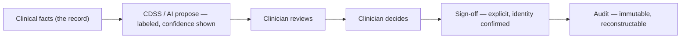

# CLINICAL_SAFETY.md — Swasthya Clinical Safety

> **Status:** Working baseline · **Owner:** Principal Architect (clinical safety ratified with clinical authority)
> **Version:** 1.0
> **Document chain:** This document consolidates the clinical-safety material from `MASTER_RULES.md` §11 (clinical safety), §33 (AI), §34 (CDSS); `PRODUCT_REQUIREMENTS.md` §6.22–6.23 (CDSS, AI); `DESIGN_SYSTEM.md` (High-Risk Actions, clinical data presentation); `DATABASE.md` (immutability, audit); and `TESTING_STRATEGY.md` §4 (clinical safety suite). It is the clinical-safety **contract** — no clinical features are implemented here.
>
> **The honesty clause (read first):** Swasthya is **not** claimed to be clinically certified, CE/ISO-classified as a medical device, or compliant with any clinical-safety standard or regulation. This document defines the safety *principles the product is designed to*; any certification or compliance claim is made only after qualified clinical and legal assessment with documented evidence (`PRODUCT_REQUIREMENTS.md` §9; `MASTER_RULES.md` §11). Nothing in this document is a claim that Swasthya has been clinically validated.

---

## 0. Clinical Safety Principles

1. **The clinician decides; the software assists.** AI and CDSS propose, warn, and support — they never silently replace clinical judgment, never auto-apply, and never act without a human decision (`MASTER_RULES.md` §11.1, §33.1).
2. **Wrong-patient prevention is the first principle.** The Identity Spine (`DESIGN_SYSTEM.md` §33) is present at every clinical interaction, and identity is re-confirmed at the moment of action — never assumed from the start of the session.
3. **The record is truth.** Clinical facts are captured completely, attributed, immutable after sign-off, and fully auditable. If it is not in the record, it did not happen.
4. **Fail loudly.** A failed result transmission, a missed alert, an unreconciled administration is escalated, retried, and surfaced — never silently swallowed (`MASTER_RULES.md` §11.3).
5. **Missing is not zero, and unknown is not safe.** Absence of a recorded allergy, a missing result, an unreviewed value are all *states that must be visible* — never blank, never implied-negative, never assumed-fine (`DESIGN_SYSTEM.md` §33).
6. **Clinical content is evidence-based, versioned, and reviewed.** Rules, alerts, ranges, and knowledge-base updates are versioned and signed off by clinical authority before release (`MASTER_RULES.md` §34.2).
7. **Safety is measured, not asserted.** Override rates, alert precision, critical-value acknowledgment times, and near-misses are monitored and reviewed — a safety property nobody measures is a hope (§17).
8. **No unsafe clinical automation.** Automation may move data, escalate, remind, and route — it may not decide (§11).

---

## 1. Clinical Documentation

- **Structure + freedom:** notes combine structured sections (history, examination, systems) with clinician free text; structure makes data usable, free text preserves clinical judgment.
- **Attribution and context:** every note names its patient (Identity Spine), encounter/admission, author, and time; the reader never wonders whose note this is or who it is about.
- **Completeness is a safety property:** the workflow surfaces what must be documented before sign-off (allergies, medications, diagnoses, orders) — it never *blocks* on completeness without explanation, but it never silently signs an empty record.
- **Drafts are labeled:** an unsaved or draft note is visibly a draft; nothing that looks final is a draft.
- **Immutability after sign:** a signed note cannot be edited; amendments are new, audited versions with the original preserved (`DATABASE.md` §3.19). Silent edits to clinical documents are prohibited.
- **Reads are audited:** who saw what record, when — visible to the patient on request (`MASTER_RULES.md` §10.8).

---

## 2. Diagnosis

- **Coded where possible** (ICD readiness), with typed status: provisional, differential, final — and an explicit primary flag (`DATABASE.md` §3.18).
- **Diagnoses are clinician-entered and clinician-signed.** The software never invents, suggests-as-fact, or auto-fills a diagnosis; AI may propose a *candidate* list that is labeled as a suggestion and never auto-attached (§10).
- **Final is an explicit act:** promoting a diagnosis to final is a deliberate clinician action, audited like sign-off.
- **Changes are versioned:** a diagnosis that changes is a new state with history — never a silent edit (the audit trail reconstructs the diagnostic course).

---

## 3. Prescriptions

- **Structured and unambiguous:** dose, route, frequency, duration, and quantity are separate labeled fields rendered as one readable line (`DESIGN_SYSTEM.md` §33); units are always shown; **dose-safety formatting rules** (no trailing zeros, no ambiguous decimals, "0.5 mg" not ".5 mg") are enforced at entry.
- **Medicines come from the formulary, not free text** — typing a medicine that does not exist in the tenant's formulary is how wrong drugs get prescribed; free-text drug entry is prohibited (`DESIGN_SYSTEM.md` §15).
- **Safety checks at prescription time:** allergy check (§5), drug–drug interaction check (§6), duplicate-therapy detection, and dose-range checks where the evidence base supports them — all severity-tiered and clinically meaningful.
- **Sign-off before effect:** a prescription takes effect on the prescriber's sign-off; amendments and discontinuations are audited actions, never edits.
- **The audit trail reconstructs the moment:** rule versions and alert outcomes are recorded with the prescription so "what did the system warn at the time" is always answerable (§6, §15).

---

## 4. Medication

- **Administration (MAR) confirms identity at the moment:** patient identity (name + MRN) is confirmed on-screen before administration is recorded; the Identity Spine is present (`DESIGN_SYSTEM.md` High-Risk Actions).
- **Administration states are explicit:** scheduled, given, refused, missed, held — each with reason where it matters; a missed or refused dose is a fact, not a gap.
- **Dual verification where policy requires** — controlled substances, high-alert medications — performed in-app with both operators recorded (`MASTER_RULES.md` §11.2; `DESIGN_SYSTEM.md` §27 L3).
- **Reconciliation:** prescribed vs. administered vs. returned is reconcilable at any time; unreconciled differences surface, never silently resolve.
- **No silent corrections:** an administration recorded in error is corrected through a reviewed, reason-captured, audited path — never a quiet edit.

---

## 5. Allergy Alerts

- **Allergies are structured facts:** substance, reaction, severity — entered and confirmed by clinical staff; **"No known allergies" is an explicit recorded state**, never an empty field (`DESIGN_SYSTEM.md` §33; `DATABASE.md` §3.11).
- **Checked at every clinical decision point** where it matters: prescription, dispensing, and administration; the allergy chip is always visible in the Identity Spine.
- **Unknown is alert-worthy:** a prescription against a patient with no allergy record at all raises the same scrutiny as one with a known allergy — absence is not safety.
- **Severity-tiered alerts:** life-threatening reactions alert loudly; mild reactions inform; the tier is evidence-based and reviewed.
- **Overrides** (§13) capture reason and are audited; an override of an allergy alert is a documented clinical decision, never a dismissal.

---

## 6. Drug Interactions

- **Knowledge-base-driven checks** at prescription and dispensing time, from a maintained, versioned interaction source (drug–drug, drug–food where relevant, drug–condition where the evidence supports it).
- **Severity tiers with clinical meaning:** only clinically meaningful interactions alert at the level that requires attention — alert fatigue is a safety defect, not a metric to maximize (`MASTER_RULES.md` §34.4).
- **Rule version is pinned to the moment:** the audit record of every alert stores the rule version and the triggering facts, so a later knowledge-base update cannot rewrite history (§15).
- **Knowledge-base updates are tested** (an update must not break existing prescriptions or silently change alert severity without review) and reviewed by clinical authority before release.
- **Failure posture:** if the interaction service is unavailable, prescribing **fails open** (care is never blocked) while the degradation is logged loudly and visibly — a CDSS outage must never prevent care, but must never be invisible either (`MASTER_RULES.md` §34.5).

---

## 7. Laboratory Results

- **Entry is not verification.** Results are entered (by instrument interface or technician) and **verified by an authorized verifier** before release — two roles, two audit records, never one silent step (`PRODUCT_REQUIREMENTS.md` §6.8; `DATABASE.md` §3.28).
- **Reference ranges are explicit and context-aware** (age/sex/clinical context), printed with the value ("5.2 (4.0–6.0) mmol/L"); out-of-range values carry direction (↑/↓) — never color alone (`DESIGN_SYSTEM.md` §33).
- **Critical/panic values are the loudest event in the product:** static, prominent, acknowledged — with the acknowledgment recorded (who, when) and escalation if unacknowledged. A critical value is never a toast, never a chip, never silent (`OBSERVABILITY.md` never-log rules keep it out of logs, but it is always in the record).
- **Missing vs. negative is explicit:** "—" for not-yet-available, "0"/negative for measured absence; a missing result is never mistaken for a negative one (`DESIGN_SYSTEM.md` §33).
- **Corrections are new versions:** a corrected result is a new, verified, audited version; the original remains visible; if the correction touches a critical value, escalation re-runs.

---

## 8. Radiology Results

- **Preliminary vs. final is explicit**, with timing visible (preliminary at, final at) — the referrer always knows what level of review a report has had (`PRODUCT_REQUIREMENTS.md` §6.9; `DATABASE.md` §3.29).
- **Verification and amendments** follow the lab discipline: verification is a distinct audited act; amendments are new versions with the original preserved.
- **Critical findings escalate like critical lab values** — loud, acknowledged, escalation on silence; a life-threatening finding that sat in a queue is a safety failure.
- **Studies are correctly attached:** every report names its study, modality, and order; a report that cannot be traced to its study is not released.

---

## 9. Clinical Decision Support (CDSS)

- **Assistive by contract:** CDSS proposes, warns, and guides — it never decides, never auto-applies, and never blocks care silently (`MASTER_RULES.md` §34.6). The human-in-the-loop flow is the product's shape:

- **Rules are evidence-based, versioned, and clinically reviewed** before release; rule governance (who approved, what evidence, when) is recorded (`MASTER_RULES.md` §34.2).
- **Precision over volume:** alerts are tiered and tuned; the false-positive rate is measured and acted on — an alert system nobody reads is worse than no alert system.
- **Fail-open with loud logging:** a CDSS failure degrades to "no support, visible degradation" — never blocks care, never silent (§6).
- **Pathways guide, never coerce:** evidence-based pathways show the expected course; deviation is documented, not blocked.

---

## 10. AI

- **Assistive only, always:** AI produces drafts, summaries, forecasts, and *suggestions* — every output is labeled as AI-generated, shows its limits/confidence, and requires clinician review before anything enters the record (`MASTER_RULES.md` §33.1).
- **The clinician owns the final document:** an AI-drafted note is signed by a clinician who reviewed it; an unsigned AI draft is visibly a draft and never enters the record as fact.
- **No autonomous clinical action exists by design:** no AI feature may order, prescribe, administer, alert-escalate, or discharge; there is no code path for AI to act without a human decision (§0.1).
- **Models are pinned and evaluated:** model versions are recorded per output; evaluation (accuracy, bias, failure modes) precedes release; models ship behind feature flags with kill-switches (`MASTER_RULES.md` §38, §33.3).
- **Data governance:** training data provenance is documented and consent-compliant; **no patient data is sent to unapproved external models** — the inference service is the platform's own, inside the tenant-isolation boundary (`ARCHITECTURE.md` §28.5).
- **Every AI action is audited:** input context, model version, output, whether it was reviewed, and who signed — an AI action without an audit record does not exist (`MASTER_RULES.md` §33.5).
- **Hallucination is mitigated by design, not by hope:** drafts are structured from the patient's actual record data where possible, and every AI-generated statement is subject to human sign-off before it can influence care.

---

## 11. Automation

- **What automation may do:** move data between steps, route results, escalate, remind, generate notifications, reconcile. **What it may not do:** make clinical decisions (§0.8).
- **Every automated clinical-path action is logged and auditable** — an automated escalation is an event with actor=system and full context, indistinguishable in the audit trail from a manual one in terms of traceability.
- **Scheduled jobs that touch clinical state** (result routing, alert escalation, retention) have safety review before release and fail loudly on error (`MASTER_RULES.md` §11.3).
- **No silent automation:** any automation that changes a clinical workflow surfaces its action somewhere a human sees it — the queue, the alert log, the record.

---

## 12. Alerts

- **Tiered severity with distinct behavior:** critical (loud, static, acknowledged, escalation-on-silence), warning (visible, actionable, dismissible with reason), informational (quiet, non-blocking).
- **Alert fatigue is the #1 CDSS failure mode and is treated as one:** alert volume is measured, precision is reviewed, and redundant/ignored alerts are redesigned or removed (`MASTER_RULES.md` §34.4).
- **Alert context is recorded:** the rule version, the triggering facts, and the patient context at the moment of the alert are stored — the audit trail reconstructs why the alert fired (§15).
- **Alert behavior is tested:** false-positive and false-negative analysis precedes release of any new alert; alert tests are part of the clinical safety suite (`TESTING_STRATEGY.md` §4).
- **Critical alerts never depend on one channel** (in-app + notification per policy) and never auto-dismiss.

---

## 13. Overrides

- **An override is a documented clinical decision, not a dismissal.** Overriding an alert records: who, when, the alert (with rule version), and a structured reason (`DESIGN_SYSTEM.md` §27; `MASTER_RULES.md` §34.3).
- **Reason is structured** (code + free text), never free-text-only — so override patterns are analyzable, not anecdotal.
- **Overrides are reviewed, not hidden:** override rates and patterns are analyzed by clinical authority — a high override rate on an alert is a finding about the alert, not about the clinicians.
- **Overrides are never granted to non-clinical roles** for clinical alerts; the override path is a clinical role's capability only.

---

## 14. Clinical Sign-Off

- **Signing is an event, not a save:** identity confirmed in-flow, timestamped, immutable after — "Signed by Dr. X, 14:32" is permanent (`DESIGN_SYSTEM.md` §22, §33).
- **Amendments, not edits:** post-sign change is a new version, explicitly flagged, with the original preserved and both visible.
- **Dual verification where policy requires** (dispensing, blood issue, high-alert administration, result override): a second authenticated operator completes the action in-app; both identities are recorded (`DESIGN_SYSTEM.md` §27 L3).
- **Sign-off is never automated** and never shortcut by speed features (§16 rule 4).
- **The signer is the accountable party by design:** the product surfaces whose name is on the record at every step, so accountability is visible, not buried.

---

## 15. Auditability

- **Every clinical action is audited:** who, what, on which patient (ID, never name in operational streams), in which tenant/facility, when, and the outcome (`MASTER_RULES.md` §19.3; `DATABASE.md` §3.36).
- **The clinical timeline is reconstructable:** from any point in the patient's care, the state — diagnoses, notes, orders, results, medications, alert outcomes — can be replayed from the audit trail.
- **Tamper-evidence is a clinical-safety property:** the append-only, hash-chained audit means a record cannot be silently altered — which is what makes the clinical record trustworthy (`DATABASE.md` §3.36).
- **Patient access:** patients can learn who accessed their record, when, and why-per-purpose (`MASTER_RULES.md` §10.8) — transparency is part of clinical safety.
- **Restore preserves audit integrity:** the DR drills verify the hash chain survives restore (`DISASTER_RECOVERY.md` §4).

---

## 16. High-Risk Workflow Rules

Every action below is classified by irreversibility × clinical/financial impact (`DESIGN_SYSTEM.md` §27 ladder; L2/L3 protections apply):

| High-risk action | Required protections |
|---|---|
| **Merge patient records** | Type-to-confirm (both MRNs), reason, full audit; merged record keeps complete history; never silent |
| **Administer a medication (MAR)** | Identity re-confirmation (name + MRN); dual verification where policy requires; refusal/miss reasons captured |
| **Dispense / reverse a dispense** | Prescription-to-patient identity check; batch verification; reversal = reason + audited status, never a delete |
| **Issue / transfuse blood** | Unit-to-patient compatibility shown and confirmed; dual verification; reaction reporting path visible |
| **Override a CDSS / allergy / interaction alert** | Reason required; alert + rule version recorded; analysis of override patterns |
| **Correct / override a verified result** | New audited version, never an edit; verifier distinct from editor; critical-value escalation re-runs if applicable |
| **Discharge / transfer a patient** | Identity confirmation; discharge summary complete before settlement; audited |
| **Sign a clinical note / encounter** | Signer identity confirmed in-flow; immutable after; amendments are new versions |
| **Discontinue / change an active prescription** | Reason captured; audited; the change is a new state with history |

**The rules that apply to all of them:**

1. **No silent destructive action.** Every high-risk action leaves an audit event; the UI shows the audit line, the database enforces it (`MASTER_RULES.md` §19).
2. **Identity is confirmed at the moment of action**, not at session start — the confirmation dialog shows name + MRN again (`DESIGN_SYSTEM.md` §33).
3. **Reason capture is structured and required.**
4. **Speed features never bypass the ladder.** Mobile quick actions shorten steps that don't matter; they never remove the steps that do (`DESIGN_SYSTEM.md` §35).
5. **Two-person verification happens in-app** with both identities recorded — never out-of-band.
6. **Every new workflow is classified at design time** by the same criteria; unclassified-by-default is prohibited (`MASTER_RULES.md` §11.6).

---

## 17. Safety Measurement and Incident Reporting

**Safety is measured like reliability** — with signals, review cadence, and owners:

| Signal | What it reveals |
|---|---|
| Critical-value acknowledgment time | Escalation speed — an SLO-class metric |
| Override rates per alert type | Alert precision and fatigue |
| Alert false-positive rate | Alert quality |
| Wrong-patient near-misses (identity conflicts caught) | Identity Spine effectiveness |
| Documentation completeness (signed encounters with allergies/orders recorded) | Record truth |
| Result verification time (entry → verified) | Verification discipline |
| Correction rate on verified results | Entry quality |

- **Incident reporting is blame-free and mandatory:** any safety concern (near-miss, wrong value shown, missed alert, wrong-patient scare) has a reporting path that is used without fear; a reported near-miss is a gift, not a problem (`MASTER_RULES.md` §11.6).
- **Post-incident review** is blameless, with tracked actions; a safety finding without an owner is not closed.
- **Clinical safety metrics are reviewed by clinical authority on a cadence** — not by engineering alone.

---

## 18. What This Document Does Not Claim

- **Not certified:** Swasthya is not claimed to be a certified or regulated medical device (no CE/ISO-class claims).
- **Not compliant-as-of-now:** no compliance with any clinical-safety standard or regulation is claimed; verification requires qualified clinical and legal assessment with documented evidence (`PRODUCT_REQUIREMENTS.md` §9).
- **Not clinically validated:** nothing here claims clinical validation, effectiveness evidence, or that any workflow has been shown to improve outcomes.
- **Assistive, not autonomous:** the claims made here are narrower and true-by-design — AI and CDSS propose and warn, clinicians decide, and every decision is recorded. When the platform eventually states a clinical-safety claim, it will be because an assessment verified it — not because this document said so.

---

*This document is the clinical-safety contract for Swasthya: the record is truth and immutable, identity is confirmed at the moment of action, automation assists but never decides, alerts are precise and never silent, overrides are documented decisions, and everything is auditable. The measure of success is a clinician who can trust the system enough to sign their name to what it shows them — and a patient whose safety never depended on the software being right without being checked.*
