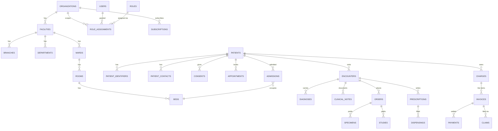

# DATABASE.md — Swasthya Database Design

> **Status:** Working baseline · **Owner:** Principal Architect (data model ratified with the team)
> **Version:** 1.0
> **Document chain:** `PRODUCT_REQUIREMENTS.md` (what) → `MASTER_RULES.md` (how) → `ARCHITECTURE.md` (shape) → **this document** (the data model the shape holds).
>
> **Scope:** conceptual and logical design. SQL DDL and migrations are **explicitly out of scope** here — this document is the design contract from which migrations are written (`MASTER_RULES.md` §30). No sample/fake hospital data is included; seeding happens only through factories in test environments.

---

## 0. Design Conventions (cross-cutting decisions)

These conventions apply to **every entity** in Section 3. Per-entity sections only state deviations.

### 0.1 Naming

- Tables: `snake_case`, plural where the table holds many rows per parent (`patients`, `appointments`, `role_assignments`).
- Columns: `snake_case`. IDs are plain `id` (UUID); tenant key is always `tenant_id`; foreign keys are `<entity>_id`.
- Boolean columns: `is_*` / `has_*`. Timestamps: `*_at`. Counts: `*_count`. Money: `*_minor` with a sibling `currency` (0.4).
- Constraint names follow the convention `pk_<table>`, `fk_<table>_<target>`, `uq_<table>_<cols>`, `chk_<table>_<col>`.

### 0.2 UUID strategy

- **All primary keys are UUIDs, generated as UUIDv7** (time-ordered). Rationale: UUIDv7 is globally unique *and* roughly insertion-ordered, so index leaf splits and page-cache churn stay low on high-volume tables — better than UUIDv4 for tables like `audit_events` and `notifications` without giving up non-enumerability.
- IDs are generated by the application at insert time (never by the DB sequence); no sequences, no `bigserial`.
- Foreign keys are UUIDs of the same type; every FK is `uuid` and indexed (0.8).

### 0.3 Timestamps and timezone

- **All timestamps are `timestamptz`**, stored in UTC, rendered in the facility's configured timezone (`facilities.timezone`).
- Every mutable row carries `created_at timestamptz NOT NULL DEFAULT now()` and `updated_at timestamptz NOT NULL DEFAULT now()` (maintained by the ORM, not by triggers).
- `deleted_at timestamptz NULL` is the soft-delete marker where soft deletion applies (0.11).
- Clinical/financial timestamps record **facts** (when the event happened), not merely when the row was written — e.g., `dispensed_at`, `verified_at`, `collected_at` are first-class fields set by the workflow, distinct from `created_at`.

### 0.4 Money and currency

- **All monetary amounts are integers in minor units** (`bigint`, e.g., paisa) — never `float`, never `numeric` for amounts.
- **Currency is explicit and frozen at transaction time.** Transacted rows (`charges`, `invoice_lines`, `payments`, `refunds`, `deposits`) carry `currency char(3)` (ISO 4217) so a later tenant-config change can never silently re-denominate history.
- Catalog prices (`medications.price_minor`, `items.price_minor`) are current-value and editable; the *transacted* value is snapshotted onto charge/invoice lines when the charge is created.
- Percentages (tax, discounts) are stored as **basis points** (`integer`, e.g., `1300` = 13%) or as explicit integers — never floats.
- The tenant's default currency lives in `organizations.currency`; it is a default for new records, never a source of truth for existing money.

### 0.5 Enum and status strategy

- **Business statuses and types are `text` columns with CHECK constraints** — not native PostgreSQL enums. Rationale: CHECK constraints are trivially evolvable (additive values via migration), introspectable, and don't carry the ALTER TYPE weight of native enums. Native enums are reserved for genuinely frozen technical values only (there are none required today).
- Allowed values are defined in exactly one place in application code (a per-domain `Status`/`Type` class) and mirrored in the CHECK constraint; the code constant is the source of truth, the CHECK is the guard.
- **Status transitions are state machines, not free-form updates**: a status service validates allowed transitions, writes the audit event, and is the only writer of `status`. Direct SQL status changes are prohibited.
- Values are additive only; removing a value requires data review and a migration.

### 0.6 Audit fields

Every mutable business entity carries: `created_by uuid NULL`, `updated_by uuid NULL` (reference `users`), `created_at`, `updated_at`. These are **attribution columns**; they are *not* the audit trail. The append-only trail is `audit_events` (Section 3.36), and per-entity audit requirements are listed per entity.

`created_by`/`updated_by` are nullable because system and job actors exist (system jobs record `created_by = NULL` with the actor captured in the audit event).

### 0.7 Optimistic locking and concurrency

- Mutable core entities (patients, encounters, prescriptions, invoices, stock balances, beds, schedule templates) carry `lock_version bigint NOT NULL DEFAULT 0`; updates use `WHERE id = ? AND lock_version = ?` and increment the version. Optimistic-lock conflicts surface as retryable API errors, never silent overwrites.
- **Pessimistic row locks** (`SELECT … FOR UPDATE`) protect the short, correctness-critical write races: stock decrement on dispensing, bed assignment, token issuance, slot booking. These are the *authoritative* serialization points (per `ARCHITECTURE.md` §13).
- Advisory locks (`pg_advisory_xact_lock`) are reserved for rare global operations (partition maintenance, idempotent long jobs).
- **Transactions**: every multi-step business operation is one DB transaction; the RLS tenant context is set with `SET LOCAL` inside that transaction (Section 1.5). No business code commits partial operations.

### 0.8 Indexing

- **Every FK is indexed.** Composite FKs (`(tenant_id, <parent_id>)`) are indexed as leading-`tenant_id` composites where the query pattern benefits.
- Hot lookups lead with `tenant_id`: `(tenant_id, <search key>)`.
- **Partial indexes** on soft-deleted tables: `… WHERE deleted_at IS NULL`.
- **Unique partial indexes** implement soft-delete-aware uniqueness (e.g., active MRN, active role assignment).
- Text search: `pg_trgm` GIN on name columns for patient/staff/item search; expression index on `lower(name)`.
- JSONB: GIN index only where the JSONB is actually filtered on; otherwise JSONB is a payload column.
- High-volume append-only tables use `BRIN` on the partitioning column instead of B-tree where the scan pattern is time-range (Section 0.13).
- Index bloat and unused-index reviews are scheduled maintenance, not an afterthought (`MASTER_RULES.md` §26).

### 0.9 Foreign keys and tenant-safe FKs

- Foreign keys are **enforced**; `ON DELETE RESTRICT` is the default for anything clinical or financial (history is never cascade-deleted).
- **Tenant-safe composite FK pattern:** child tables of tenant-scoped parents reference them as `FOREIGN KEY (tenant_id, parent_id) REFERENCES parent(tenant_id, id)`. This makes a cross-tenant reference **structurally impossible** — a row in tenant A can never point at a row in tenant B even if application code is buggy.
- Tenant-scoped tables reference **platform-global** catalogs (roles, permissions, plans) with plain `id` FKs; those catalogs are read-only to tenants and never carry tenant data.
- Polymorphic references are avoided: where a row may reference several kinds of parents (e.g., charges), the entity uses **typed nullable FKs** (one column per possible parent) plus a `source_type` discriminator for reporting — never an unenforceable `(source_type, source_id)` pair.

### 0.10 Transactions

- Business operations = single transactions; the tenant GUC is set per transaction (1.5).
- **Idempotency:** the API layer persists an `idempotency_keys` table (tenant-scoped: `tenant_id`, `key`, `request_hash`, `resource_type`, `resource_id`, `responded_at`) before executing create/mutate requests on clinical/financial paths; a replay returns the stored outcome (per `MASTER_RULES.md` §12.4).
- Money movements and stock movements are always transactional with row locks (0.7); a failed dispense cannot lose stock or double-charge.

### 0.11 Soft deletion

- **Rule:** anything auditable is soft-deleted (`deleted_at`) or never deleted; hard `DELETE` is prohibited for clinical, financial, identity, and audit data.
- Soft delete is a **status transition**, not a data trick: the delete is audited (who, why), and hard-deleting the `deleted_at` marker is impossible through the app.
- Tables with active-scope uniqueness use partial unique indexes on `deleted_at IS NULL` so a soft-deleted row does not block reuse of a key (e.g., MRN reuse after purge — per `PRODUCT_REQUIREMENTS.md` MRN rules).
- Retention-based purge (Section 4) is the *only* hard-delete path, and it is a scheduled, reviewed, audited job.

### 0.12 Data retention and archival

- Every entity carries a **retention class** (Section 4): clinical, financial, identity, operational, audit, notification. Retention periods are policy-driven and tenant-configurable within documented legal minimums — this document defines the classes and rules, not invented day-counts.
- **Archival:** partitioned tables are archived by detaching read-only partitions to an archive schema or cold object storage (parquet); archived data remains restorable and audit-integrity-preserving.
- Purge after retention expiry runs through a scheduled, tested, audited job — never ad hoc SQL.

### 0.13 Partitioning strategy

- **RANGE partitioning on time** (monthly/quarterly, by `created_at` or the domain timestamp) is the design-time default for the known high-volume, append-heavy tables: `audit_events`, `notifications`, `delivery_attempts`, `vital_observations` (high-frequency), `device_readings` (RPM, Phase 3), `idempotency_keys` (expiry-based), `integration_events`.
- Partition maintenance (create/detach/drop) is a scheduled job with advisory locking; queries always filter on the partitioning column where possible (BRIN-friendly scans).
- Hash partitioning is reserved for future tenant-count-driven scale decisions (`ARCHITECTURE.md` §26, stage 5) — not implemented preemptively.

### 0.14 Backup strategy

- Automated PostgreSQL backups + WAL archiving (PITR), multi-AZ standby, encrypted backup storage, cross-region copy, quarterly restore drills verified against RLS integrity (`ARCHITECTURE.md` §25; `MASTER_RULES.md` §22–23). Audit partitions are included in backups with the same rigor as clinical data.

---

## 1. Tenant Strategy

### 1.1 The rule — does `tenant_id` exist on an entity?

**Rule: every table whose rows are owned by, or meaningful only to, a single tenant carries `tenant_id uuid NOT NULL REFERENCES organizations(id)`. The only exceptions are platform-global catalogs and the tenant root itself.**

| Class | Examples | `tenant_id` |
|---|---|---|
| **Tenant-scoped** (the vast majority) | facilities, branches, patients, encounters, charges, stock, consents, subscriptions | `NOT NULL` — RLS-enforced |
| **Tenant root** | organizations | No — it *is* the tenant |
| **Platform-global, read-only to tenants** | roles, permissions, plans, drug-interaction knowledge base, coding systems | No — shared catalog, never writable by tenants |
| **Global identity** | users (authentication accounts) | No — one account may span tenants; tenancy is expressed via `role_assignments` |

### 1.2 Why `tenant_id` on entities (not "one column for everything, or none")

1. **RLS requires the key on the row.** PostgreSQL row-level security enforces `tenant_id = current_setting('app.tenant_id')`. If a row has no tenant key, the database cannot isolate it, and isolation becomes "we hope the app filters correctly" — which is exactly the failure mode `MASTER_RULES.md` §4.3 forbids.
2. **It makes cross-tenant references structurally impossible.** With the composite `(tenant_id, parent_id)` FK pattern (0.9), a buggy query cannot create a child row in tenant A pointing at a parent in tenant B.
3. **It makes queries, indexes, and partitions tenant-aware by construction.** Every hot index leads with `tenant_id`; every high-volume table can be reasoned about per tenant.
4. **Operationally it is indispensable:** support queries, incident response, metering, and offboarding all need "everything for this tenant" to be a mechanical filter.
5. **Missing `tenant_id` is therefore a review-time design error** — the same class as a missing FK — caught before code, not in production.

### 1.3 Why users are global (the deliberate exception)

An account is a person's identity, not a tenant's record: staff can work at two organizations, platform staff span all tenants, and a patient's portal account must survive moving between hospitals. Making `users` global and expressing tenancy through `role_assignments` (user × role × tenant × scope) keeps one credential per person and keeps tenant boundaries in *assignment* tables, where RLS applies. `users` rows are protected by application-layer controls and column encryption, not by RLS.

### 1.4 Facility/branch scoping

`tenant_id` is the **RLS isolation boundary**. `facility_id` / `branch_id` are **domain scoping** columns on records that are facility/branch-local (appointments, encounters, beds, stock balances, schedule templates), enforced by application policies (`MASTER_RULES.md` §8) because staff legitimately span facilities within a tenant. RLS stays at tenant level; facility/branch is a policy concern, not a database hard boundary.

### 1.5 RLS mechanics

- Every tenant-scoped table: `ALTER TABLE … ENABLE ROW LEVEL SECURITY` **and `FORCE ROW LEVEL SECURITY`** (so even the table owner is subject to policies).
- The application connects as a dedicated `swasthya_app` role — **non-owner, non-superuser, no BYPASSRLS** — so RLS cannot be bypassed by privilege.
- Policies: `USING (tenant_id = current_setting('app.tenant_id')::uuid)` and the matching `WITH CHECK` for writes.
- The middleware sets `SET LOCAL app.tenant_id = '<validated-uuid>'` at transaction start, from the authenticated principal only (never client input) — see `ARCHITECTURE.md` §8.3. PgBouncer runs in **session mode** because `SET LOCAL` is transaction-scoped (`ARCHITECTURE.md` §8.5).
- The cross-tenant leakage test suite is a mandatory CI gate (`MASTER_RULES.md` §16.4).

### 1.6 Escalation path

Schema-per-tenant remains the documented escalation for enterprise/compliance demands (`ARCHITECTURE.md` §28.7). This is why all queries and FK patterns route tenancy through the central context — escalation must not require rewriting business code. The design here is the single-database + RLS default.

---

## 2. Conceptual Model

### 2.1 Domain map

- **Identity & organization:** organizations → facilities → branches → departments; users ↔ role_assignments ↔ roles/permissions; staff.
- **Patient:** patients → identifiers, contacts, insurance policies, consents, documents.
- **Front desk:** appointments ↔ schedules; queues/tokens (operational, high-churn — see 3.15).
- **Clinical:** encounters → diagnoses, clinical notes, orders, prescriptions; admissions (IPD) → wards/rooms/beds → nursing.
- **Services:** orders → lab (specimens/results), radiology (studies/reports); prescriptions → pharmacy dispensings.
- **Supply chain:** items/stores/stock → procurement (vendors, POs, GRNs).
- **Finance:** charges → invoices → payments/deposits/refunds; insurance claims.
- **Platform:** audit_events, notifications, documents, consents, subscriptions/entitlements, integrations.

### 2.2 Core entity-relationship spine

### 2.3 Cardinality narrative

- One organization owns many facilities; one facility has many branches and departments; wards belong to a facility, rooms to a ward, beds to a room.
- A patient belongs to exactly one tenant; an encounter belongs to one patient; diagnoses/notes/orders/prescriptions attach to an encounter (or admission).
- One order yields one or more specimens (lab) or studies (radiology); one prescription has many lines; a line is dispensed through dispensings referencing stock batches.
- Charges reference their source (encounter/admission/order/prescription); invoices group charges; payments allocate across invoices; claims are built from invoice lines.
- Every auditable action writes one `audit_event`; notifications fan out to `delivery_attempts`.

---

## 3. Logical Model

> Per-entity spec. Conventions from Section 0 apply unless stated. "Tenant ownership" states the rule from Section 1.

### 3.1 organizations

| Aspect | Design |
|---|---|
| **Purpose** | The tenant: a hospital group or company that subscribes to the platform. Root of tenancy and of org-level configuration. |
| **Primary key** | `id uuid` (UUIDv7) |
| **Tenant ownership** | The tenant root — no `tenant_id`; RLS-exempt (it is the tenant). |
| **Important fields** | `name text`, `code varchar(50)`, `status text` (active, suspended, closed, offboarded), `currency char(3)`, `timezone text`, `locale text`, `tax_config jsonb` (basis points per tax type), `settings jsonb`, `created_at`, `updated_at` |
| **Relationships** | 1–N `facilities`, `subscriptions`, `role_assignments`, `consents` (via patients), `audit_events` |
| **Indexes** | `uq_organizations_code`; partial index on `status` for active tenants |
| **Uniqueness** | `code` unique (organization slug) |
| **Audit** | Lifecycle changes (activate/suspend/offboard), settings/tax changes, onboarding events |
| **Soft deletion** | No — a tenant is never deleted; `status = offboarded` and data purged per policy |
| **Retention** | Identity class: kept for the documented legal/contract period, then purge per offboarding policy (Section 4) |

### 3.2 facilities

| Aspect | Design |
|---|---|
| **Purpose** | A hospital within an organization; the level where most configuration (departments, wards, catalogs) hangs. |
| **Primary key** | `id uuid` |
| **Tenant ownership** | Tenant-scoped: `tenant_id uuid NOT NULL` (composite FK with all children). |
| **Important fields** | `tenant_id`, `name text`, `code varchar(50)`, `status text` (active, inactive), `timezone text`, `address jsonb`, `settings jsonb` |
| **Relationships** | N–1 `organizations`; 1–N `branches`, `departments`, `wards`, `appointments`, `stock_balances`, `medications` |
| **Indexes** | `(tenant_id)`; unique `(tenant_id, code)` |
| **Uniqueness** | `(tenant_id, code)` unique |
| **Audit** | Creation, status change, settings changes |
| **Soft deletion** | Yes (`deleted_at`) — with active-scope partial unique index so a closed facility's code can be reused deliberately |
| **Retention** | Identity class |

### 3.3 branches

| Aspect | Design |
|---|---|
| **Purpose** | A unit/site within a facility (e.g., a clinic wing or satellite unit); the operational scope for queues, stock, and staff rosters. |
| **Primary key** | `id uuid` |
| **Tenant ownership** | Tenant-scoped: `tenant_id NOT NULL`; also `facility_id NOT NULL` (tenant-safe composite FK). |
| **Important fields** | `tenant_id`, `facility_id`, `name text`, `code varchar(50)`, `status text`, `address jsonb` |
| **Relationships** | N–1 `facilities`; 1–N `appointments`, `stock_balances`, `role_assignments` (scope) |
| **Indexes** | `(tenant_id, facility_id)`; unique `(tenant_id, facility_id, code)` |
| **Uniqueness** | `(tenant_id, facility_id, code)` unique |
| **Audit** | Lifecycle and configuration changes |
| **Soft deletion** | Yes |
| **Retention** | Identity class |

### 3.4 users

| Aspect | Design |
|---|---|
| **Purpose** | The authentication account for any human actor: staff, org admins, platform staff, patients (portal). Global identity, one credential per person. |
| **Primary key** | `id uuid` |
| **Tenant ownership** | **Global** — no `tenant_id` (Section 1.3). Tenancy is expressed via `role_assignments`; patient linkage via `patients.user_id`. RLS-exempt; protected by application controls. |
| **Important fields** | `email citext` (or lower-indexed `varchar`), `password_hash text` (argon2id), `status text` (pending, active, locked, disabled), `mfa_secret_encrypted text`, `mfa_recovery_codes_encrypted jsonb`, `last_login_at timestamptz`, `password_changed_at`, `created_at`, `updated_at` |
| **Relationships** | 1–N `role_assignments`; 0–1 `patients`; 0–1 `staff` (per tenant); 1–N `notifications`, `audit_events` (actor) |
| **Indexes** | Unique `(lower(email))`; `status` |
| **Uniqueness** | `email` unique (case-insensitive) |
| **Audit** | Every auth event (login, failure, lockout, token issue/revoke, password change, MFA change) — per `MASTER_RULES.md` §7.5 |
| **Soft deletion** | Yes (`deleted_at`) — a disabled account is a status, a merged account is soft-deleted with history preserved |
| **Retention** | Identity class; credential data encrypted at rest; account retained while any tenant relationship or legal obligation requires it |

### 3.5 roles

| Aspect | Design |
|---|---|
| **Purpose** | Platform-global role definitions (superadmin, org admin, doctor, nurse, pharmacist, …) that tenants assign. Seeded, not user-creatable per tenant. |
| **Primary key** | `id uuid` |
| **Tenant ownership** | **Platform-global** — no `tenant_id`; read-only to tenants. |
| **Important fields** | `code varchar(100)`, `name text`, `scope_type text` (platform, organization, facility, branch), `description text`, `is_system boolean`, `created_at`, `updated_at` |
| **Relationships** | 1–N `role_assignments`; N–N `permissions` (via `role_permissions`) |
| **Indexes** | Unique `code` |
| **Uniqueness** | `code` unique |
| **Audit** | Role definition changes are platform-administration events (versioned; rolled out like code) |
| **Soft deletion** | No — roles are versioned/retired, never deleted; retiring is a status change audited with affected assignments reviewed |
| **Retention** | Platform catalog — kept with version history (assignment history must remain interpretable) |

### 3.6 permissions

| Aspect | Design |
|---|---|
| **Purpose** | Platform-global permission catalog, namespaced `domain:action` (e.g., `pharmacy:dispense`, `finance:void`). |
| **Primary key** | `id uuid` |
| **Tenant ownership** | **Platform-global** — no `tenant_id`. |
| **Important fields** | `code varchar(100)`, `domain text`, `description text`, `is_system boolean` |
| **Relationships** | N–N `roles` (via `role_permissions`) |
| **Indexes** | Unique `code`; `(domain)` |
| **Uniqueness** | `code` unique |
| **Audit** | Catalog changes are platform events; permission-to-role grants audited (who granted what) |
| **Soft deletion** | No — permissions are additive; a removed permission is a migration-reviewed retirement |
| **Retention** | Platform catalog — kept (historical grants must remain interpretable) |

### 3.7 role_assignments (user-role assignments)

| Aspect | Design |
|---|---|
| **Purpose** | The tenancy-and-authorization join: which user holds which role in which tenant (and optionally which facility/branch scope). This is *also* the user's membership record (Section 1.3). |
| **Primary key** | `id uuid` |
| **Tenant ownership** | Tenant-scoped: `tenant_id NOT NULL` (nullable only for platform-scope assignments, where `tenant_id IS NULL` and `scope_type = platform`). |
| **Important fields** | `user_id uuid NOT NULL`, `role_id uuid NOT NULL`, `tenant_id uuid NULL`, `facility_id uuid NULL`, `branch_id uuid NULL`, `scope_type text`, `status text` (active, revoked), `granted_by uuid`, `granted_at timestamptz`, `revoked_by uuid`, `revoked_at timestamptz`, `created_at` |
| **Relationships** | N–1 `users`, N–1 `roles`, N–1 `organizations` (nullable); optional N–1 `facilities`/`branches` (tenant-safe FKs) |
| **Indexes** | `(user_id, status)`; `(tenant_id, role_id)`; unique partial `(user_id, role_id, tenant_id, facility_id, branch_id) WHERE status = 'active'` |
| **Uniqueness** | One active assignment per (user, role, scope); revoke-and-regrant creates a new row (history preserved) |
| **Audit** | Grant and revoke (who, what, scope, when) — the highest-value authorization audit |
| **Soft deletion** | No — revoked rows persist as history; status is the lifecycle |
| **Retention** | Identity class; assignment history retained for auditability of the authorization matrix |

### 3.8 departments

| Aspect | Design |
|---|---|
| **Purpose** | Organizational structure within a facility (OPD, surgery, pharmacy, HR…), used by staff, inventory, and reporting. |
| **Primary key** | `id uuid` |
| **Tenant ownership** | Tenant-scoped: `tenant_id NOT NULL`, `facility_id NOT NULL`. |
| **Important fields** | `tenant_id`, `facility_id`, `name text`, `code varchar(50)`, `status text`, `parent_department_id uuid NULL` (hierarchy) |
| **Relationships** | N–1 `facilities`; self-referencing hierarchy; 1–N `staff`, `items` (owning department) |
| **Indexes** | `(tenant_id, facility_id)`; unique `(tenant_id, facility_id, code)` |
| **Uniqueness** | `(tenant_id, facility_id, code)` unique |
| **Audit** | Creation, hierarchy changes, status changes |
| **Soft deletion** | Yes (active-scope partial unique on code) |
| **Retention** | Identity class |

### 3.9 locations

| Aspect | Design |
|---|---|
| **Purpose** | Generic physical places that are not clinical bed spaces: waiting areas, stores, nursing stations, procedure areas. Used by inventory placement and asset tracking. |
| **Primary key** | `id uuid` |
| **Tenant ownership** | Tenant-scoped: `tenant_id NOT NULL`, `facility_id NOT NULL`, `branch_id NULL`. |
| **Important fields** | `tenant_id`, `facility_id`, `branch_id`, `name text`, `code varchar(50)`, `type text` (store, waiting_area, nursing_station, procedure_area, other), `status text` |
| **Relationships** | N–1 `facilities`; 1–N `stock_balances` (store location), `assets` |
| **Indexes** | `(tenant_id, facility_id)`; unique `(tenant_id, facility_id, code)` |
| **Uniqueness** | `(tenant_id, facility_id, code)` unique |
| **Audit** | Lifecycle and type changes |
| **Soft deletion** | Yes |
| **Retention** | Identity class |

### 3.10 staff

| Aspect | Design |
|---|---|
| **Purpose** | Employment/clinical identity within a tenant: who the person is to the hospital (department, designation, licenses), distinct from the global login account. |
| **Primary key** | `id uuid` |
| **Tenant ownership** | Tenant-scoped: `tenant_id NOT NULL`, `facility_id NOT NULL`. |
| **Important fields** | `tenant_id`, `facility_id`, `department_id`, `user_id uuid NULL` (0–1 per tenant), `employee_code varchar(50)`, `full_name text`, `designation text`, `license_number_encrypted text`, `status text` (active, on_leave, departed), `hire_date date`, `settings jsonb` |
| **Relationships** | N–1 `users` (nullable); N–1 `departments`; 1–N `appointments` (provider), `encounters` (provider), `dispensings`, `role_assignments` |
| **Indexes** | `(tenant_id, facility_id)`; unique `(tenant_id, employee_code)`; unique partial `(tenant_id, user_id) WHERE status <> 'departed'` |
| **Uniqueness** | `employee_code` unique per tenant; at most one active staff record per user per tenant |
| **Audit** | Employment lifecycle (hire, department change, leave, departure), license changes; staff personal data is sensitive and access-controlled |
| **Soft deletion** | No — departure is a status; history must persist (clinical records reference the clinician) |
| **Retention** | Identity class; staff data retained while clinical history references the person, then per policy |

### 3.11 patients

| Aspect | Design |
|---|---|
| **Purpose** | The master patient record — the platform's most safety-critical entity. Registered once, identified reliably, referenced by every module. |
| **Primary key** | `id uuid` |
| **Tenant ownership** | Tenant-scoped: `tenant_id NOT NULL`, `facility_id NOT NULL` (registering facility). |
| **Important fields** | `tenant_id`, `facility_id`, `mrn varchar(50)`, `user_id uuid NULL` (portal account), `full_name text`, `date_of_birth date`, `sex text` (configurable values), `blood_group text NULL`, `photo_key text NULL`, `status text` (active, merged, archived), `merge_into_patient_id uuid NULL`, `consent_summary jsonb`, `lock_version bigint`, `created_by`, `created_at`, `updated_at` |
| **Relationships** | 0–1 `users`; 1–N `patient_identifiers`, `patient_contacts`, `consents`, `appointments`, `encounters`, `admissions`, `charges`, `documents` |
| **Indexes** | Unique `(tenant_id, mrn)`; `(tenant_id, lower(full_name))` with `pg_trgm` GIN; `(tenant_id, date_of_birth)`; partial `(tenant_id, mrn) WHERE deleted_at IS NULL`; unique partial `(tenant_id, user_id) WHERE user_id IS NOT NULL AND status <> 'merged'` |
| **Uniqueness** | MRN unique per tenant; one portal user per patient; merge is the only identity-resolution path (never two live records for one person) |
| **Audit** | Every create/update, every **read by staff**, merges (who, why, source/target), identifier changes — per `PRODUCT_REQUIREMENTS.md` §6.1 |
| **Soft deletion** | No hard delete. Merged patients are `status = merged` with pointer to the survivor; all history follows the merge with full audit |
| **Retention** | Clinical class (longest); purged only per retention law after documented review — never casually |

### 3.12 patient_identifiers

| Aspect | Design |
|---|---|
| **Purpose** | Additional identity documents for one patient: national ID (e.g., NPRN where applicable), passport, driving license, other. Supports deduplication and consent-based national linkage. |
| **Primary key** | `id uuid` |
| **Tenant ownership** | Tenant-scoped: `tenant_id NOT NULL`. |
| **Important fields** | `tenant_id`, `patient_id uuid NOT NULL`, `type text` (national_id, passport, license, other), `value_encrypted text` (pgcrypto), `issuing_country text NULL`, `is_verified boolean`, `verified_by uuid NULL`, `verified_at timestamptz NULL`, `status text` (active, superseded) |
| **Relationships** | N–1 `patients` (tenant-safe composite FK) |
| **Indexes** | `(tenant_id, patient_id)`; partial unique `(tenant_id, type, hash(value_encrypted)) WHERE status = 'active'` for duplicate detection |
| **Uniqueness** | One active identifier per (patient, type); duplicate *detection* uses a deterministic hash column — duplicates are merge candidates, never silent |
| **Audit** | Add/verify/supersede events; reads are sensitive (identity data) |
| **Soft deletion** | No — superseded by status; identifiers underpin deduplication history |
| **Retention** | Identity class; encrypted at rest; national IDs held only with consent and purpose limitation (`MASTER_RULES.md` §10.6) |

### 3.13 patient_contacts

| Aspect | Design |
|---|---|
| **Purpose** | Contact and next-of-kin details for one patient: phone, email, address, emergency contacts. |
| **Primary key** | `id uuid` |
| **Tenant ownership** | Tenant-scoped: `tenant_id NOT NULL`. |
| **Important fields** | `tenant_id`, `patient_id uuid NOT NULL`, `type text` (phone, email, address, emergency_contact), `value text` (phone/email) or `address jsonb`, `is_primary boolean`, `contact_person jsonb NULL` (for emergency contacts: name, relation), `valid_from`, `valid_to timestamptz NULL`, `status text` (active, superseded) |
| **Relationships** | N–1 `patients` |
| **Indexes** | `(tenant_id, patient_id, type)`; partial unique `(tenant_id, patient_id, type) WHERE is_primary AND status = 'active'` |
| **Uniqueness** | One active primary per (patient, type); history preserved as superseded rows |
| **Audit** | Create/update/supersede (versioning); notification preferences tied here |
| **Soft deletion** | No — supersede, don't delete (contact history matters for care continuity) |
| **Retention** | Identity class |

### 3.14 insurance_policies (patient insurance)

| Aspect | Design |
|---|---|
| **Purpose** | A patient's coverage under a payer's policy/product: validity, benefits, and approval linkage used at charge time. |
| **Primary key** | `id uuid` |
| **Tenant ownership** | Tenant-scoped: `tenant_id NOT NULL`. |
| **Important fields** | `tenant_id`, `patient_id uuid NOT NULL`, `payer_id uuid NOT NULL` (from `payers` master), `policy_number varchar(100)`, `coverage_type text`, `valid_from date`, `valid_to date NULL`, `benefits jsonb` (limits/caps), `status text` (active, expired, cancelled), `lock_version bigint` |
| **Relationships** | N–1 `patients`; N–1 `payers` (tenant master); 1–N `claims` |
| **Indexes** | `(tenant_id, patient_id, status)`; partial unique `(tenant_id, payer_id, policy_number) WHERE status = 'active'` |
| **Uniqueness** | Policy number unique per payer; one active policy per (patient, payer) where the product requires it |
| **Audit** | Policy add/change/cancel; benefit-limit changes; coverage checks at charge time |
| **Soft deletion** | No — supersede by status (claims reference coverage at claim time) |
| **Retention** | Financial class |

### 3.15 appointments

> **Implemented with Phase 6/7.** Booking validates against derived availability (SlotService) and races on the partial unique index on live statuses — the row-lock double-booking guard. Check-in issues `token_no` from the per-(tenant, facility, provider, date) row-locked counter in `token_counters` (not in this section's table list; the counter is operational, not a domain entity — see the token queue note below). Status transitions (booked → checked_in → in_consultation → completed; cancelled/no_show) are validated and audited; cancellation always captures a reason.

| Aspect | Design |
|---|---|
| **Purpose** | The booking itself: patient × provider × schedule occurrence × slot. Backs queues, tokens, check-in, cancellation, rescheduling. |
| **Primary key** | `id uuid` |
| **Tenant ownership** | Tenant-scoped: `tenant_id NOT NULL`, `facility_id NOT NULL`, `branch_id NULL`. |
| **Important fields** | `tenant_id`, `facility_id`, `branch_id`, `patient_id uuid NOT NULL`, `provider_staff_id uuid NOT NULL`, `schedule_occurrence_id uuid NOT NULL`, `appointment_type text` (opd, follow_up, procedure, teleconsult), `starts_at timestamptz NOT NULL`, `ends_at timestamptz NOT NULL`, `status text` (booked, checked_in, in_consultation, completed, cancelled, no_show), `cancel_reason text NULL`, `token_no int NULL`, `queue_id uuid NULL`, `source text` (counter, portal, walk_in), `lock_version bigint`, `idempotency_key_id uuid NULL` |
| **Relationships** | N–1 `patients`; N–1 `staff` (provider); N–1 schedule occurrences; 1–0..1 `encounters` (converted visit) |
| **Indexes** | `(tenant_id, provider_staff_id, starts_at)`; `(tenant_id, patient_id, starts_at)`; `(tenant_id, facility_id, status, starts_at)`; unique partial `(tenant_id, schedule_occurrence_id, starts_at) WHERE status IN ('booked','checked_in','in_consultation')` — slot double-booking guard |
| **Uniqueness** | One live booking per slot; token sequence uniqueness handled by the queue (row-locked issuance) |
| **Audit** | Book/check-in/complete/cancel/no-show/reschedule (who, when, reason); token priority overrides |
| **Soft deletion** | No — status transitions only; a cancelled appointment is history, not a deleted row |
| **Retention** | Clinical class (appointments are part of the care record) |

### 3.16 schedules

> **Implemented with Phase 6.** `schedule_templates` + `schedule_exceptions` exist exactly as designed; availability slots are DERIVED by SlotService (templates minus exceptions minus live bookings) and exposed at `GET /staff/{staff}/availability?date=` — never stored, so they cannot go stale.

| Aspect | Design |
|---|---|
| **Purpose** | Doctor availability as recurring templates plus exceptions; availability *slots* are derived, never stored. Two tables. |
| **Primary key** | `schedule_templates.id uuid`; `schedule_exceptions.id uuid` |
| **Tenant ownership** | Tenant-scoped: `tenant_id NOT NULL`, `facility_id NOT NULL`. |
| **Important fields** | Templates: `tenant_id`, `facility_id`, `staff_id uuid NOT NULL`, `service_id uuid NULL`, `day_of_week int`, `starts_at time`, `ends_at time`, `slot_minutes int`, `capacity int`, `valid_from date`, `valid_to date NULL`, `status text`. Exceptions: `template_id uuid NULL` or `staff_id`, `exception_date date`, `reason text` (leave, holiday, block), `status text` |
| **Relationships** | N–1 `staff`; 1–N `appointments` (via derived occurrences) |
| **Indexes** | `(tenant_id, staff_id, day_of_week)`; unique `(tenant_id, staff_id, day_of_week, starts_at, valid_from)`; exceptions: unique `(tenant_id, staff_id, exception_date)` |
| **Uniqueness** | One template per (staff, weekday, start, validity); one exception per (staff, date) |
| **Audit** | Template and exception changes (schedule integrity is booking truth) |
| **Soft deletion** | Yes (templates); exceptions are date-scoped rows that expire naturally |
| **Retention** | Operational class; templates retained while referenced by bookings, then archival |

### 3.17 encounters

> **Implemented with Phase 7 + Phase 3 slice 4.** Started from a checked-in appointment (`POST /appointments/{appointment}/start-encounter`); one encounter per appointment (partial unique). Status lifecycle: open → signed → closed (discharge, `POST /encounters/{encounter}/discharge`). Signed encounters are immutable — clinical content cannot be added after signing (amendment is a later phase). Only the encounter's provider (via their staff profile) can document, sign, or discharge.

| Aspect | Design |
|---|---|
| **Purpose** | The clinical visit container: OPD, ER, teleconsult, or linked to an admission. The spine of the clinical record. |
| **Primary key** | `id uuid` |
| **Tenant ownership** | Tenant-scoped: `tenant_id NOT NULL`, `facility_id NOT NULL`, `branch_id NULL`. |
| **Important fields** | `tenant_id`, `facility_id`, `branch_id`, `patient_id uuid NOT NULL`, `admission_id uuid NULL`, `appointment_id uuid NULL`, `type text` (opd, ipd, er, teleconsult), `status text` (open, in_progress, signed, amended, closed), `provider_staff_id uuid NOT NULL`, `started_at timestamptz`, `ended_at timestamptz NULL`, `signed_by uuid NULL`, `signed_at timestamptz NULL`, `disposition text NULL` (home, admitted, referred, deceased), `discharge_summary text NULL`, `discharged_by uuid NULL`, `discharged_at timestamptz NULL`, `lock_version bigint` |
| **Discharge** | `signed → closed` via CAS on `(status, lock_version)`; only the encounter provider (gate `encounter:sign`); audited `encounter.discharged` (disposition + ids, never the summary text) |
| **Relationships** | N–1 `patients`; 0–1 `admissions`; 0–1 `appointments`; 1–N `diagnoses`, `clinical_notes`, `orders`, `prescriptions`, `charges` |
| **Indexes** | `(tenant_id, patient_id, started_at)`; `(tenant_id, provider_staff_id, started_at)`; `(tenant_id, facility_id, status)`; unique `(tenant_id, appointment_id) WHERE appointment_id IS NOT NULL` |
| **Uniqueness** | One encounter per appointment (where appointment-driven); encounter numbers unique per tenant |
| **Audit** | Creation, **reads**, sign, amendment (amendments are new audited entries, never silent edits — per `PRODUCT_REQUIREMENTS.md` §6.4), closure |
| **Soft deletion** | No — signed records are immutable history; amendment is the only evolution path |
| **Retention** | Clinical class (longest) |

### 3.17a follow_ups

> **Implemented with Phase 3 slice 4.** A planned return visit or teleconsult linked to the encounter that generated it (`PRODUCT_REQUIREMENTS` §6.7). Lifecycle: planned → booked (linked to a real appointment of the same patient/facility) → completed, or cancelled with a reason. Every transition is a compare-and-swap on `(status, lock_version)`.

| Aspect | Design |
|---|---|
| **Purpose** | The follow-up plan: who to see, when, and why — the clinical hand-off from this visit to the next. |
| **Primary key** | `id uuid` |
| **Tenant ownership** | Tenant-scoped: `tenant_id NOT NULL`, `facility_id NOT NULL` (TENANT_FACILITY tier, RLS enabled + FORCED). |
| **Important fields** | `tenant_id`, `facility_id`, `patient_id uuid NOT NULL`, `encounter_id uuid NOT NULL`, `provider_staff_id uuid NOT NULL`, `follow_up_type text` (return_visit, teleconsult), `planned_at timestamptz NOT NULL`, `reason text NULL`, `booked_appointment_id uuid NULL`, `status text` (planned, booked, completed, cancelled), `cancel_reason text NULL`, `lock_version bigint`, `created_by/updated_by NULL` |
| **Relationships** | N–1 `patients`, `encounters`, `staff` (provider); 0–1 `appointments` (booked linkage, same patient/facility enforced) |
| **Indexes** | `(tenant_id, patient_id, planned_at)`; `(tenant_id, encounter_id)`; `(tenant_id, provider_staff_id, planned_at)`; `(tenant_id, facility_id, status, planned_at)`; `(tenant_id, id)` composite-FK unique |
| **Uniqueness** | None beyond PK — each plan is its own event |
| **Audit** | `follow_up.planned`, `.booked`, `.cancelled`, `.completed` — facts only (ids, type, plannedAt), never reason text or clinical content |
| **Soft deletion** | No — cancellation is a status with a reason, never a delete |
| **Retention** | Clinical class |

### 3.18 diagnoses

> **Implemented with Phase 7.** Typed (provisional/differential/final), coded where available (ICD-10 readiness), `is_primary`, status lifecycle (active → resolved/ruled_out in later phases).

| Aspect | Design |
|---|---|
| **Purpose** | Diagnosis records for an encounter/admission, coded where available (ICD readiness), typed (provisional, differential, final). |
| **Primary key** | `id uuid` |
| **Tenant ownership** | Tenant-scoped: `tenant_id NOT NULL`. |
| **Important fields** | `tenant_id`, `encounter_id uuid NOT NULL`, `admission_id uuid NULL`, `code varchar(20) NULL`, `coding_system text NULL` (icd10, snomed, custom), `description text`, `diagnosis_type text` (provisional, differential, final), `is_primary boolean`, `onset_date date NULL`, `status text` (active, resolved, ruled_out) |
| **Relationships** | N–1 `encounters`; N–1 `admissions` (nullable) |
| **Indexes** | `(tenant_id, encounter_id)`; `(tenant_id, code)` for analytics |
| **Uniqueness** | None beyond PK — a diagnosis is a fact, not a key |
| **Audit** | Add/change/resolve; diagnosis changes are clinical-record mutations |
| **Soft deletion** | No |
| **Retention** | Clinical class |

### 3.19 clinical_notes

> **Implemented with Phase 7.** Structured `content` jsonb sections; draft → signed (author-only); signed notes immutable; the self-referencing `parent_note_id` amendment chain is schema-ready but the amend flow ships later.

| Aspect | Design |
|---|---|
| **Purpose** | Structured clinical documentation: consultation notes, nursing notes, procedure notes, progress notes. Amendments are new, audited versions. |
| **Primary key** | `id uuid` |
| **Tenant ownership** | Tenant-scoped: `tenant_id NOT NULL`. |
| **Important fields** | `tenant_id`, `encounter_id uuid NULL`, `admission_id uuid NULL`, `note_type text` (consultation, nursing, procedure, progress, discharge, other), `author_staff_id uuid NOT NULL`, `content jsonb` (structured sections), `status text` (draft, signed, amended), `signed_at timestamptz NULL`, `parent_note_id uuid NULL` (amendment chain), `lock_version bigint` |
| **Relationships** | N–1 `encounters` (nullable) / `admissions` (nullable); self-referencing amendment chain |
| **Indexes** | `(tenant_id, encounter_id, created_at)`; `(tenant_id, admission_id, created_at)`; `(tenant_id, author_staff_id)` |
| **Uniqueness** | None beyond PK |
| **Audit** | Draft/sign/amend/read; the amendment chain is itself audited (who amended what, why) |
| **Soft deletion** | No — drafts may be discarded pre-sign; signed notes are immutable, amendments append |
| **Retention** | Clinical class |

### 3.20 orders

| Aspect | Design |
|---|---|
| **Purpose** | Generic clinical order (lab, radiology, procedure, blood, other) with priority, scheduling, and status; specialized data hangs off it (specimens, studies). |
| **Primary key** | `id uuid` |
| **Tenant ownership** | Tenant-scoped: `tenant_id NOT NULL`, `facility_id NOT NULL`. |
| **Important fields** | `tenant_id`, `facility_id`, `patient_id uuid NOT NULL`, `encounter_id uuid NULL`, `admission_id uuid NULL`, `type text` (lab, radiology, procedure, blood, other), `priority text` (routine, urgent, stat), `clinical_indication text`, `order_number varchar(50)`, `ordering_staff_id uuid NOT NULL`, `status text` (drafted, ordered, scheduled, in_progress, completed, cancelled), `ordered_at timestamptz`, `idempotency_key_id uuid NULL` |
| **Relationships** | N–1 `patients`; N–1 `encounters` (nullable); 1–0..N `specimens` (lab); 1–0..N `studies` (radiology); 1–N `charges` (source) |
| **Indexes** | Unique `(tenant_id, order_number)`; `(tenant_id, patient_id, ordered_at)`; `(tenant_id, status, priority)` |
| **Uniqueness** | `order_number` unique per tenant |
| **Audit** | Create/status change/cancel; stat orders and their fulfillment are audited with timestamps |
| **Soft deletion** | No — cancelled is a status with reason |
| **Retention** | Clinical class |

### 3.21 prescriptions (+ prescription_lines)

> **Implemented with Phase 7.** Header + lines in one atomic call; each line validates against the active formulary; line charges are derived at invoice time (medication price × quantity, minor units). Prescriptions are never deleted — discontinuation is a status.

| Aspect | Design |
|---|---|
| **Purpose** | The prescription header and its lines: what was prescribed, by whom, for whom, with dose/route/frequency — the source of dispensing and of interaction checks. |
| **Primary key** | `prescriptions.id uuid`; `prescription_lines.id uuid` |
| **Tenant ownership** | Tenant-scoped: `tenant_id NOT NULL`. |
| **Important fields** | Header: `tenant_id`, `patient_id uuid NOT NULL`, `encounter_id uuid NULL`, `admission_id uuid NULL`, `prescriber_staff_id uuid NOT NULL`, `status text` (drafted, active, dispensed, discontinued, expired), `notes text NULL`, `lock_version bigint`. Lines: `prescription_id uuid NOT NULL`, `medication_id uuid NOT NULL`, `dose text`, `route text`, `frequency text`, `duration text`, `quantity_minor bigint NULL`, `instructions text NULL`, `status text` (ordered, dispensed, cancelled), `line_no int` |
| **Relationships** | N–1 `patients`; N–1 `encounters`/`admissions`; 1–N `prescription_lines`; N–1 `medications`; 1–N `dispensings` (via lines) |
| **Indexes** | `(tenant_id, patient_id, created_at)`; `(tenant_id, prescriber_staff_id)`; lines: `(tenant_id, prescription_id)` |
| **Uniqueness** | None beyond PK; `line_no` unique per prescription |
| **Audit** | Prescribe/amend/discontinue; CDSS alerts shown at prescription time and any overrides (audit reconstructs alert context) |
| **Soft deletion** | No — discontinuation is a status; a prescription is clinical history |
| **Retention** | Clinical class |

### 3.22 medications (formulary)

> **Implemented with Phase 7.** The formulary CRUD exists (index/store); prices in integer minor units. Pharmacy stock, batches, and dispensing are later phases.

| Aspect | Design |
|---|---|
| **Purpose** | The tenant's medicine catalog (formulary): generic/brand, strength, form, pricing; the reference for prescribing and dispensing. |
| **Primary key** | `id uuid` |
| **Tenant ownership** | Tenant-scoped: `tenant_id NOT NULL`, `facility_id NOT NULL`. |
| **Important fields** | `tenant_id`, `facility_id`, `code varchar(50)`, `generic_name text`, `brand_name text NULL`, `strength text`, `form text` (tablet, syrup, injection…), `unit text`, `price_minor bigint`, `currency char(3)`, `is_controlled boolean`, `status text` (active, inactive), `interaction_eligible boolean` (CDSS linkage), `lock_version bigint` |
| **Relationships** | 1–N `prescription_lines`; 1–N `stock_batches` (via items linkage or direct batch association — pharmacy stock references the medicine); 1–N `dispensings` |
| **Indexes** | Unique `(tenant_id, facility_id, code)`; `pg_trgm` on `(generic_name, brand_name)` |
| **Uniqueness** | `(tenant_id, facility_id, code)` unique |
| **Audit** | Catalog changes, price changes (pricing is financial truth for charges) |
| **Soft deletion** | Yes (active-scope partial unique on code) — retired medicines stay referenced by history |
| **Retention** | Operational/clinical boundary: catalog rows retained while referenced by prescriptions |

### 3.23 admissions

> **Implemented with Phase 3 slice 6.** The inpatient stay: admission from an OPEN encounter claims a live AVAILABLE bed atomically (compare-and-swap on `beds (status, current_admission_id, lock_version)` — two clerks can never book the same bed; the partial unique `uq_beds_tenant_current_admission` is the DB backstop), and discharge writes a SIGNED discharge-summary clinical note (type `discharge`) that releases the bed (occupied → cleaning, never immediately reassignable). Every status transition is CAS-guarded (`status, lock_version`); one open admission per patient and per encounter is enforced by partial uniques. The tenant-safe composite FK `fk_beds_tenant_current_admission` (`beds` → `admissions` via `(tenant_id, id)`) was added with the table. Bed-day charging and transfers (`in_ward`, `transferred`) are later-phase billing/nursing work.

| Aspect | Design |
|---|---|
| **Purpose** | The inpatient stay: admission through discharge, with ward/bed placement, transfers, and the discharge summary. |
| **Primary key** | `id uuid` |
| **Tenant ownership** | Tenant-scoped: `tenant_id NOT NULL`, `facility_id NOT NULL`. |
| **Important fields** | `tenant_id`, `facility_id`, `patient_id uuid NOT NULL`, `encounter_id uuid NOT NULL` (the IPD encounter), `admission_number varchar(50)`, `admission_type text` (emergency, planned, transfer_in), `admitting_diagnosis text`, `admitted_at timestamptz`, `status text` (admitted, in_ward, transferred, discharged, cancelled), `discharged_at timestamptz NULL`, `discharge_type text NULL` (home, referral, transfer_out, against_advice), `discharge_summary_id uuid NULL`, `lock_version bigint` |
| **Relationships** | N–1 `patients`; 1–1 `encounters`; 1–0..N `clinical_notes`; 1–N `charges` (bed days); 0–1 `discharge_summary` (a clinical note of type discharge); bed placement via `beds.current_admission_id` |
| **Indexes** | Unique `(tenant_id, admission_number)`; partial uniques `(tenant_id, encounter_id)` and `(tenant_id, patient_id)` on the open statuses (admitted/in_ward/transferred); `(tenant_id, patient_id, admitted_at)`; `(tenant_id, status)`; `(tenant_id, id)` composite-FK unique |
| **Uniqueness** | `admission_number` unique per tenant; one open admission per patient and per encounter at a time (partial uniques on status open); one admission per occupied bed |
| **Audit** | Admission, every bed/ward transfer (who moved the patient, where, why), discharge, discharge-summary reads |
| **Soft deletion** | No |
| **Retention** | Clinical class |

### 3.24 wards

| Aspect | Design |
|---|---|
| **Purpose** | A clinical ward within a facility (general, surgery, pediatric, ICU…), grouping rooms and beds. |
| **Primary key** | `id uuid` |
| **Tenant ownership** | Tenant-scoped: `tenant_id NOT NULL`, `facility_id NOT NULL`. |
| **Important fields** | `tenant_id`, `facility_id`, `name text`, `code varchar(50)`, `ward_type text`, `status text` (active, inactive), `settings jsonb` (observation schedules) |
| **Relationships** | N–1 `facilities`; 1–N `rooms`; 1–N `nursing_notes`, `vital_observations` (ward scope) |
| **Indexes** | `(tenant_id, facility_id)`; unique `(tenant_id, facility_id, code)` |
| **Uniqueness** | `(tenant_id, facility_id, code)` unique |
| **Audit** | Lifecycle and configuration changes |
| **Soft deletion** | Yes — but never while beds exist or admissions reference it (RESTRICT) |
| **Retention** | Operational class |

### 3.25 rooms

| Aspect | Design |
|---|---|
| **Purpose** | A room within a ward (or standalone), containing beds; carries room-type and charge-rate config. |
| **Primary key** | `id uuid` |
| **Tenant ownership** | Tenant-scoped: `tenant_id NOT NULL`, `facility_id NOT NULL`. |
| **Important fields** | `tenant_id`, `facility_id`, `ward_id uuid NOT NULL`, `name text`, `code varchar(50)`, `room_type text` (general, private, semi_private, icu), `daily_rate_minor bigint NULL`, `currency char(3) NULL`, `status text` |
| **Relationships** | N–1 `wards`; 1–N `beds` |
| **Indexes** | `(tenant_id, ward_id)`; unique `(tenant_id, facility_id, code)` |
| **Uniqueness** | `(tenant_id, facility_id, code)` unique |
| **Audit** | Lifecycle, rate changes (rates are financial truth for bed charges) |
| **Soft deletion** | Yes — RESTRICT while beds exist |
| **Retention** | Operational class |

### 3.26 beds

| Aspect | Design |
|---|---|
| **Purpose** | The allocatable unit of inpatient capacity; live state plus assignment history. |
| **Primary key** | `id uuid` |
| **Tenant ownership** | Tenant-scoped: `tenant_id NOT NULL`, `facility_id NOT NULL`. |
| **Important fields** | `tenant_id`, `facility_id`, `room_id uuid NOT NULL`, `bed_code varchar(20)`, `status text` (available, occupied, reserved, cleaning, out_of_service), `current_admission_id uuid NULL`, `lock_version bigint` |
| **Relationships** | N–1 `rooms`; 0–1 `admissions` (current occupant, tenant-safe composite FK) |
| **Indexes** | Unique `(tenant_id, room_id, bed_code)`; partial `(tenant_id, status)` for occupancy views; partial unique `(tenant_id, current_admission_id) WHERE current_admission_id IS NOT NULL` (created with the beds table, backstops the CAS claim) |
| **Uniqueness** | `bed_code` unique per room; one admission per occupied bed; one bed per current admission |
| **Audit** | Every state change and assignment/transfer (who, when) — assignment is row-locked and transactional |
| **Soft deletion** | No — beds persist; `out_of_service` is a status |
| **Retention** | Operational class |

### 3.27 nursing (nursing_notes, mar_entries, vital_observations)

| Aspect | Design |
|---|---|
| **Purpose** | Inpatient nursing documentation: notes, medication administration records, and vital observations — the ward's operational and clinical record. Three tables. |
| **Primary key** | `nursing_notes.id`, `mar_entries.id`, `vital_observations.id` (all uuid) |
| **Tenant ownership** | Tenant-scoped: `tenant_id NOT NULL`; `facility_id NOT NULL` on observations and notes. |
| **Important fields** | Notes: `tenant_id`, `admission_id uuid NOT NULL`, `author_staff_id uuid NOT NULL`, `content jsonb`, `status text`, `signed_at`. MAR: `tenant_id`, `admission_id`, `prescription_line_id uuid NOT NULL`, `administered_by uuid NOT NULL`, `verified_by uuid NULL`, `scheduled_at`, `administered_at`, `status text` (scheduled, given, refused, missed, held), `reason text NULL`. Vitals: `tenant_id`, `admission_id uuid NULL`, `encounter_id uuid NULL`, `patient_id uuid NOT NULL`, `type text` (bp, pulse, temp, spo2, weight, score), `value jsonb`, `measured_at timestamptz NOT NULL`, `measured_by uuid`, `is_abnormal boolean` |
| **Relationships** | N–1 `admissions`/`encounters`; MAR N–1 `prescription_lines`; vitals N–1 `patients` |
| **Indexes** | Notes: `(tenant_id, admission_id, created_at)`; MAR: `(tenant_id, admission_id, scheduled_at)`; vitals: `(tenant_id, patient_id, measured_at)` — **BRIN on `measured_at`** (high volume, time-range scans) |
| **Uniqueness** | MAR: unique partial `(tenant_id, prescription_line_id, scheduled_at)` for one administration per scheduled dose |
| **Audit** | MAR administrations (who gave what, verification, refusals), observation entries (overdue-observation escalation), vitals abnormal flags |
| **Soft deletion** | No |
| **Retention** | Clinical class; vitals archived by partition to cold storage after the active clinical window |

### 3.28 laboratory & radiology orders (lab_tests, lab_orders, lab_order_items)

| Aspect | Design |
|---|---|
| **Purpose** | The shared lab/radiology order lifecycle (Phase 3 slice 2, PRODUCT_REQUIREMENTS §6.8): tenant test catalog, order container with one status state machine, and one item row per ordered test carrying the result. Laboratory tests and radiology studies share this surface (`category` distinguishes them). |
| **Primary key** | `lab_tests.id`, `lab_orders.id`, `lab_order_items.id` (uuid) |
| **Tenant ownership** | TENANT_FACILITY tier: `tenant_id NOT NULL`, `facility_id NOT NULL`; RLS on + FORCED (companion migration `2026_08_15_130100`). |
| **Important fields** | Tests (catalog, soft-deletable like medications): `tenant_id`, `facility_id`, `code varchar(50)`, `name`, `category` (laboratory/hematology/biochemistry/microbiology/immunology/pathology/radiology/ultrasound/other), `sample_type NULL`, `unit NULL`, `reference_range NULL`, `method NULL`, `status` (active/inactive), `lock_version`. Orders: `tenant_id`, `facility_id`, `patient_id`, `encounter_id`, `ordered_by_staff_id`, `priority` (routine/urgent/stat), `status` (ordered → collected → processing → results_entered → verified → reported), `clinical_indication NULL`, `ordered_at`, `collected_by_staff_id/collected_at NULL`, `processing_at NULL`, `verified_by_staff_id/verified_at NULL`, `reported_by_staff_id/reported_at NULL`, `lock_version`. Items: `tenant_id`, `facility_id`, `lab_order_id`, `lab_test_id`, `result_value NULL`, `result_unit NULL`, `reference_range NULL` (snapshot taken at order time), `entered_by_staff_id/entered_at NULL`, `verified_by_staff_id/verified_at NULL` |
| **State machine** | Order-level CAS transitions: `ordered → collected → processing → results_entered → verified → reported`. Each transition is a compare-and-swap on `(status, lock_version)` — a concurrent writer affects 0 rows and gets 409 CONFLICT (no double-advance). `reported` is immutable; corrections are new audited versions (later phase). |
| **Entry ≠ verification** | Enforced twice: distinct permissions (`lab:result_entry` vs `lab:verify`) AND a different-staff guard (the verifier must not be the enterer, 403 SCOPE_DENIED). Verification requires a result for every item. |
| **Relationships** | Orders N–1 patients/encounters; N–1 staff (ordered/collected/verified/reported); items N–1 orders (composite `(tenant_id, id)`), N–1 lab_tests; items reference-range is the catalog snapshot at order time |
| **Indexes** | `uq_lab_tests_tenant_facility_code` (partial, active); `uq_lab_tests_tenant_id`; `uq_lab_orders_tenant_id`; `uq_lab_order_items_tenant_order_test` (one item per test per order); query indexes on (tenant, facility, status, ordered_at), (tenant, patient, ordered_at), (tenant, encounter), (tenant, lab_order) |
| **Uniqueness** | One catalog code per (tenant, facility); one item per (order, test) |
| **Audit** | Order creation, collect, processing, results entry, verification, report release — facts only (`lab_order.*`), never result values/PHI; `lab_test.created` for the catalog |
| **Soft deletion** | Catalog soft-deletes (history stays referenced); orders/items never delete |
| **Retention** | Clinical class |
| **Later-phase plan** | Specimen accession chain-of-custody, instrument interfaces (LIS/HL7), radiology studies/reports with DICOM refs, notification delivery (SMS/email via the notifications module §3.37) and the timing-based auto-escalation job — documented in PRODUCT_REQUIREMENTS §6.8 |

> **Critical-value escalation (Phase 3 slice 7):** a result flagged `isCritical` at entry triggers a `critical_value_events` row targeted at the ordering clinician (the flag lives on the flagged `lab_order_items` result; the event stores NO result value). Lifecycle `triggered → acknowledged` (the target clinician, who/when recorded — `lab:acknowledge`) and `triggered → escalated` (a supervisor, `lab:escalate`, never the target — fail loudly, never silently per `MASTER_RULES.md` §11.3); `escalated → acknowledged` still closes the loop. Transitions are CAS on `(status, lock_version)`; one OPEN event per item is the partial-unique backstop (a repeated trigger while open is a no-op; after acknowledgment a correction re-runs escalation). Audit: `critical_value.triggered/.acknowledged/.escalated` — facts only (encounterId, itemId, target/actor staff ids), never the result value, test name, or patient name.

### 3.29 radiology (studies, radiology_reports) — planned, NOT yet implemented

> Radiology orders currently run on the SHARED lab order surface (§3.28): a `lab_tests` row with `category = 'radiology'` is ordered and reported through `lab_orders`/`lab_order_items`. The modality scheduling, study records, and preliminary/final report tables below are the documented later-phase plan.

| Aspect | Design |
|---|---|
| **Purpose** | Imaging studies and reports: order scheduling, modality performance, report drafting/verification, DICOM/PACS references. Two tables. |
| **Primary key** | `studies.id`, `radiology_reports.id` (uuid) |
| **Tenant ownership** | Tenant-scoped: `tenant_id NOT NULL`, `facility_id NOT NULL`. |
| **Important fields** | Studies: `tenant_id`, `facility_id`, `order_id uuid NOT NULL`, `modality text` (xray, usg, ct, mri), `scheduled_at`, `performed_at`, `status text` (scheduled, performed, reported, cancelled), `dicom_refs jsonb` (study instance UIDs, image refs — never the pixels). Reports: `tenant_id`, `study_id uuid NOT NULL`, `report_type text` (preliminary, final, addendum), `content text`, `reported_by uuid`, `reported_at`, `verified_by uuid NULL`, `verified_at timestamptz NULL`, `status text` (draft, preliminary, final, amended), `parent_report_id uuid NULL` |
| **Relationships** | Studies N–1 `orders`; reports N–1 `studies`; amendment chain self-references |
| **Indexes** | `(tenant_id, order_id)`; `(tenant_id, modality, scheduled_at)`; reports: `(tenant_id, study_id)` |
| **Uniqueness** | One study per order (where order-driven); one active final report per study |
| **Audit** | Order → schedule → perform → report → verify transitions; prelim/final timing; amendments; report reads |
| **Soft deletion** | No |
| **Retention** | Clinical class |

### 3.30 pharmacy (dispensings)

| Aspect | Design |
|---|---|
| **Purpose** | Prescription dispensing: the pharmacist verifies the prescription (drafted → active) and dispenses it (active → dispensed). The LINE is the unit of dispensing — `prescription_lines` carries the per-line stamps `dispensed_by_staff_id`, `dispensed_at` (plus `status` ordered → dispensed), and the header carries the verification stamps `verified_by_staff_id`, `verified_at`. A standalone `dispensings` table with batch linkage, returns, and reversals is a later-phase plan. |
| **Primary key** | `prescriptions.id` + `prescription_lines.id` (composite-FK supported) |
| **Tenant ownership** | Tenant-scoped via the prescription/encounter (TENANT_FACILITY; the effective facility is the encounter's facility — `AccessCheck::prescription`). |
| **Important fields** | Lines: `status` (ordered → dispensed, cancelled), `dispensed_by_staff_id NULL`, `dispensed_at NULL`. Header: `status` (drafted → active → dispensed; discontinued/expired terminal), `verified_by_staff_id NULL`, `verified_at NULL`, `lock_version` |
| **Relationships** | N–1 `prescription_lines` (dispense movements); charges `source_type='prescription'` posted per dispensed line (price × quantity, minor units) |
| **Uniqueness** | Header CAS on `(status, lock_version)`; line `(tenant_id, prescription_id, line_no)` unique |
| **Audit** | `pharmacy.verified`, `pharmacy.dispensed` — facts only (patientId/encounterId, lineCount, totalAmountMinor, staff ids), never names or clinical content |
| **Soft deletion** | No — dispensing is a status, a reversal would be a new audited event (planned) |
| **Retention** | Clinical class |

### 3.31 inventory (inventory_items, inventory_movements)

| Aspect | Design |
|---|---|
| **Purpose** | Implemented lean stock model: one `inventory_items` row per (tenant, facility, medication) with a live on-hand quantity, plus the append-only `inventory_movements` ledger (receipt / adjustment / dispense). The full designed model — item master, stores, expiry-tracked `stock_batches`, BRIN-ledger — is a later-phase plan; batches/expiry are not implemented yet. |
| **Primary key** | each table: `id uuid` |
| **Tenant ownership** | Tenant-scoped: `tenant_id NOT NULL`, `facility_id NOT NULL` (TENANT_FACILITY tier, RLS enabled + FORCED). |
| **Important fields** | Items: `tenant_id`, `facility_id`, `medication_id uuid NOT NULL`, `quantity_on_hand bigint NOT NULL CHECK (>= 0)`, `reorder_level bigint NULL CHECK (>= 0)`, `lock_version bigint`, `created_by/updated_by NULL`. Movements: `tenant_id`, `facility_id`, `inventory_item_id uuid NOT NULL`, `movement_type text` (receipt, adjustment, dispense) CHECK, `quantity_delta bigint NOT NULL CHECK (<> 0)`, `reason text NULL` (required for adjustments), `prescription_line_id uuid NULL` (dispense linkage, composite FK), `occurred_at timestamptz`, `created_by NULL` |
| **Relationships** | Items N–1 `medications` (composite FK), N–1 `facilities`; movements N–1 `inventory_items` (composite FK), N–1 `prescription_lines` (composite FK) |
| **Indexes** | Items: unique `(tenant_id, facility_id, medication_id)`; `(tenant_id, id)` composite-FK unique; `(tenant_id, facility_id)`; `(tenant_id, medication_id)`. Movements: `(tenant_id, id)`; `(tenant_id, inventory_item_id, occurred_at)` |
| **Uniqueness** | One stock row per (facility, medication); receipts upsert atomically (INSERT … ON CONFLICT DO UPDATE); dispenses/adjustments are CAS on `(quantity_on_hand, lock_version)` — stock can never go negative or double-deduct |
| **Audit** | `inventory.received`, `inventory.adjusted` — facts only; every change is a ledger row, never a silent overwrite |
| **Soft deletion** | No for movements (ledger truth); items are not soft-deletable in the implemented model (planned with the full item master) |
| **Retention** | Financial/operational class |

### 3.32 procurement (vendors, purchase_requests, purchase_orders, goods_receipts)

| Aspect | Design |
|---|---|
| **Purpose** | Buy the hospital's goods: vendor master, request → approval → PO → GRN → three-way match. Four tables (+ approval rows). |
| **Primary key** | each table: `id uuid` |
| **Tenant ownership** | Tenant-scoped: `tenant_id NOT NULL`, `facility_id NOT NULL`. |
| **Important fields** | Vendors: `tenant_id`, `code varchar(50)`, `name text`, `tax_id_encrypted text`, `bank_details_encrypted jsonb`, `status text` (active, blacklisted), `rating jsonb NULL`. Requests: `tenant_id`, `request_number varchar(50)`, `requested_by uuid`, `department_id uuid NULL`, `status text` (draft, submitted, approved, rejected, ordered), `requested_at`. POs: `tenant_id`, `po_number varchar(50)`, `vendor_id uuid NOT NULL`, `status text` (draft, issued, confirmed, partially_received, received, cancelled), `expected_delivery date NULL`, `lock_version bigint`. GRNs: `tenant_id`, `grn_number varchar(50)`, `po_id uuid NOT NULL`, `received_by uuid`, `received_at`, `status text` (draft, received, matched), `match_status text NULL` |
| **Relationships** | PO N–1 `vendors`; PO lines N–1 POs; GRN N–1 `purchase_orders`; GRN lines reference PO lines and create stock movements (receipts); approvals via `purchase_request_approvals` (approver, step, decision, at) |
| **Indexes** | Unique numbers per tenant: `(tenant_id, request_number)`, `(tenant_id, po_number)`, `(tenant_id, grn_number)`; `(tenant_id, vendor_id)` |
| **Uniqueness** | Document numbers unique per tenant; one GRN line per PO line per receipt (partial unique) |
| **Audit** | Every approval step (requester ≠ approver), PO deviations, GRN receipt, three-way-match result — payment blocks on match failure are enforced |
| **Soft deletion** | No — document lifecycle is status; cancelled is audited |
| **Retention** | Financial class |

### 3.33 billing (charges, invoices, deposits, refunds)

> **Implemented with Phase 6/7 (charges + invoices) and Phase 3 slice 5 (refund/adjustment requests).** Posted charges are immutable; a charge is invoiced at most once (partial unique on `invoice_lines.charge_id` — re-invoicing returns 409, never a double-bill). Invoice lines are frozen snapshots. Refunds/adjustments are REQUEST → APPROVAL → immutable reversing entry: the approved `refund_requests` row IS the reversal — the original charge is never mutated. Amounts are integer minor units end to end.
>
> **Refund/adjustment lifecycle (implemented):** `requested → approved | rejected` (both terminal). The refundable amount for a charge is `amount_minor − Σ(approved)`; creation and approval both re-check it under the charge-row lock, so over-refund is impossible even under concurrency. Approval/rejection is CAS-guarded (status + lock_version — duplicate approval affects zero rows and returns 409) and the approver must differ from the requester (segregation of duties). A designed `completed` state (actual disbursement back to the patient) is a later-phase addition when a payment/disbursement surface exists.

| Aspect | Design |
|---|---|
| **Purpose** | Charge capture, invoicing, deposits, and refunds — the financial record spine. Five tables (deposits still planned). |
| **Primary key** | each table: `id uuid` |
| **Tenant ownership** | Tenant-scoped: `tenant_id NOT NULL`, `facility_id NOT NULL`, `branch_id NULL`. |
| **Important fields** | Charges: `tenant_id`, `patient_id uuid NOT NULL`, `source_type text` (encounter, admission, order, prescription, dispensing, manual), typed FKs (nullable `encounter_id`, `admission_id`, `order_id`, `prescription_id`, `dispensing_id`, `item_id`), `description text`, `amount_minor bigint NOT NULL`, `currency char(3) NOT NULL`, `tax_rate_bps int`, `status text` (posted, voided), `voided_by uuid NULL`, `void_reason text NULL`, `charged_at timestamptz`, `idempotency_key_id uuid NULL`. Invoices: `tenant_id`, `patient_id uuid NOT NULL`, `invoice_number varchar(50)`, `status text` (draft, issued, partially_paid, paid, voided), `total_minor bigint`, `total_tax_minor bigint`, `issued_at`, `lock_version bigint`. Deposits: `tenant_id`, `patient_id uuid NOT NULL`, `amount_minor bigint`, `remaining_minor bigint`, `status text` (active, exhausted, refunded), `collected_by uuid`. **Refund requests (implemented):** `tenant_id`, `facility_id`, `patient_id`, `charge_id uuid NOT NULL` (composite FK), `amount_minor bigint NOT NULL CHECK (> 0)`, `reason_code text` CHECK (overcharge, duplicate_charge, service_not_rendered, patient_request, adjustment, other), `reason_note text NULL`, `status text` (requested, approved, rejected), `requested_by/approved_by/rejected_by uuid NULL`, `approved_at/rejected_at timestamptz NULL`, `rejection_reason text NULL`, `lock_version bigint` (CAS). |
| **Relationships** | Charges N–1 `patients` + typed sources; invoice lines N–1 `invoices` and 1–1 `charges` (frozen amount/tax snapshots); deposits N–1 `patients`; refund requests N–1 `charges` (the approved request IS the reversing entry — the charge is never mutated) |
| **Indexes** | Unique `(tenant_id, invoice_number)`; `(tenant_id, patient_id, charged_at)`; `(tenant_id, status)` for aging; invoice lines `(tenant_id, charge_id)` unique — one charge line per invoice; refund requests `(tenant_id, charge_id)` and `(tenant_id, status)` |
| **Uniqueness** | `invoice_number` unique per tenant; a posted charge is invoiced at most once (partial unique); deposits/refunds idempotency via `idempotency_key_id` (planned) |
| **Audit** | Every charge, invoice issue, payment allocation, deposit, refund, void, adjustment — financial events are immutable once posted; corrections are reversing entries (`MASTER_RULES.md` §37.3). Refund events: `refund.requested`, `refund.approved`, `refund.rejected` — facts only (charge id, amount, reason CODE — never reason_note text, never patient names) |
| **Soft deletion** | No — void is a status with reason and approver; posted financial rows are immutable; the refund reversal is an approved request, never a delete |
| **Retention** | Financial class (statute-driven) |

### 3.34 payments (payments, payment_allocations, settlements)

> **Implemented with Phase 6/7 (payments + allocations; settlements later).** Capture is idempotent per `idempotency_key` (unique index — a retry returns the existing payment, no new money); allocation updates the invoice under an optimistic `lock_version`, serializing concurrent payments; overpayment and double-payment are refused.

| Aspect | Design |
|---|---|
| **Purpose** | Money received: payment capture, allocation across invoices, and daily settlement/reconciliation. Three tables. |
| **Primary key** | each table: `id uuid` |
| **Tenant ownership** | Tenant-scoped: `tenant_id NOT NULL`, `facility_id NOT NULL`, `branch_id NULL`. |
| **Important fields** | Payments: `tenant_id`, `patient_id uuid NULL` (or walk-in payer), `method text` (cash, card, wallet, bank, insurance), `provider_ref text NULL`, `amount_minor bigint NOT NULL`, `currency char(3) NOT NULL`, `status text` (authorized, captured, failed, refunded), `received_by uuid`, `received_at timestamptz`, `idempotency_key_id uuid NOT NULL`. Allocations: `tenant_id`, `payment_id uuid NOT NULL`, `invoice_id uuid NOT NULL`, `amount_minor bigint NOT NULL`, `allocated_at`. Settlements: `tenant_id`, `branch_id`, `cashier_id uuid`, `settlement_date date`, `expected_minor bigint`, `actual_minor bigint`, `variance_minor bigint`, `status text` (open, reconciled, disputed), `reconciled_by uuid NULL` |
| **Relationships** | Payments N–1 `patients` (nullable); allocations N–1 `payments`, N–1 `invoices`; settlements N–1 `staff` (cashier) |
| **Indexes** | `(tenant_id, received_at)`; unique `(tenant_id, idempotency_key_id)`; allocations unique `(payment_id, invoice_id)`; settlements unique `(tenant_id, branch_id, cashier_id, settlement_date)` |
| **Uniqueness** | One allocation per (payment, invoice); one settlement per (branch, cashier, day); payment idempotency enforced by key |
| **Audit** | Capture/authorize/fail/refund, allocations, settlement reconciliation — variances alert immediately and are never silently absorbed |
| **Soft deletion** | No |
| **Retention** | Financial class; receipts are *derived* artifacts (from the ledger), never separately invented rows |

### 3.35 insurance_claims (claims, claim_lines)

| Aspect | Design |
|---|---|
| **Purpose** | Third-party payer claims: build from invoice truth, submit, track status, settle. Two tables. |
| **Primary key** | `claims.id uuid`; `claim_lines.id uuid` |
| **Tenant ownership** | Tenant-scoped: `tenant_id NOT NULL`. |
| **Important fields** | Claims: `tenant_id`, `claim_number varchar(50)`, `policy_id uuid NOT NULL` (insurance_policies), `invoice_id uuid NOT NULL`, `payer_id uuid NOT NULL`, `status text` (draft, submitted, pending, partial, paid, denied), `submitted_at`, `denial_reason text NULL`, `settlement_minor bigint NULL`, `lock_version bigint`. Lines: `claim_id uuid NOT NULL`, `invoice_line_id uuid NOT NULL`, `billed_minor bigint`, `approved_minor bigint NULL`, `status text` (pending, approved, denied) |
| **Relationships** | Claims N–1 `insurance_policies`, N–1 `invoices`, N–1 `payers`; lines N–1 `claims`, N–1 `invoice_lines` (tenant-safe FKs) |
| **Indexes** | Unique `(tenant_id, claim_number)`; `(tenant_id, status)`; `(tenant_id, payer_id, submitted_at)` |
| **Uniqueness** | `claim_number` unique per tenant; one claim line per invoice line |
| **Audit** | Every status change, submission, denial, settlement — claims must be reconstructable for disputes; claims data maps exactly to invoice truth (never fabricated lines) |
| **Soft deletion** | No |
| **Retention** | Financial class |

### 3.36 audit_events

| Aspect | Design |
|---|---|
| **Purpose** | The append-only, tamper-evident audit trail — the platform's compliance backbone (`MASTER_RULES.md` §19). |
| **Primary key** | `id uuid` |
| **Tenant ownership** | Tenant-scoped where the event is tenant activity (`tenant_id NOT NULL`); `tenant_id NULL` for platform events. |
| **Important fields** | `tenant_id uuid NULL`, `occurred_at timestamptz NOT NULL`, `actor_type text` (user, system, integration), `actor_id uuid NULL`, `actor_email text NULL`, `action text` (namespaced), `resource_type text`, `resource_id uuid NULL`, `facility_id uuid NULL`, `payload jsonb` (versioned schema), `ip_address inet NULL`, `correlation_id uuid NOT NULL`, `prev_hash text NULL`, `event_hash text NOT NULL` |
| **Relationships** | Standalone (references resources by id + type; never FK-coupled so history survives resource purges) |
| **Indexes** | `(tenant_id, occurred_at)`; `(tenant_id, actor_id, occurred_at)`; `(tenant_id, resource_type, resource_id)`; **BRIN on `occurred_at`** — RANGE-partitioned monthly |
| **Uniqueness** | PK only; hash chain provides integrity (each row's `event_hash` covers the prior row's hash) |
| **Audit** | It *is* the audit — no update/delete path exists; write access restricted to the audit service; read via a dedicated read-only role |
| **Soft deletion** | Never. Purge only after documented retention via partition drop, with a platform-level audit of the purge |
| **Retention** | Audit class (compliance-driven); partitioned for archive-by-detach |

### 3.37 notifications (notifications, notification_templates, delivery_attempts)

| Aspect | Design |
|---|---|
| **Purpose** | Notification dispatch and delivery truth: what was sent, via which channel, and whether it arrived. Three tables. |
| **Primary key** | each table: `id uuid` |
| **Tenant ownership** | Tenant-scoped: `tenant_id NOT NULL` (templates are per-tenant config; delivery attempts inherit). |
| **Important fields** | Notifications: `tenant_id`, `user_id uuid NULL`, `patient_id uuid NULL`, `type text` (appointment_reminder, result, billing, clinical_alert, stock_alert), `channel text` (in_app, email, sms, push), `template_id uuid NULL`, `payload jsonb`, `status text` (queued, sent, delivered, failed), `sensitive boolean` (PHI content flag). Templates: `tenant_id`, `code varchar(100)`, `channel text`, `subject text`, `body text`, `status text`, `version int`. Attempts: `tenant_id`, `notification_id uuid NOT NULL`, `attempt_no int`, `provider text`, `status text` (accepted, delivered, failed, bounced), `provider_ref text NULL`, `error text NULL`, `attempted_at timestamptz` |
| **Relationships** | Notifications N–1 `users`/`patients` (nullable); attempts N–1 `notifications` |
| **Indexes** | Notifications: `(tenant_id, user_id, status)`; `(tenant_id, created_at)` — **RANGE-partitioned**; attempts: `(tenant_id, notification_id)`; unique `(notification_id, attempt_no)` |
| **Uniqueness** | One attempt per (notification, attempt_no); template versioning prevents template drift |
| **Audit** | Sensitive dispatches (results, clinical alerts) audited with delivery outcome; delivery failures escalate (never silently dropped) |
| **Soft deletion** | No |
| **Retention** | Notification class (short, e.g., delivery-verification window), then partition archive |

### 3.38 documents

| Aspect | Design |
|---|---|
| **Purpose** | Metadata for every file in object storage: patient documents, consents, discharge summaries, exports. The object key is the pointer; pixels/bytes live in S3. |
| **Primary key** | `id uuid` |
| **Tenant ownership** | Tenant-scoped: `tenant_id NOT NULL`; object keys are tenant-prefixed (`tenants/{id}/…`). |
| **Important fields** | `tenant_id`, `patient_id uuid NULL`, `admission_id uuid NULL`, `encounter_id uuid NULL`, `document_type text` (consent, id, referral, report, discharge, other), `object_key text NOT NULL`, `checksum text NOT NULL`, `size_bytes bigint`, `mime_type text`, `status text` (staged, available, archived, purged), `uploaded_by uuid`, `uploaded_at timestamptz`, `expires_at timestamptz NULL` (time-boxed documents), `retention_class text`, `parent_document_id uuid NULL` (version chain) |
| **Relationships** | Optional N–1 `patients`/`admissions`/`encounters` (typed, tenant-safe); version chain self-reference |
| **Indexes** | Unique `(tenant_id, object_key)`; `(tenant_id, patient_id, document_type)`; partial `(tenant_id, expires_at) WHERE expires_at IS NOT NULL` |
| **Uniqueness** | Object key unique per tenant; versioning via parent chain, never overwrite |
| **Audit** | Upload, **every access** (signed-URL issuance), archive/purge actions — document access is audited per `MASTER_RULES.md` §6.7 |
| **Soft deletion** | No — status lifecycle (staged → available → archived → purged); retention enforced on the object store side too |
| **Retention** | Per document type (consent/clinical long; operational short); object-store lifecycle rules mirror the metadata |

### 3.39 consents

| Aspect | Design |
|---|---|
| **Purpose** | Patient consent as a first-class, versioned, auditable record: treatment, data use, telehealth, marketing opt-out. |
| **Primary key** | `id uuid` |
| **Tenant ownership** | Tenant-scoped: `tenant_id NOT NULL`. |
| **Important fields** | `tenant_id`, `patient_id uuid NOT NULL`, `consent_type text` (treatment, data_use, telehealth, marketing, research), `version int NOT NULL`, `status text` (active, revoked, expired), `scope jsonb` (what it covers), `given_by uuid NULL` (who captured), `given_at timestamptz`, `revoked_by uuid NULL`, `revoked_at timestamptz NULL`, `document_id uuid NULL` (signed artifact) |
| **Relationships** | N–1 `patients`; 0–1 `documents` |
| **Indexes** | `(tenant_id, patient_id, consent_type)`; partial unique `(tenant_id, patient_id, consent_type) WHERE status = 'active'` — one active consent per type |
| **Uniqueness** | One active consent per (patient, type); new capture creates a new version |
| **Audit** | Capture, version, revocation, and the consent state at the moment of any data use — purpose limitation is auditable end-to-end |
| **Soft deletion** | No |
| **Retention** | Clinical/identity class — consent history outlives the consent (disputes require it) |

### 3.40 subscriptions

| Aspect | Design |
|---|---|
| **Purpose** | The tenant's commercial relationship: plan, period, billing state. |
| **Primary key** | `id uuid` |
| **Tenant ownership** | Tenant-scoped: `tenant_id NOT NULL` (one active subscription per tenant). |
| **Important fields** | `tenant_id`, `plan_id uuid NOT NULL` (platform `plans`), `status text` (trialing, active, past_due, suspended, cancelled), `current_period_start date`, `current_period_end date`, `trial_ends_at timestamptz NULL`, `billing_cycle text` (monthly, yearly), `settings jsonb` |
| **Relationships** | N–1 `organizations`; N–1 `plans`; 1–N `entitlements`; 1–N billing `invoices` (tenant billing) |
| **Indexes** | Unique partial `(tenant_id) WHERE status IN ('trialing','active','past_due')`; `(status)` for platform operations |
| **Uniqueness** | One live subscription per tenant |
| **Audit** | Plan change, suspension, cancellation — commercial changes are platform-audited events |
| **Soft deletion** | No — lifecycle is status; history retained |
| **Retention** | Financial class (billing disputes) |

### 3.41 feature entitlements (plans, plan_features, entitlements)

| Aspect | Design |
|---|---|
| **Purpose** | The entitlement model: platform `plans` (catalog) → `plan_features` (what a plan grants) → runtime `entitlements` (what a tenant currently holds). |
| **Primary key** | each table: `id uuid` |
| **Tenant ownership** | `plans`/`plan_features` are **platform-global** (no `tenant_id`); `entitlements` are tenant-scoped. |
| **Important fields** | Plans: `code varchar(50)`, `name text`, `status text` (active, retired), `price_minor bigint`, `currency char(3)`. Plan features: `plan_id uuid NOT NULL`, `feature_key varchar(100)` (module/capacity key), `value jsonb` (boolean grant or capacity). Entitlements: `tenant_id`, `subscription_id uuid NOT NULL`, `feature_key varchar(100)`, `value jsonb`, `status text` (active, revoked), `granted_at` |
| **Relationships** | Plan features N–1 `plans`; entitlements N–1 `subscriptions` |
| **Indexes** | Unique `(code)` on plans; unique `(plan_id, feature_key)` on plan features; unique `(subscription_id, feature_key)` on entitlements |
| **Uniqueness** | Feature keys unique per plan/subscription |
| **Audit** | Plan/feature catalog changes (platform), entitlement grants/revocations — a downgrade caps, never deletes tenant data |
| **Soft deletion** | Plans retire by status; entitlements revoke by status |
| **Retention** | Platform catalog / financial class |

### 3.42 integrations (integrations, integration_events)

| Aspect | Design |
|---|---|
| **Purpose** | The integration registry and its message log: what is connected, its true status, and every message exchanged. |
| **Primary key** | `integrations.id uuid`; `integration_events.id uuid` |
| **Tenant ownership** | Tenant-scoped: `tenant_id NOT NULL` (each tenant's connections are theirs). |
| **Important fields** | Integrations: `tenant_id`, `type text` (payment, sms, email, lab, pacs, national), `provider text`, `config_encrypted jsonb` (credentials — secrets store references, never plaintext), `status text` (configured, active, degraded, disabled), `last_checked_at timestamptz`, `health jsonb`. Events: `tenant_id`, `integration_id uuid NOT NULL`, `direction text` (inbound, outbound), `message_type text`, `correlation_id uuid`, `payload jsonb`, `status text` (queued, sent, delivered, failed, retrying), `attempts int`, `error text NULL`, `occurred_at timestamptz` |
| **Relationships** | Events N–1 `integrations` |
| **Indexes** | Integrations: unique `(tenant_id, type, provider)`; events: `(tenant_id, integration_id, occurred_at)` — **RANGE-partitioned**; `(tenant_id, status)` for failure monitoring |
| **Uniqueness** | One integration per (tenant, type, provider) |
| **Audit** | Every message (direction, type, correlation, outcome); credential changes; status truth is monitored, never asserted |
| **Soft deletion** | No — disabled is a status; message log is evidence |
| **Retention** | Operational class for health data; message log retained per integration contract, then partition archive |

### 3.43 services

> **Added in Phase 4.** §3.16 (schedules) references `service_id` but no services entity was defined in this document; this section closes that gap. Implemented with Phase 4.

| Aspect | Design |
|---|---|
| **Purpose** | The facility's catalog of clinical/billable offerings (OPD consultation, procedure, investigation…), referenced by doctor schedules (`service_id`), appointment booking, and billing charges in later phases. |
| **Primary key** | `id uuid` |
| **Tenant ownership** | Tenant-scoped: `tenant_id NOT NULL`, `facility_id NOT NULL`. |
| **Important fields** | `tenant_id`, `facility_id`, `department_id uuid NULL`, `name text`, `code varchar(50)`, `service_type text` (opd_consultation, procedure, investigation, follow_up, other), `status text` (active, inactive), `default_duration_minutes int NULL`, `default_charge_minor bigint NULL`, `currency char(3) NULL` |
| **Relationships** | N–1 `facilities` (tenant-safe composite FK); N–1 `departments` (nullable, tenant-safe composite FK); 1–N `schedule_templates` (service_id) |
| **Indexes** | `(tenant_id, facility_id)`; unique `(tenant_id, facility_id, code) WHERE deleted_at IS NULL` |
| **Uniqueness** | Code unique per (tenant, facility) among live services |
| **Audit** | Lifecycle; charge changes are audited (financial truth for future billing) |
| **Soft deletion** | Yes — active-scope partial unique on code |
| **Retention** | Identity class |

### 3.44 facility_settings

> **Added in Phase 4.** PRODUCT_REQUIREMENTS §5.5 defines settings as data (`setting`, `setting_group`, `setting_audit`); Phase 4 implements the facility-scoped key/value slice (`facility_settings`) with the versioning and audit behavior §5.5 requires. Tenant-wide settings arrive with the settings phase.

| Aspect | Design |
|---|---|
| **Purpose** | Facility configuration as data — never code (MASTER_RULES.md §1.3): queue rules, billing knobs, feature toggles. Each key is versioned; every change is audited with old and new values. |
| **Primary key** | `id uuid` |
| **Tenant ownership** | Tenant-scoped: `tenant_id NOT NULL`, `facility_id NOT NULL`. |
| **Important fields** | `tenant_id`, `facility_id`, `key varchar(100)` (namespaced identifier `[a-z][a-z0-9._-]+`), `value jsonb NOT NULL`, `version int NOT NULL DEFAULT 1` (bumped on every change), `updated_by uuid NULL`, `updated_at timestamptz` |
| **Relationships** | N–1 `facilities` (tenant-safe composite FK) |
| **Indexes** | Unique `(tenant_id, facility_id, key)` |
| **Uniqueness** | One row per (tenant, facility, key) |
| **Audit** | Every change (old → new) and every removal (last value) |
| **Soft deletion** | No — removing a key is itself a state change and is audited |
| **Retention** | Operational class; settings history lives in audit_events |

---

## 4. Data Lifecycle: Retention, Archival, Purge

### 4.1 Retention classes

| Class | Applies to | Rule |
|---|---|---|
| **Clinical** | patients, encounters, notes, diagnoses, orders, prescriptions, admissions, nursing, lab/radiology results, consents | Longest class — retained per legal record requirements; **never** purged without documented legal review; archival to cold storage after the active window |
| **Financial** | charges, invoices, payments, deposits, refunds, claims, settlements, procurement documents, subscriptions | Statute-of-limitations class; immutable while live, archive after close, purge after expiry with audit |
| **Identity** | organizations, facilities, branches, users, staff, identifiers, contacts | Kept while any relationship or legal obligation exists; offboarding purge per tenant policy |
| **Operational** | wards, rooms, beds, locations, schedules, items, stores, assets | Shortest class; archival-friendly; soft-delete lifecycle |
| **Audit** | audit_events | Compliance-defined; partitioned archive-by-detach; purge only via platform-audited partition drop |
| **Notification** | notifications, delivery_attempts, integration_events | Short retention (delivery-verification window), then partition archive |

### 4.2 Rules

- Retention periods are **policy + tenant configuration** within documented legal minimums — this document defines the classes, not invented day-counts. Periods are ratified with legal counsel before go-live (`PRODUCT_REQUIREMENTS.md` §9).
- **Archival** = detach read-only partitions to an archive schema or cold object storage (parquet), restorable, audit-integrity preserved.
- **Purge** = scheduled, tested, audited job; the only hard-delete path in the system; runs per tenant and per retention class; never ad hoc.
- Offboarding a tenant follows its documented purge plan across all classes and all stores (database, cache, object storage, backups per policy — `MASTER_RULES.md` §36.6).

---

## 5. Consistency with the Other Documents

- Tenancy and RLS mechanics here implement `ARCHITECTURE.md` §8; the escalation path (schema-per-tenant) preserves this model.
- Audit design implements `MASTER_RULES.md` §19 and `ARCHITECTURE.md` §21.
- Financial immutability, idempotency, and integer money implement `MASTER_RULES.md` §37 and `PRODUCT_REQUIREMENTS.md` §6.13.
- Partitioning and backup strategy implement `ARCHITECTURE.md` §7, §25 and `MASTER_RULES.md` §22–23.
- Nothing in this document creates data, sample rows, or claims compliance; it is the design contract migrations must honor.

---

*This document is the data design contract for Swasthya. Migrations written from it must preserve every rule here — tenant-safe FKs, FORCE RLS, append-only audit, integer money, status machines — because the database is the last line of defense.*
