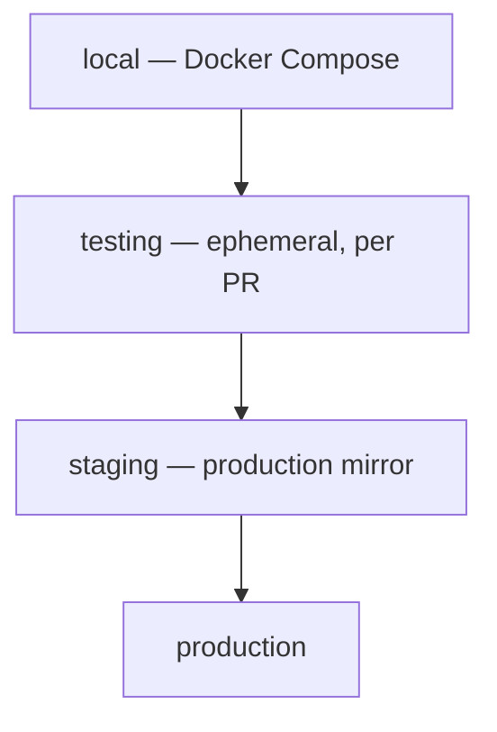
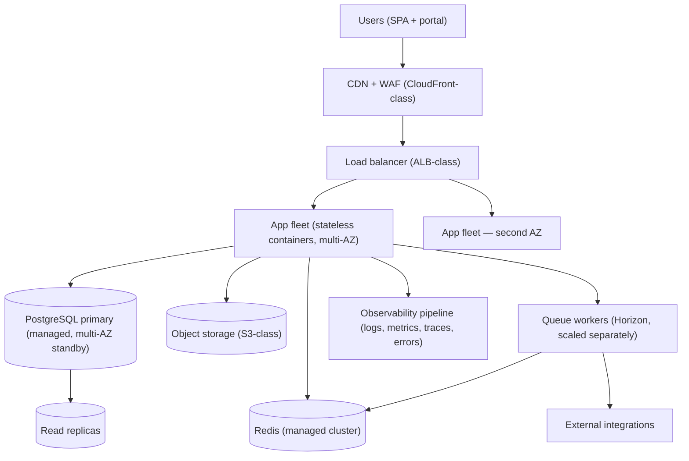
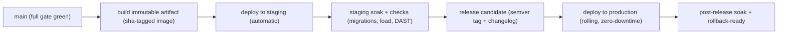

# DEPLOYMENT.md — Swasthya Deployment Design

> **Status:** Working baseline · **Owner:** Principal Architect (deployment ratified with the team)
> **Version:** 1.0
> **Document chain:** This document operationalizes `ARCHITECTURE.md` §24–27 (deployment architecture, DR, scaling), `MASTER_RULES.md` §21–23 (deployment, DR, backups), `SECURITY.md` §27–30 (access, backups, DR), and `TESTING_STRATEGY.md` §6 (CI cadence). It specifies the deployment design — it deploys nothing.
>
> **Cloud provider stance:** this document specifies **provider-agnostic patterns** with named reference implementations (e.g., "managed PostgreSQL (AWS RDS-class)"). The concrete provider is an infrastructure decision made during provisioning via an ADR — not assumed here, and the design does not depend on it.

---

## 0. Deployment Principles

1. **Everything ships through CI/CD.** No manual production changes, no ad hoc server edits, no "quick fix in prod" (`MASTER_RULES.md` §21.2). If it is not in the pipeline, it does not exist in production.
2. **Environments are stages, not snowflakes.** Local → CI → staging → production differ only in scale, data, and secrets — never in topology shape or code path.
3. **Build once, promote the same artifact.** The immutable image tested in CI and staging is the image deployed to production. No rebuild-on-deploy.
4. **Zero-downtime is the default.** Releases are rolling and health-gated; a release that cannot roll back does not happen.
5. **Migrations are forward-only and backward-compatible.** Schema changes never require downtime and never get reverted on a live database (`MASTER_RULES.md` §30).
6. **Rehearsed, not improvised.** Deploys, rollbacks, restores, and failovers are documented runbooks that are actually run (TESTING_STRATEGY §3.16–3.17).
7. **Observability ships with the deploy.** Monitoring, logging, and alerting for a surface exist before that surface reaches production (`MASTER_RULES.md` §20, §39).

---

## 1. Environment Model

| Environment | Purpose | Data | Access | Deploy source |
|---|---|---|---|---|
| **local** | Developer workstation | Factories/synthetic | Developer only | `docker compose up` |
| **testing (CI)** | Every PR gate | Ephemeral synthetic | CI only | Pipeline stages |
| **staging** | Production mirror: migrations, load tests, DAST, release candidates | Synthetic with production-like volume profiles | Team (MFA) | Auto: every merge to `main`; manually for release candidates |
| **production** | Real service | Real tenant data | Platform ops (Section 28 of SECURITY.md) | Release candidates only, via pipeline |

**Parity rules:**

- Same application/worker image, same PostgreSQL version, same migration path, same config class (env-specific values, never code differences).
- Staging runs the **upgrade-path migration test** on every release candidate (`TESTING_STRATEGY` §3.15).
- Environments are **network- and credential-isolated** (staging never shares a database, secrets store, or bucket with production; staging never touches production credentials — `MASTER_RULES.md` §28.5).

---

## 2. Development and Local

- **One command:** `docker compose up` runs the full stack: application (FPM + web server), queue worker, scheduler, PostgreSQL, Redis, mail catcher, and MinIO (S3-compatible object storage for local documents).
- **Bootstrap:** migrations run automatically; factories seed synthetic data (never production data — `MASTER_RULES.md` §28.5).
- **`.env.example` is committed** with placeholders; local runs need **no secrets** (local keys are generated on first boot).
- **Hot reload:** frontend dev server + backend auto-reload; the local environment matches production image versions to avoid "works locally" surprises.

---

## 3. Testing (CI) Environment

- **Ephemeral per PR:** PostgreSQL + Redis as service containers; the schema is built by running migrations (this is the fresh-database migration test — `TESTING_STRATEGY` §3.15).
- **Parallel workers** each get an isolated database; no test depends on another's data.
- **No secrets in CI logs:** pipeline credentials come from the CI's secret store; `APP_DEBUG` never true in CI output for staging/prod jobs.
- CI runs the full gate (TESTING_STRATEGY §6) and builds the artifact that later promotes.

---

## 4. Staging

- **Production mirror:** same topology shape, same image, same config class, same migration path — only data is synthetic and scale is smaller.
- **Deployments:** every merge to `main` deploys to staging automatically (the staging run *is* the promotion check); release candidates are deployed to staging explicitly before production.
- **What runs on staging:** the nightly full suite (E2E, responsive, a11y, performance, load), DAST scans, the upgrade-path migration test, and every release candidate's soak.
- **Post-deploy smoke:** every staging deploy runs `backend/smoke_staging.sh` (health, auth + tenant context, the OPD chain, RPM, CDSS fail-open, the AI fail-closed boundary, cross-tenant isolation, audit reachability) against the deployed API before promotion — fail-closed, PHI/secret-safe, complementing the browser E2E (`STAGING.md` §11).
- **Synthetic data with volume profiles:** factories generate production-like row volumes (peak-day registrations, appointments, charges) so load tests and performance budgets are meaningful — never a copy of production rows (`MASTER_RULES.md` §28.5).

---

## 5. Production

**Topology (provider-agnostic; reference names in parentheses):**

**Configuration decisions:**

- **Application:** stateless containers (PHP-FPM initially; Octane as a staged evolution — `ARCHITECTURE.md` §28.4); no sessions on disk, no local state; scaled horizontally behind the load balancer.
- **Data plane:** managed PostgreSQL (multi-AZ, automated backups, PITR, read replicas), managed Redis, object storage — managed services chosen so the platform team operates the product, not the operating system.
- **Edge:** CDN for static assets and edge TLS, WAF for the public surfaces, TLS everywhere (`SECURITY.md` §11).
- **Network:** private subnets for data plane; the database is reachable only from the app tier and the audited bastion (`SECURITY.md` §14, §28); egress for integrations through a controlled proxy/allowlist (`SECURITY.md` §22).
- **Secrets:** injected from the secrets store at runtime (Section 7); nothing sensitive in the image, the pipeline, or `.env` files.
- **Regions:** production runs multi-AZ; a second-region backup copy exists; multi-region active operation is a documented future step, not today's shape (`ARCHITECTURE.md` §28.8).
- **Phase 22 failover readiness (2026-08-17):** `backend/ci/failover-drill.sh` proves in the disposable environment that the stateless app serves from a pre-verified standby database with RLS intact (switch-over ~1 s, `health/ready` database check ok, isolation probes 1/0/0 — `NATIONAL_SCALE.md` §3). **This is single-environment readiness, not a production cutover claim:** WAL promotion, read-replica routing, DNS/edge switch, and health-gated traffic shift remain the annual failover exercise on real infrastructure (`DISASTER_RECOVERY.md` §13) — **NOT PROVEN** at production scale.

---

## 6. Environment Variables

- **Convention:** application configuration is environment variables; code has no hardcoded configuration (`MASTER_RULES.md` §28). Namespaced (`APP_*`, `DB_*`, `REDIS_*`, `S3_*`, `SWASTHYA_*`).
- **`.env.example`** is committed with placeholders and documentation; real values never enter the repository.

| Group | Variables (examples) |
|---|---|
| App | `APP_ENV`, `APP_DEBUG` (must be `false` in prod), `APP_URL`, `APP_KEY` (from secrets), `APP_TIMEZONE` |
| Database | `DB_HOST`, `DB_PORT`, `DB_DATABASE`, `DB_USERNAME` (password from secrets) |
| Redis / queue | `REDIS_HOST`, `REDIS_PORT`, `QUEUE_CONNECTION=redis`, `QUEUE_PRIORITY` |
| Storage | `FILESYSTEM_DISK=s3`, `S3_BUCKET`, `S3_REGION`, `S3_ENDPOINT` (credentials from secrets) |
| Tokens/session | `TOKEN_TTL_MINUTES`, `REFRESH_TOKEN_TTL_DAYS` |
| Security | `SESSION_SECURE_COOKIE=true`, rate-limit floors per route class |
| Features | `FEATURE_*` flags (Section 19, feature flags as config) |
| Observability | `OTEL_EXPORTER_OTLP_ENDPOINT`, `SENTRY_DSN` (from secrets), `LOG_CHANNEL=stack` |
| Channels | `MAIL_*`, SMS/push provider config (keys from secrets) |

- **Environment-specific values live in the environment's config store** (per-environment variable groups in the deploy platform), not in the codebase.
- **Validation:** the application fails fast at boot when required variables are missing or `APP_DEBUG` is true in production — a misconfigured instance never serves traffic.

---

## 7. Secrets

- **One secrets store** (KMS/Secrets Manager-class) per environment; environments are isolated from each other (`SECURITY.md` §13).
- **What lives there:** database passwords, `APP_KEY` and encryption keys, object-storage credentials, mail/SMS/push provider keys, payment-provider keys, integration credentials, error-tracking DSNs, bastion/break-glass credentials.
- **Injection:** runtime injection (environment/service injection), never baked into images; images contain zero secrets by construction (verified by CI scan).
- **Rotation:** on schedule and on personnel/credential change; a leaked secret is revoked and rotated immediately and reported as an incident (`MASTER_RULES.md` §29).
- **Least privilege:** each environment and each component reads only its own secrets; access to the store is logged.
- **Future:** workload-identity / dynamic credentials so even the secrets store holds fewer long-lived values (SECURITY.md §13, recommended).

---

## 8. CI/CD

- **Pipeline stages** (from TESTING_STRATEGY §6): lint/static/scans → unit → integration/database → API/security/isolation → E2E/a11y/responsive smoke → performance smoke → **build image** → staging deploy → soak → production.
- **Artifact immutability:** the image is built once (sha-tagged) and promoted; staging and production run the identical artifact; a rebuild is a new artifact that re-enters the pipeline.
- **Production deploys are release-candidate-only**, triggered from a semver tag after staging green — never from a feature branch, never manually constructed.
- **Hotfix path:** branch from the release tag, minimal fix, full gate, promoted like a release — never a manual production edit (`MASTER_RULES.md` §21.2).
- **Deploy credentials** live in the CI secret store; pipeline runs are audited; production deploy steps require explicit approval.

**Implemented (2026-08-12):** `.github/workflows/ci.yml` runs a `backend`
job (PHP 8.2/8.3 matrix; Pint; disposable `postgres:16`; migrations; RLS
verification; full Pest suite incl. tenant isolation) **and** a `frontend`
job (Node 20; npm ci; typecheck; 20 unit tests; production build; E2E
against the disposable DB — desktop + mobile OPD workflow + axe a11y).
The complete pipeline was executed locally as a twin
(`backend/ci/run-local-ci.sh` + `frontend/playwright.ci.config.ts`); it has
**not yet run on a real GitHub-hosted runner** (the repository has not been
pushed). A real-runner run is the first remaining CI step
(`STAGING.md` §14–15).

---

## 9. Database Migrations

- **Release-based, forward-only, backward-compatible** (`MASTER_RULES.md` §30): the schema is a migration path, and every release's migrations are reviewed, tested, and deployed as part of the release — never run by hand in production.
- **Expand/contract discipline:** additive (nullable column) → backfill in a batch job → deploy code that uses it → tighten in a later release. Locking or destructive migrations on live tables require a reviewed plan.
- **Deploy ordering:** migrations run as a distinct, monitored step *before* new code serves traffic that depends on them; the release pipeline enforces this order.
- **Safety:** `migrate --force` with a lock guard (one migrator at a time); migration duration is budgeted; long backfills are chunked jobs, not a blocking DDL statement where avoidable.
- **Verification:** fresh-database build and upgrade-path tests run in CI (TESTING_STRATEGY §3.15); the release gate runs the upgrade path against a staging snapshot.
- **Rollback of schema:** production never runs "down" migrations — a bad release is mitigated **forward** (new migration) with the application rolled back first (Section 10).

---

## 10. Rollback

- **Application rollback is fast and primary:** redeploy the previous immutable artifact (the last sha-tagged image) — seconds to minutes, no rebuild. Because the app is stateless and tokens are server-validated, rollback is clean.
- **Feature flags are the first lever:** behavior behind a flag is turned off before any rollback is considered (`MASTER_RULES.md` §38) — the fastest possible mitigation.
- **Database rollback is forward-only:** schema is never reverted on live production. A bad migration is mitigated by (a) rolling the app back to the version that matches the *previous* schema, and (b) shipping a corrective migration forward. The expand/contract discipline makes this safe.
- **Rollback runbook:** every release records its rollback path (app image tag, flag to flip, corrective-migration trigger); the rollback is rehearsed on staging before production releases that carry risk.
- **Post-rollback:** the release owner stays in the incident until the cause is understood; a postmortem with actions follows (`MASTER_RULES.md` §39.3).

---

## 11. Zero/Minimal-Downtime Deployments

- **Rolling deploy:** new instances join behind the load balancer → health checks pass → traffic shifts → old instances drain and terminate. No user-visible outage; in-flight requests complete.
- **Statelessness enables it:** no local sessions, no local files — draining an instance is invisible to users; queued jobs are picked up by remaining workers (Section 15).
- **Migration ordering** (Section 9) is what makes the rolling deploy safe: code and schema never diverge unsafely because new code only deploys after its migrations, and backward compatibility keeps old instances healthy during the shift.
- **Worker drain:** workers finish or re-queue in-flight jobs gracefully; the scheduler runs in exactly one instance to avoid duplicate scheduled work.
- **Health-gated:** the orchestrator's readiness checks must pass before an instance receives traffic; a failed rollout auto-rolls back per the pipeline (Section 10).

---

## 12. Health Checks

- **Two endpoints per component:**
  - **Liveness** (`/health/live`) — the process is up (orchestrator restarts if not).
  - **Readiness** (`/health/ready`) — the component can serve: checks DB connectivity, Redis, object-storage reachability, and queue connectivity.
- **Load balancer uses readiness** for routing (an instance that lost its DB is drained, not restarted in a loop); the orchestrator uses liveness.
- **Workers** report heartbeats (Horizon); a silent worker alerts (Section 19).
- **Health payloads carry no PHI and no secrets** — status + component timings only; health checks are on a separate, rate-limited path.

---

## 13. Load Balancing

- **Edge:** CDN terminates TLS, serves static assets, absorbs DDoS/WAF (Section 5).
- **Application:** the load balancer routes `/api/*` and the SPA to the app fleet on readiness-based health; TLS is end-to-end.
- **No sticky sessions required** — the app is stateless by design; any instance can serve any request. This removes a whole class of balancing constraints.
- **Database:** PgBouncer in **session mode** (RLS `SET LOCAL` is transaction-scoped — `ARCHITECTURE.md` §8.5) with bounded pools; pool saturation is a monitored metric.
- **Internal traffic** (app → data plane) stays on private networks; nothing data-plane is exposed publicly.

---

## 14. Scaling

Scaling is **staged and measured** (`ARCHITECTURE.md` §26); the deployment supports the stages rather than pre-building them:

| Stage | What scales | How |
|---|---|---|
| 1 | Static/edge | CDN absorbs asset and edge load |
| 2 | Read path | Read replicas; reporting routed to a dedicated analytics replica |
| 3 | Async | Queue workers scale (by queue depth); per-queue limits |
| 4 | Request density | More app instances; later Octane for density per instance |
| 5 | Write path | Partitioning rollout on high-volume tables (audit, notifications, vitals) |
| 6 | Domain isolation | Extract a hot domain into its own deployable (only when measured — `ARCHITECTURE.md` §28.1) |

- **Scaling triggers:** app fleet by CPU/latency, workers by queue depth, replicas by read load — with headroom, not at the cliff edge.
- **Capacity planning:** load tests define the per-instance envelope; capacity is planned against the national-scale projections, never autoscaled blindly (a database that autoscales under pressure is a panic, not a plan).
- **Redis and PostgreSQL scale decisions are deliberate** (cluster sizing, replica count) — reviewed with the load-test evidence.

---

## 15. Containers

- **Image strategy:** multi-stage builds; minimal runtime images (PHP-FPM + web server, or Octane runtime when adopted); non-root process; pinned base images rebuilt on a cadence for security patches.
- **One image, two entrypoints:** the same image runs the app and the workers (different commands) — one artifact, no drift between web and worker behavior.
- **Tagging:** immutable `sha` tags for promotion; `latest`-style tags never used for deploys.
- **Scanning:** images are vulnerability-scanned in CI; critical/high findings block the build (`SECURITY.md` §32–33).
- **No secrets in images** (Section 7); filesystem is read-only at runtime except designated writable paths (or fully read-only with external storage).
- **Kubernetes stance:** managed containers (ECS-class/Fargate-class) are the default; Kubernetes is adopted only when operational demands genuinely require it — documented, not assumed (`ARCHITECTURE.md` §24).

---

## 16. Backups

- **PostgreSQL:** automated backups + WAL archiving (PITR), multi-AZ standby, encrypted, monitored (failure alerts within the hour) (`MASTER_RULES.md` §23).
- **Object storage:** versioning + replication so documents are recoverable; retention lifecycle mirrors document metadata (`DATABASE.md` §3.38).
- **Cross-region copy** of backups exists so a regional event cannot destroy both the system and its recovery data (`MASTER_RULES.md` §22.5).
- **Restore is proven quarterly:** restore into a clean environment, verify data integrity and critical journeys **and RLS policy re-application** (a restored database with broken policies would be a data-leak event — `SECURITY.md` §29).
- **Retention per policy** (including audit data); offboarding a tenant includes backup grooming per policy (`MASTER_RULES.md` §36.6).
- **Backup credentials are isolated** from production credentials; backups are never publicly reachable.

---

## 17. Monitoring

- **Metrics:** Prometheus-class scrape of application, workers, PostgreSQL, Redis, queue depth, and edge (latency, error rate, saturation, traffic).
- **Dashboards:** per-domain and platform operations (requests, p95/p99 latency, errors, queue depths, job failures, cache hit ratio, DB connections, replica lag) — a surface without a dashboard does not reach production (§0.7).
- **Traces:** OpenTelemetry end-to-end (API → DB → Redis → queues → integrations) with correlation IDs (`MASTER_RULES.md` §18).
- **Error tracking:** production stack traces with correlation IDs (Sentry-class), frontend errors in the same pipeline.
- **Synthetics:** external synthetic checks on critical journeys (login, booking, billing) run continuously.
- **SLOs:** critical-journey SLOs with error budgets, reviewed on a cadence (`MASTER_RULES.md` §20).

---

## 18. Logging

- **Structured JSON** everywhere (app, workers, edge, frontend client errors) — no prose-only lines (`MASTER_RULES.md` §18).
- **Correlation + request IDs** on every line; a log line without its trace is a defect.
- **No PHI in logs, ever** — not in messages, error traces, or metric labels (`MASTER_RULES.md` §18.4); log-scrubbing rules are enforced and reviewed.
- **Shipping:** a lightweight collector (FluentBit-class) forwards to the central log store; local dev logs never ship; log retention per policy.
- **Logs are searchable by tenant/facility context for support** (with access control) — never by patient name or other PHI fields.

---

## 19. Alerting

- **Alert taxonomy:** severity (critical → info) with response times; every alert has an **owner**, a **runbook link**, and a defined meaning (`MASTER_RULES.md` §20.3).
- **What pages:** production incidents (5xx spikes, DB down, backup failure, job dead-letter growth, cert expiry, security events); **what emails/dashboards:** trends and warnings (queue growth, replica lag, budget burn).
- **On-call:** a documented rotation for production incidents with escalation paths and a contact tree (`SECURITY.md` §31).
- **Alert fatigue is actively tuned:** every alert is reviewed for actionability; a paged alert that required no action is redesigned or removed. A fatigue that trains responders to ignore alerts is a safety defect (`MASTER_RULES.md` §34.4).
- **Synthetic + security alerts** (breach indicators, anomaly spikes) page like production incidents — never "wait until Monday" (`SECURITY.md` §31).

---

## 20. Release Management

- **Versioning:** semver; a release is a tagged, immutable artifact with a changelog in plain language for users (`MASTER_RULES.md` §25.6).
- **Flow:** main (green gate) → build → staging (automatic deploy + soak) → release candidate → production (rolling) → post-release watch. Nothing skips a step.
- **Production readiness checklist** (MASTER_RULES §39) is enforced by the pipeline and by the release owner: backups verified, dashboards alerting, runbook current, rollback rehearsed, secrets in the store, release notes written.
- **Release owner:** a named person owns each release through the soak window; the checklist is checked by them, not by memory.
- **Post-release:** the owner watches alerts and metrics for the soak window; a regression reaching production is rolled back or hotfixed per the incident process, followed by a blameless postmortem with actions (`MASTER_RULES.md` §39.3).
- **Change freezes** and deploy windows are documented and respected; a release in a freeze requires written approval.

---

## 21. Infrastructure as Code and Provider Portability

- **Everything is code:** environments, networks, data plane, pipelines — provisioned as code (Terraform-class) and reviewed like code (`MASTER_RULES.md` §25.1).
- **Environment modules are parameterized:** one module defines the topology; local/CI/staging/production are instantiations with different parameters — this is how parity is enforced mechanically, not by discipline.
- **Provider choice** (when made) is recorded in an ADR with the rationale: managed-service maturity, data-residency requirements, cost model, and team operational capacity. The design above maps to AWS-class (RDS, ElastiCache, S3, CloudFront/WAF, ECS), Azure-class, or GCP-class equivalents without structural change.

---

## 22. Deployment Invariants

1. **No deploy that cannot roll back.** The previous artifact, the flag to flip, and the corrective path exist before the deploy starts.
2. **No production change outside the pipeline.** Manual production edits are prohibited; break-glass is audited, time-boxed, and reviewed (`SECURITY.md` §28).
3. **One artifact, promoted.** Staging and production run the identical image.
4. **Migrations before code, forward-only, backward-compatible.** The schema and the code never diverge unsafely.
5. **Health-gated traffic.** Nothing serves until readiness passes; nothing keeps serving after readiness fails.
6. **Observability ships with the surface.** Dashboards, logs, and alerts exist before production traffic.
7. **Restore is proven, not assumed.** Backups restore cleanly with RLS intact, on a quarterly rhythm.
8. **Rehearsed over improvised.** Deploys, rollbacks, restores, and failovers are runbooks that are actually run.

---

*This document is the deployment contract for Swasthya: environments that mirror each other, an artifact that is built once and promoted, releases that are zero-downtime and rollback-ready, data that is backed up and provably restorable, and operations that are observed, logged, and alerted. It deploys nothing — it defines how the platform will be operated when it does.*
