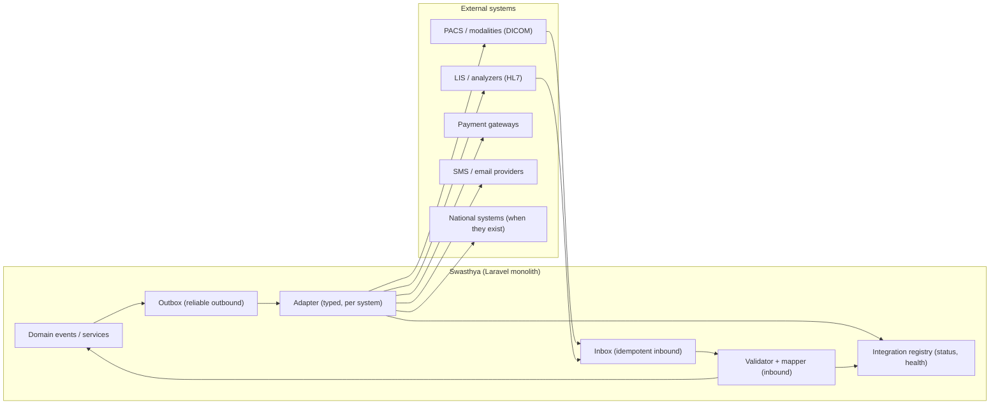

# INTEROPERABILITY.md — Swasthya Interoperability Design

> **Status:** Working baseline · **Owner:** Principal Architect (interop posture ratified with the team)
> **Version:** 1.0
> **Document chain:** This document deepens `ARCHITECTURE.md` §22–23 (integration architecture, interoperability), `MASTER_RULES.md` §32 (interoperability) and §35 (third-party integrations), `DATABASE.md` §3.42 (integrations), and `SECURITY.md` §22 (SSRF) and §35 (integrations). It is the interoperability **readiness design** — no integration is implemented here.
>
> **The honesty clause (read first):** **Nothing in this document claims that any integration exists.** Every system below is tagged with its true readiness level — *design* (the pattern is specified), *planned* (scheduled with a real provider), or *future* (depends on a partner, a standard, or a national system existing). A green status page without monitoring is a lie (`MASTER_RULES.md` P.16); an integration that is stubbed in production is a lie (P.14). This document specifies readiness; reality is recorded in the integration registry, measured, not asserted.

---

## 0. Interoperability Principles

1. **Standards-first.** FHIR R4 (clinical exchange), HL7 v2 (ADT/lab messaging), DICOM (imaging) are the exchange languages. The platform speaks standards at its boundaries and speaks its own language internally (`MASTER_RULES.md` §32.1).
2. **The internal model is the truth; standards are projections.** The mapping layer translates internal → standard and standard → internal; the internal schema is never reshaped to fit a standard, and the standard is never bent to fit the schema.
3. **Real or absent.** Every integration is wired to a real endpoint, contract-tested, monitored, and kill-switchable — in staging and production. Stubs exist only in test environments.
4. **Every exchange is consented, secured, and audited.** Data crossing the boundary follows the same consent, purpose-limitation, and audit rules as data inside the platform (`MASTER_RULES.md` §10).
5. **Fail loud, retry safe, never hang.** Integrations are async, idempotent, bounded-retry, circuit-broken, and their degradation is visible (`MASTER_RULES.md` §35.2).
6. **Versioning is a boundary property.** Our contracts, the standards versions we speak, the mapping versions, and provider APIs are all versioned.

---

## 1. Integration Architecture

- **Outbound path:** domain event → outbox (transactional, reliable) → adapter → external system. The outbox is what makes delivery reliable without holding up the request (`MASTER_RULES.md` §35).
- **Inbound path:** external message → inbox (deduplicated) → validation → mapping → domain. The inbox is what makes inbound replay-safe.
- **The registry is the truth:** every integration's actual status (configured / active / degraded / disabled), owner, and health are recorded there and monitored — never asserted (`MASTER_RULES.md` §35.6).

---

## 2. Integration Boundaries

**What crosses the boundary** (data, never decisions):

- Clinical facts (patient identity for matching, encounters, orders, results, documents) — subject to consent.
- Financial data (charges, invoices, claims, payments) — subject to the billing/claims rules.
- Operational data (appointments, availability, stock for exchange where it exists).

**What never crosses:**

- **Authorization decisions** — the external system never decides who may see what inside Swasthya; the platform's policies apply at the boundary.
- **Tenancy** — every exchange is tenant-scoped; credentials, consent, and audit are per tenant; a cross-tenant exchange does not exist (`TENANCY.md` §4).
- **Audit integrity** — external systems never write to the audit trail; the audit records *that* the exchange happened.

**The boundary is where controls concentrate:** consent check, security (Section 11), idempotency (Section 8), and mapping (Section 5) are all enforced at the adapter — the domain never sees the raw external format.

---

## 3. Adapters

- **One adapter per system type, one implementation per provider:** the internal interface is stable (the domain speaks to "SMS", not "Provider X's API"); provider-specific detail lives inside the adapter (`ARCHITECTURE.md` §22; `MASTER_RULES.md` §35.1).
- **Adapter responsibilities:** credential handling (from the secrets store, never baked), transport, authentication to the provider, mapping (Section 5), retries and backoff (Section 7), circuit breaking, status reporting to the registry, and **redacted logging** (no PHI, no secrets — `OBSERVABILITY.md` §17).
- **Adapters are small and reviewable:** a thick adapter is a design failure; complexity belongs to the mapping and resilience layers, not the transport glue.
- **Adapters never make clinical decisions** — they move data and report outcomes; interpretation is the domain's job (`CLINICAL_SAFETY.md` §11).

---

## 4. External IDs

- **Internal IDs are UUIDs and never leave the platform unqualified.** External systems reference Swasthya resources through a stable **external identifier** (e.g., `urn:swasthya:patient:<uuid>`), not a raw UUID where the ecosystem expects its own scheme.
- **The entity mapping is a first-class store** (`integration_entity_map`-style): `(internal_id, internal_type, external_system, external_id, last_synced_at, status)` — bidirectionally queryable, tenant-scoped (`DATABASE.md` §3.42 discipline).
- **External IDs are references, never primary keys:** the internal schema never uses a provider's ID as a PK; the mapping table is the bridge.
- **Matching inbound messages:** external patient/message IDs resolve through the mapping table; unmatched messages enter a **review queue** (manual match) — never silent auto-creation of patients from external data without identity rules (`PRODUCT_REQUIREMENTS.md` §6.1 duplicate discipline).

---

## 5. Mapping

- **FHIR R4 projection:** the internal domain model maps to FHIR R4 resources (Patient, Encounter, Observation, MedicationRequest, DiagnosticReport) through a dedicated projection layer with **contract-tested fixtures** — mapping drift fails CI (`MASTER_RULES.md` §32.5).
- **HL7 v2 mapping:** message mappers for the patterns the ecosystem uses (ADT admit/transfer/discharge, ORU lab results); segment/field mapping is explicit, versioned, and fixture-tested.
- **DICOM mapping:** Swasthya exchanges *references* (study instance UIDs, accession numbers, image references) with PACS — never pixels; the internal radiology model carries DICOM references (`DATABASE.md` §3.29).
- **Reverse mapping for inbound** is explicit: external → internal, validated against the internal schema (a lab result whose mapped patient cannot be resolved is quarantined to the review queue, not imported).
- **Mapping versions are recorded per exchange** so "what mapping was in effect when this message crossed" is reconstructable (same discipline as CDSS rule versions — `CLINICAL_SAFETY.md` §6).

---

## 6. Synchronization

- **Modes:**
  - **Realtime (event-driven):** domain events → outbox → adapter (results released, appointments confirmed, claims submitted).
  - **Scheduled (batch):** reconciliation sweeps (payment settlement matching, daily lab report batches), rate-aware.
  - **On-demand:** explicit sync requests from the UI/API, for support and tenant-initiated recovery.
- **The outbox makes delivery reliable** even across crashes: messages are written transactionally with the domain change and delivered exactly-once *to the queue* (idempotency makes at-least-once safe at the provider — Section 8).
- **State machine per exchange** (`pending → sent → acknowledged/failed`), visible in the integration events log — an unacknowledged message is a visible, alertable fact, not a silent gap (`DATABASE.md` §3.42).
- **Conflict handling:** two-way sync conflicts resolve by explicit policy — last-write-wins only where clinically/financially safe; otherwise the conflict enters a review queue. Silent overwrites of clinical data are prohibited (`CLINICAL_SAFETY.md` §15).

---

## 7. Retries

- **Bounded retries with exponential backoff + jitter**, per adapter, with a retry budget (max attempts, max window). A message that exhausts its budget goes to a **dead-letter queue that alerts** — silent message death is prohibited (`MASTER_RULES.md` §14).
- **Retry classification:** transient failures (timeouts, 5xx, throttling) retry; permanent failures (4xx validation, mapping errors) fail fast to the dead-letter with a reason — retrying a permanent failure is waste, not resilience.
- **Rate-limit-aware retries:** integration queues are rate-limited per provider; retries respect `Retry-After` (`API_CONTRACTS.md` §15).
- **Retries are safe because operations are idempotent** (Section 8) — a retry never double-sends a charge or double-creates a patient.

---

## 8. Idempotency

- **Outbound:** every outbound message carries an idempotency/message key; providers that support idempotency receive it; providers that don't get deduplicated by the outbox state machine (a "sent, unacknowledged" message is *re-sent with the same key*, never re-created).
- **Inbound:** every inbound message is deduplicated in the **inbox** by its message ID — the same message arriving twice (provider retry, redelivery) is processed once; the inbox also records the outcome for replay-proofing.
- **Financial exchanges** (payments, claims) carry the platform's `Idempotency-Key` discipline end-to-end (`API_CONTRACTS.md` §13; `MASTER_RULES.md` §12.4) — a double-charged patient via an integration is the same defect as one via the UI.

---

## 9. Failures

- **Registry truth:** each integration's status (active / degraded / disabled) is measured by health checks and recorded — never claimed (`MASTER_RULES.md` §35.6). A status page is a lie if it isn't fed by monitoring.
- **Degraded modes are designed per integration:** what the workflow does when the SMS provider is down (queue + visible "delayed" state), when the lab interface is down (manual entry path that is fully audited), when payment gateway is down (cash path works; card attempts queue with clear UI) (`MASTER_RULES.md` §35.2).
- **Never hang a request:** all outbound calls are async (queue), time-boxed, circuit-broken; a down integration degrades a defined workflow — it never wedges the platform.
- **Kill-switch:** each integration sits behind a feature flag/circuit breaker so it can be disabled independently in production, and disabling is itself an audited action.
- **Failure alerting:** dead-letter growth, circuit-breaker trips, and unacknowledged-message age alert like production incidents (`OBSERVABILITY.md` §8, §14).

---

## 10. Audit

- **Every exchange is an audited event:** direction, message type, correlation ID, external system, outcome, tenant, and payload reference — in `integration_events` (`DATABASE.md` §3.42), with the same append-only discipline as clinical audit.
- **Consent is checked at the boundary:** an outbound exchange carrying patient data records the consent basis at the moment of exchange; an inbound exchange that implies new data uses the same consent rules as internal capture (`MASTER_RULES.md` §10.2).
- **No PHI in operational logs** — payloads live in the access-controlled integration events store, never in log lines (`OBSERVABILITY.md` §17).
- **Audit reconstructs disputes:** a claim dispute or a lab-result dispute is traceable to the exact message, mapping version, and outcome.
- **Retention:** integration event logs retain per the integration contract, then partition-archive (`DATABASE.md` §4).

---

## 11. Security

- **Credentials per integration** in the secrets store, tenant-scoped, least-privilege, rotated on cadence (`SECURITY.md` §13) — never shared between tenants, never in code.
- **Transport security:** TLS everywhere; **egress allowlist** so adapters can only reach approved destinations (SSRF guard — `SECURITY.md` §22); outbound through the controlled proxy.
- **Partner/machine access:** OAuth2/OIDC for partner APIs with scoped, short-lived tokens; mTLS where the ecosystem supports it (`SECURITY.md` §5 future).
- **Inbound webhooks:** signature-verified (HMAC), replay-protected, validated before mapping; an unsigned or malformed message is rejected and logged, never processed (`ARCHITECTURE.md` §22).
- **Tenant isolation across integrations:** a provider credential and its outbox/inbox are tenant-scoped; a message cannot carry another tenant's context (`TENANCY.md` §4).
- **Inbound data is untrusted input:** external data is validated against the same rules as API input before it touches the domain (`MASTER_RULES.md` §12.5) — a lab message cannot inject a patient or a diagnosis it was not mapped and authorized to create.

---

## 12. Versioning

| What | Versioning rule |
|---|---|
| **Swasthya API** | `/api/vN`, additive within version, deprecation window (`API_CONTRACTS.md` §2) |
| **Standards spoken** | Explicit versions: FHIR R4.0.1, HL7 v2.x (per message pattern), DICOM 3.0 — pinned and documented per adapter |
| **Mapping layers** | Versioned; fixture-tested; the version in effect is recorded per exchange (Section 5) |
| **Provider APIs** | Pinned per provider; upgrades are tested against fixtures and staging before rollout |
| **Integration contracts** | Each integration has a contract version; a provider's breaking change is a tracked upgrade project, not a silent drift |

- **Deprecation discipline:** retiring an integration or a mapping version follows the platform's deprecation policy — announced, monitored, removed after the window (`MASTER_RULES.md` §31 discipline applied to integrations).

---

## 13. The Integration Inventory (honest readiness levels)

> Readiness tags: **design** = the pattern is specified here; **planned** = scheduled with a real provider against a real endpoint; **future** = depends on a partner, standard implementation, or national system existing. None of these is an existing integration.

| System | Readiness | What "ready" means here |
|---|---|---|
| **FHIR** | **Design** | The R4 projection layer and contract-tested fixtures are specified; export/import readiness. No live FHIR endpoint exists or is claimed. |
| **HL7** | **Design → readiness layer implemented** | The ORU^R01 parser (`Hl7Message`/`Hl7Segment`/`OruR01Parser`) and mapper (`OruResultMapper`) are implemented and contract-tested against fixtures (`backend/tests/Fixtures/hl7/`, `Hl7MessageTest`, `OruResultMapperTest`). This is the mapping/readiness layer only — no live HL7 connection exists; inbound transport (inbox, dedup, webhook signature verification) and LIS integration remain `future`. |
| **DICOM** | **Design** | Reference-level readiness (study UIDs, accession, image refs) specified; the platform is not a PACS and does not claim DICOM viewing or storage. |
| **PACS** | **Future** | Depends on a hospital's PACS vendor; DICOM reference readiness is the enabler. No PACS is connected or claimed. |
| **LIS** | **Future** | Depends on a hospital's instruments/LIS; HL7-ready adapters are the enabler. No analyzer is connected or claimed. |
| **RIS** | **Future** | Depends on a hospital's RIS; the radiology order/study model is the interface. No RIS is connected or claimed. |
| **Pharmacies** | **Future** | E-prescription exchange is designed (FHIR MedicationRequest projection); live exchange depends on the receiving system existing. None exists or is claimed. |
| **Laboratories** | **Future** | National lab reporting only when the national system exists and is specified. Not simulated. |
| **Payment systems** | **Planned** | Real gateway integration (national wallets/cards) is scheduled with the billing module; contract-tested, kill-switchable, real endpoints only. No provider is currently connected. |
| **Insurance** | **Future** | Claims exchange depends on payer portals/EDI existing; the claim model is the interface. No payer is connected or claimed. |
| **SMS** | **Planned** | A real aggregator integration is scheduled with the notifications module (MVP); delivery is monitored and delivery attempts audited. No provider is currently connected. |
| **Email** | **Planned** | A real email provider is scheduled with the notifications module; same discipline. No provider is currently connected. |
| **Messaging** | **Future** | Internal notification channels are the design; an external messaging platform is only considered if a partner exists. None is claimed. |
| **National health systems** | **Future** | Built only when the national system exists and is specified; each is a contract-tested project with a named owner (`MASTER_RULES.md` §32.4). Nothing is simulated, nothing is claimed. |

**Rule of the inventory:** when a "planned" integration ships, the registry records it as active with monitored status and the contract tests in CI; when a "future" integration becomes possible, it enters the pipeline through the ADR process — it never appears on a status page first.

---

## 14. Interoperability Definition of Done

An integration (or a readiness layer) is done — and only then listed anywhere as real — when all hold:

- [ ] A named owner and a documented purpose (what data, what direction, what consent basis)
- [ ] A typed adapter with a stable internal interface, or a readiness layer with its fixtures
- [ ] Contract tests in CI (fixtures for both directions; mapping drift fails)
- [ ] Real endpoint + real credentials in staging and production — no stubs outside tests
- [ ] Idempotency inbound and outbound; bounded retries; dead-letter with alerting
- [ ] A documented degraded mode per failure class; a kill-switch
- [ ] Monitored status in the registry (active/degraded/disabled measured, never asserted)
- [ ] Consent check at the boundary; every exchange audited; no PHI in logs
- [ ] Versioned: standards version, mapping version, provider API pin, contract version
- [ ] Credentials in the secrets store, tenant-scoped, least-privilege, rotation-capable

---

*This document is the interoperability contract for Swasthya: standards at the boundary, mapping as a projection, reliability as outbox + idempotency + retries, security as scoped credentials and validated inbound, and honesty as the rule — the inventory says what is design, what is planned, and what is future, and nothing is called an integration until it is real, tested, and measured.*
