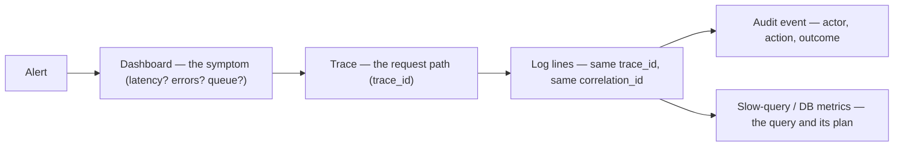

# OBSERVABILITY.md — Swasthya Observability Design

> **Status:** Working baseline · **Owner:** Principal Architect (observability ratified with the team)
> **Version:** 1.0
> **Document chain:** This document operationalizes `MASTER_RULES.md` §18 (logging), §19 (audit), §20 (observability); `ARCHITECTURE.md` §20 (observability); `DEPLOYMENT.md` §17–19 (monitoring, logging, alerting); and `SECURITY.md` §25 (audit, no-PHI logging). It is the observability **design** — nothing is implemented here.
>
> **The central principle:** observability is how the platform is debugged **without production access**. If a problem cannot be investigated from dashboards, traces, and logs alone, the observability design has failed — and break-glass production access stays a rare, audited exception (`SECURITY.md` §28).

---

## 0. Observability Principles

1. **Three pillars + events:** logs (what happened), metrics (how much / how fast), traces (how it flows) — joined by request and correlation IDs, with the audit trail as the fourth, separate stream (`MASTER_RULES.md` §19).
2. **If it is not observable, it does not ship.** Every feature and every component arrives with its metrics, logs, trace spans, dashboard, and owned alerts — the DoD box (Section 19).
3. **Correlation is the backbone:** one patient action is one correlation ID that survives every hop — API, queue job, integration, log line, trace (`MASTER_RULES.md` §18.2).
4. **Operations logs are not the audit trail.** The append-only audit (`DATABASE.md` §3.36) records *who did what to what*; operational logs record *what the system did and how it went*. They are separate stores with separate retention and access.
5. **The never-log rule is absolute** (Section 17): no PHI, no secrets, no financial identifiers — in logs, metrics labels, trace attributes, or error reports. Observability that stores patient data is a data breach, not a debugging convenience.

---

## 1. Structured Logging

- **Everything is structured JSON** — no prose-only lines, no free-text that cannot be queried (`MASTER_RULES.md` §18.1).
- **Log line schema (fixed, versioned):**

```json
{
  "timestamp": "2026-08-11T09:30:00.123Z",
  "level": "info",
  "service": "api",
  "instance": "app-7f3c",
  "env": "production",
  "request_id": "req-…",
  "correlation_id": "corr-…",
  "trace_id": "4bf9…",
  "tenant_id": "t-…",
  "facility_id": "f-…",
  "actor_id": "u-…",
  "message": "appointment booked",
  "fields": { "appointment_id": "appt-5521", "duration_ms": 142 }
}
```

- **Levels are disciplined** (`debug` in dev only, `info` for meaningful lifecycle events, `warn` for anomalies, `error` for failures, `critical` for human-response) — log noise that buries real signals is a defect (`MASTER_RULES.md` §18.3).
- **Contextual logging:** every line carries tenant/facility/actor context from the request or job context — so support can query "all errors for tenant X" without ever logging patient data.
- **Redaction is enforced, not assumed:** request bodies are not logged by default; sensitive attributes are scrubbed by a shared redactor; the redactor is tested (Section 17).
- **Retention and shipping:** logs ship through a lightweight collector (FluentBit-class) to the central store with defined retention; local/dev logs never ship (`MASTER_RULES.md` §18.5).

---

## 2. Metrics

- **Families:** RED (Rate, Errors, Duration) for services; USE (Utilization, Saturation, Errors) for resources; plus **business metrics** (counts that run the hospital: registrations, bookings, encounters, charges — aggregate counts only, never identifying).
- **Naming:** `swasthya_<domain>_<name>_<unit>` (e.g., `swasthya_billing_charges_posted_total`); every metric documented with its definition (a metric whose definition is not agreed is not a metric — `PRODUCT_REQUIREMENTS.md` §6.19).
- **Kinds:** counters (events), histograms (latency distributions, bucket edges per route class), gauges (queue depth, connections).
- **Cardinality discipline:** labels are bounded (route, domain, status class, tenant *bucket* where needed) — never a label per patient, per tenant ID at scale, or per free-form value.
- **Business metrics carry no PHI:** counts are numbers, not records; drill-down to records happens in the product's access-controlled analytics, not in the metrics store.

---

## 3. Tracing

- **OpenTelemetry end-to-end:** one trace per request spanning API → middleware → domain → PostgreSQL → Redis → queue enqueue → worker execution → integration calls (`ARCHITECTURE.md` §20).
- **Context propagation:** W3C `traceparent` across HTTP and through job payloads; the trace ID appears in every log line (Section 1) so traces and logs join.
- **Sampling policy:** head-based sampling for critical paths (auth, clinical, billing — sampled at 100 % or high rate), tail-sampling so errors are never lost; sampling is configured, documented, and reviewed (an unsampled error is an invisible error).
- **Span attributes:** route, status class, tenant *bucket*, component timings; **SQL is never logged with bind values** — query text is parameterized and PHI-bearing values never become attributes (Section 17).
- **DB/Redis/queue spans** make "which query was slow" answerable from the trace alone — without production database access.

---

## 4. Request IDs

- **`X-Request-Id`:** server-generated per request; echoed in the response header and present on every log line and span for that request (`API_CONTRACTS.md` §17–18).
- Generated at the edge when absent; **never trusted from the client** (it identifies the server-side request, not the user's claim).
- One request = one ID = one complete set of log lines; the request ID is the unit of "what happened during this call."

---

## 5. Correlation IDs

- **`X-Correlation-Id`:** client-generated per **user gesture** (one patient action — book, then check in, then encounter, then bill), spanning multiple requests, queue jobs, and integration calls (`MASTER_RULES.md` §18.2; `API_CONTRACTS.md` §17).
- **Async preservation:** job payloads carry the correlation ID; integration messages carry it in `correlationId` (`DATABASE.md` §3.42) — a booking that fails at the payment step is one trace from the SPA to the payment provider.
- **Error envelopes embed it**, so a user-reported error is traceable end-to-end from the toast to the log store.
- Correlation IDs carry no data — they are safe to store in logs, traces, and audit events.

---

## 6. Application Health

- **Health endpoints** (`DEPLOYMENT.md` §12): liveness (`/health/live`) for the orchestrator; readiness (`/health/ready`) checking DB, Redis, object-storage, and queue connectivity — used by the load balancer so a broken instance is drained, not served.
- **Payloads carry no PHI and no secrets** — status and component timings only; the health path is rate-limited and excluded from normal request metrics noise.
- **App signals:** request throughput, p95/p99 latency, error rate, worker heartbeats (Horizon), scheduler last-run timestamp (a silent scheduler is a defect), and queue health (Section 8).
- **Startup/shutdown events** are logged and metered (deploys, restarts, OOM kills) — infrastructure changes are observable too.

---

## 7. Database Health

- **PostgreSQL metrics:** connection count vs. pool (PgBouncer saturation), active/idle sessions, replica lag, checkpoint/wal metrics, deadlocks, cache hit ratio, index bloat signals, and **slow-query capture** (auto-captured queries with plans — never with PHI bind values).
- **WAL archiving status is a first-class signal:** archiving lag and gaps page immediately — a silent archiving stall is a data-loss event waiting to happen (`DISASTER_RECOVERY.md` §2).
- **Backup health:** last backup success/failure, base-backup age, restore-drill outcomes recorded as metrics.
- **Tenancy health at the DB layer:** the isolation probe's results (passed/failed), and **RLS-blocked/anomalous query counts** — a spike in denied cross-tenant attempts is a security signal, not noise (`TENANCY.md` §21; `SECURITY.md` §25).
- **Slow-query review** is a scheduled job: plans reviewed, indexes adjusted, N+1 regressions caught by CI (`TESTING_STRATEGY.md` §3.12) and by production capture.

---

## 8. Queue Health

Per logical queue (`high`, `default`, `notifications`, `reports`, `integrations`, `low` — `ARCHITECTURE.md` §15):

- **Depth** (gauge), **oldest-job age** (staleness — a deep-but-old queue is worse than a deep queue), **processing latency** percentiles.
- **Failure rate, retry counts, and dead-letter growth** — a growing dead-letter queue alerts; silent job death is prohibited (`MASTER_RULES.md` §14).
- **Worker saturation** (count, busy ratio, heartbeat) and **rate-limited queue throttling** (integration queues deliberately slowed — visible as queue time, not as errors).
- **Job-level traces** tie a failing job to its payload's correlation ID and tenant context.

---

## 9. API Latency

- **Latency budgets per route class** (auth, reads, writes, clinical, financial, reporting) with p50/p95/p99 histograms per endpoint (`TESTING_STRATEGY.md` §3.12).
- **SLOs on critical journeys** (login, patient lookup, booking, billing) with error budgets; **burn-rate alerts** fire before the budget is exhausted (`MASTER_RULES.md` §20.4).
- **Slow-request capture:** sampled slow requests carry their trace, so "the booking call is slow" decomposes into "the availability query took 400 ms" from the dashboard alone.
- **Load-test baselines:** CI load tests record latency envelopes (peak-hour OPD rush, ER spikes — `TESTING_STRATEGY.md` §3.13); production latency trending against baseline is a capacity signal, not a mystery.
- **Phase 22 measured baseline (2026-08-17, 1M patients / ~2.9M rows on the reference cluster):** point lookups 0.2–0.8 ms, provider-day schedule 0.27 ms, inserts ~0.3–0.5 ms, update ~3.3 ms, delete ~86 ms (WITH CHECK re-eval), tenant-scoped name search **147–158 ms (documented hot spot)** — all under RLS with canonical claims; error rate 0 (`NATIONAL_SCALE.md` §1). Production SLO targets and burn-rate budgets remain a deployment-phase commitment — these envelopes are the trend baseline, not a production claim.

---

## 10. Error Rates

- **Per-endpoint and per-domain error rates**, decomposed: **4xx ≠ 5xx**. 4xx are client/validation (a UX or contract signal); 5xx are defects (a paging signal). A dashboard that lumps them hides the story.
- **Error-rate SLOs and spike alerts:** a 5xx spike pages; a sustained elevation burns the error budget and alerts before the budget dies.
- **Error tracking** (Sentry-class) captures production stack traces with correlation IDs — deduplicated, owned, and **configured to redact PHI-shaped and secret-shaped values before they leave the app** (Section 17).
- **Frontend errors** flow into the same pipeline: client-side failures (failed requests, render errors) are attributed to the correlation ID of the gesture that failed.

---

## 11. Authentication Failures

- **Metrics:** login attempts, failure rate, lockouts, MFA failures, refresh failures, per identity class (staff vs. patient) and per scope.
- **Anomaly alerting:** credential-stuffing patterns — high failure rate per IP or per account — alert like a production incident (`SECURITY.md` §18, §25); enumeration attempts (uniform responses, but anomalous volumes) are visible.
- **Security events are both audited and alerted:** the audit trail records the facts; alerting watches the pattern. A lockout storm pages; a single failed login does not.
- **Dashboard:** auth health per identity class — availability (login SLO) and security (failure patterns) on one surface.

---

## 12. Tenant-Specific Errors

- **Per-tenant and per-facility error breakdowns** (aggregate, no PHI): a tenant erroring disproportionately is visible to support before the tenant reports it (`TENANCY.md` §10 support model).
- **Tenant state is observable:** suspension/offboarding state, entitlement-denial counts, and metering accuracy (usage meters are observability data — `MASTER_RULES.md` P.15).
- **Cross-tenant anomaly signals:** authorization-denial spikes, RLS-blocked query counts, and out-of-context job attempts — the isolation probes that watch for the thing that must never happen (`TENANCY.md` §21).
- **Support queries by tenant:** logs and metrics are queryable by tenant context (never by patient identity), so a support grant starts with a working view.

---

## 13. Infrastructure Monitoring

- **Compute:** CPU, memory, disk, network per instance; container health (restarts, OOM kills); image/patch currency as a metric.
- **Edge & load balancer:** 5xx/latency per target, health-check pass/fail, WAF block counts, CDN error and cache-hit rates.
- **Redis:** memory, evictions, hit rate, connection count, slow commands — a Redis that evicts under load is a capacity signal, not a surprise.
- **Object storage:** error rates, latency percentiles, throttling events, replication/versioning health.
- **Network:** egress proxy/NAT errors, integration egress allowlist violations (SSRF guards firing — a security signal, `SECURITY.md` §22).
- **Managed-service posture:** provider status is *not* relied upon as the primary signal — the platform's own probes measure what the platform experiences.

---

## 14. Alerting

- **Taxonomy** (`DEPLOYMENT.md` §19): severity with response times; every alert has an **owner, a runbook link, and a documented meaning** (`MASTER_RULES.md` §20.3).
- **What pages** (production incidents): 5xx spikes, critical-journey SLO burn, DB down/unreachable, WAL-gap/backup failure, dead-letter growth, cert expiry, auth-failure storms, security events.
- **What doesn't page:** warnings and trends (queue growth, replica lag, budget burn warnings) go to dashboards and digest channels.
- **SLO burn alerts** fire early, on rate, not after the budget is gone.
- **Alert fatigue is actively managed:** every alert is reviewed for actionability on a cadence; an alert that paged without action is redesigned or removed (`MASTER_RULES.md` §20.3, §34.4).
- **Synthetic checks** (external, on critical journeys) alert independently of internal telemetry — a silent platform and a dead platform look identical without them.

---

## 15. Dashboards

**Dashboard standards:** every alert has a dashboard; every dashboard has an owner; dashboards are code-defined (as-code, reviewed like code — `DEPLOYMENT.md` §21); a dashboard nobody reads is removed.

| Dashboard | Audience | Content (no PHI) |
|---|---|---|
| **Platform operations** | On-call | Global traffic, errors, latency, queues, DB/Redis health, backups, SLO burn |
| **Per-domain** (clinical, billing, pharmacy, lab) | Domain owners | Domain rates/errors/latency, dead-letters, key business counts |
| **Per-tenant / per-facility** (support) | Support | Tenant aggregate errors, state, entitlement denials — queryable per tenant |
| **Security** | Platform/security | Auth failures, lockouts, RLS-blocked counts, WAF blocks, egress violations |
| **Executive** | Leadership | Business metrics: registrations, bookings, charges, reconciliation — agreed definitions, no identifying data |

The drill-down path from any dashboard is: **number → chart → trace → log line → audit event** (Section 16). A dashboard that cannot be drilled into is a screenshot.

**In-product analytics dashboards (Phase 3 slice 21, ROADMAP Phase 17, DATABASE.md §3.51):** the *product's* operational/financial/clinical dashboards are separate from this observability surface but follow the same discipline — metric definitions are VERSIONED (one ACTIVE version per code, `kpi_definitions`), every number is a `metric_snapshot` computed from the observed source tables at generation time (never fabricated — MASTER_RULES.md P.15), and the in-product drill-down is **number → snapshot → access-controlled source data**, with every report run and export audited (facts only — MASTER_RULES.md §19.3). Reporting reads execute on the dedicated `reporting` read-replica connection so product dashboards never degrade transactional paths — the same guarantee this section makes for platform dashboards.

---

## 16. Incident Investigation

**The investigation path is the design:**



- **Every incident starts at the dashboard**, narrows to a trace, joins logs by IDs, and checks the audit event for the actor and action — all without production access.
- **The golden-trace workflow:** user reports "booking failed" → correlation ID from the error envelope → one trace showing exactly where it broke (auth? availability query? queue? payment provider?) → the log lines of every hop.
- **Tenant-scoped investigation:** support investigates a tenant's incident through tenant-context views — never by opening production data directly.
- **Break-glass production access is the last resort**, not the first step: only when observability is genuinely insufficient — and it is audited, time-boxed, and reviewed (`SECURITY.md` §28).
- **Evidence preservation:** logs, traces, and audit retention are long enough for postmortems and legal obligations; a postmortem without its evidence is a recollection, not an analysis.

---

## 17. What Must Never Be Logged

**This section is absolute. Any violation is a data-protection incident, not a logging bug** (`MASTER_RULES.md` §10.5, §18.4; `SECURITY.md` §25).

**Never in logs, metrics labels, trace attributes, or error reports:**

| Class | Examples |
|---|---|
| **Healthcare / PHI** | Patient names, MRNs, dates of birth, identifiers (national IDs, NPRN-class), phone numbers, addresses, clinical content, diagnoses, symptoms, prescriptions, lab values, results, any free-text clinical note |
| **Secrets** | Passwords, password hashes, tokens (access/refresh), API keys, DB credentials, MFA codes and recovery codes, encryption keys, integration credentials |
| **Financial identifiers** | Full card numbers, full bank account numbers, full payment-token values (PCI-class data) |
| **Personal data beyond need** | Full phone/email where an ID reference suffices; anything that identifies a person when the operation only needs a resource ID |

**The rules that make "never" enforceable:**

1. **Default-deny payload logging:** request and response bodies are not logged; logging a body is an explicit, reviewed, sampled exception with scrubbing — and never for clinical, auth, or payment endpoints.
2. **A shared redactor** scrubs sensitive-shaped values (token-like, card-like, MRN-like patterns) at the logging boundary; **CI tests assert redaction**: log lines constructed with PHI-shaped and secret-shaped values must come out scrubbed.
3. **Identifiers replace identity in logs:** logs carry `patient_id`-style resource IDs and tenant/facility context — never the patient's name or data. The audit trail (access-controlled, `DATABASE.md` §3.36) is where access *facts* live; operational logs are where system *behavior* lives.
4. **Metrics and traces are held to the same standard:** labels never contain names or values; trace attributes never carry query bind values or response payloads.
5. **Error tracking redaction** is configured at the source (scrub before send), tested, and reviewed — a stack trace that embeds a patient's name is a breach of this section, even if the error tracker is "internal."
6. **Log access is least-privilege:** the log store is queryable by role (on-call, domain owners, support-with-grant); support queries by tenant context, never by patient identity.

---

## 18. SLOs and Error Budgets

- **SLOs** on the critical journeys (login, patient lookup, booking, billing) — availability and latency, agreed with the team and reviewed quarterly (`MASTER_RULES.md` §20.4).
- **Error budgets** are the discipline: an SLO with a budget that is never consulted is a poster; burn-rate alerts make the budget operational.
- **SLO definitions are versioned and agreed** — an SLO whose definition changed silently is not an SLO (`PRODUCT_REQUIREMENTS.md` §6.19 discipline applies).

---

## 19. Observability Definition of Done

A feature, component, or infrastructure change is **observable** — and only then shippable — when all hold:

- [ ] Metrics exist for its rates, errors, and durations; definitions documented
- [ ] Log lines at the right levels, structured, with tenant/facility context and no PHI/secrets (Section 17)
- [ ] Trace spans joined by trace/request/correlation IDs; sampling configured
- [ ] A dashboard exists, owned, with a drill-down path (Section 15)
- [ ] Alerts exist for its failure modes, each with an owner and runbook link
- [ ] Health/readiness covers its new dependencies (Section 6)
- [ ] Redaction rules verified by test where the feature touches data (Section 17)

---

*This document is the observability contract for Swasthya: everything observable, everything correlated, everything debuggable without production access — and, above all, a platform that observes its operations without ever observing its patients' data. The moment a log line could identify a patient, the observability design has failed; the moment a problem cannot be investigated from the dashboards, it has failed too.*
