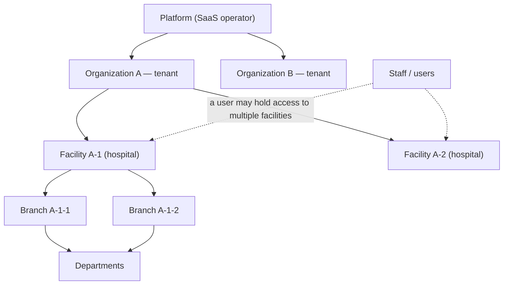
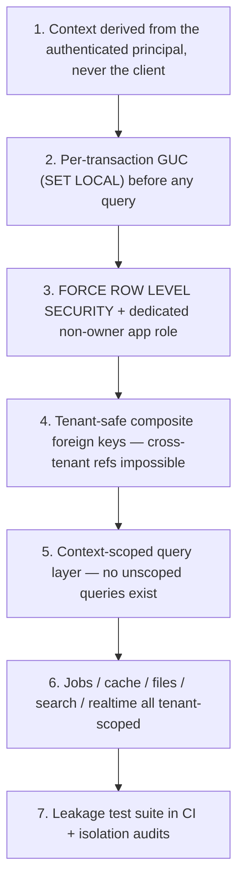

# TENANCY.md — Swasthya Multi-Tenancy Architecture

> **Status:** Working baseline · **Owner:** Principal Architect
> **Version:** 1.0
> **Document chain:** This document is the tenancy deep-dive: `ARCHITECTURE.md` §8 (tenancy in the platform), `DATABASE.md` §1 (tenant strategy, RLS mechanics), `SECURITY.md` §8–9 (isolation controls), `MASTER_RULES.md` §4 (tenancy rules) all converge here. Where details differ, this document is the specification.
>
> **Scope:** the complete multi-tenant architecture — model, context, isolation, lifecycle (provisioning → operation → offboarding), access boundaries, and how accidental cross-tenant access is made impossible. Design only; no implementation.

---

## 0. The Tenancy Model

**The tenant is the Organization.** Everything a hospital group owns — facilities, branches, departments, patients, staff, records, money, configuration — belongs to exactly one organization, and the organization is the unit of **isolation, subscription, billing, and data ownership**.



**Fixed definitions (used everywhere in this document):**

| Term | Definition |
|---|---|
| **Platform** | The SaaS operator. Runs the product; its own identity class and tables; no tenant of its own. |
| **Organization (tenant)** | The paying customer. Owns all data below it. Isolation boundary, subscription boundary, billing boundary. |
| **Facility** | A hospital (or clinic/care site) owned by one organization. The common *operating* context for staff workflows. A user may hold access to one or many facilities within an organization. |
| **Branch** | A unit/site within a facility (wing, satellite unit). Operational scope for queues, stock, rosters. |
| **Department** | Organizational structure within a facility; groups staff, work, and reporting. |
| **Staff / user** | A person with an account. Tenancy is expressed through **role assignments** (user × role × tenant × facility scope), never on the user row itself (`DATABASE.md` §1.3). |

**Two structural rules:**

1. **A facility belongs to exactly one organization.** Cross-organization facility references do not exist (and cannot, structurally — `DATABASE.md` §0.9).
2. **A user's access is always expressed as scoped assignments**, never as global membership: a user who works at Facility A-1 and Facility A-2 of Organization A holds two facility-scoped (or one org-scoped, per policy) assignments. A user with no assignments has no access.

---

## 1. Tenant Identification

- **`tenant_id`** is the universal key: a UUID referencing `organizations.id`, present on every tenant-scoped row and table (`DATABASE.md` §1.1).
- **Tenant *code*** (the org slug, e.g., `biratnagar-general`) is a human-facing identifier used in support, exports, and optional branded portal subdomains — unique, immutable in practice, never a foreign key.
- **`tenant_id` never appears in API URLs.** Resources are addressed by their own IDs; the tenant is resolved from the authenticated principal (Section 3), never from the path, query, or body. Rationale: URLs are logged, bookmarked, shared, and cached; a tenant identifier in a URL is both a leak and a temptation to trust it.
- **Optional branded subdomains** (`facility.brand.example`) are a *presentation* feature (portal branding), mapped to the principal's validated context — never an input that establishes context on its own.
- Tenants are identified **once**: the same organization is the same tenant across every facility, every environment, and every export.

---

## 2. Context Model

Every request executes inside a **context stack**. Context is a server-side fact derived from the authenticated principal — it is never "whatever the client said the tenant was."

### 2.1 The stack

```
Principal (authenticated user)
  └─ Platform context        — only for platform-role users (no tenant)
  └─ Tenant context          — the active organization (exactly one per request)
       └─ Facility context   — the active facility (exactly one per request, when the workflow is facility-local)
            └─ Branch context— optional, for branch-local workflows (queue, stock)
```

- **Tenant context:** the organization whose rows the request may touch. Derived by validating the principal's active role assignments in the requested (or default) organization.
- **Facility context:** the facility within that organization the user is operating in. Derived by validating the facility against the principal's scoped assignments. A multi-facility user switches facility deliberately; the switch re-validates, never assumes.
- **Branch context:** where workflows are branch-local; validated like facility.
- **Patient context:** patient portal requests are *self-scoped* — the principal is the patient, and context is derived from their patient record (their organization) and the facilities where their care is delivered. A patient never selects a context and can never see another patient's context (`PRODUCT_REQUIREMENTS.md` §6.2).
- **Platform context:** superadmin requests carry no tenant; they operate on platform tables (roles, plans, tenant lifecycle) and reach *into* a tenant only through explicit, audited, time-boxed grants (Sections 9–10).

### 2.2 Context rules

1. **One tenant per request.** Context is fixed at request start; it cannot be switched mid-transaction.
2. **The client may *request* a context (facility switch), the server *validates and derives* it.** The client proposes; the server disposes.
3. **Every request has a context** — a request that fails to establish a validated context is rejected (default deny), never run "without" one.
4. **Context is immutable within the request** and is carried into audit events, logs (correlation ID), and every downstream call (Section 4).

---

## 3. How Every API Request Establishes Tenant Context

```mermaid
sequenceDiagram
    participant S as SPA
    participant A as Auth middleware
    participant C as Context resolver
    participant P as PostgreSQL (RLS)
    S->>A: request + bearer token (+ optional facility switch)
    A->>A: verify token, load principal
    A->>C: principal + requested facility
    C->>C: resolve active role assignments for principal
    C->>C: validate requested facility is within an assigned org/facility scope
    C->>C: derive tenant_id from that facility's organization (never from client)
    C->>P: BEGIN; SET LOCAL app.tenant_id = <derived org uuid>
    C->>P: run context-scoped query
    P-->>S: tenant rows (RLS) ∧ facility rows (policies)
```

**Step by step:**

1. **Authenticate.** The bearer token is verified; the principal (user, roles, active assignments) is loaded. No token → no context → 401.
2. **Resolve intended context.** The request may carry a facility-context hint (a switch); the resolver takes the principal's active role assignments and determines which organizations and facilities the principal may use.
3. **Validate, then derive.** The requested facility must match an active assignment. The **`tenant_id` is then derived from that facility's organization** — the client never supplies a `tenant_id`. If the hint is absent, the principal's default/active context (from their session) is used and validated the same way.
4. **Set the database context.** Before any query, the middleware opens the transaction and issues `SET LOCAL app.tenant_id = '<uuid>'` — transaction-scoped, per `DATABASE.md` §1.5 (PgBouncer must be session-mode).
5. **Run the request.** All queries execute under the RLS policy; the policy layer additionally enforces facility/branch scope (Section 7).
6. **Commit/rollback.** Context dies with the transaction.

**Background jobs and realtime follow the same rule from the other side:** every job payload carries its validated `tenant_id` (and facility scope), and the worker re-establishes context — validating the job's tenant, not assuming it — before executing (`ARCHITECTURE.md` §8.4). Realtime channel subscriptions are authorized per channel against the principal's context; a channel name is never trusted from the client.

---

## 4. Context in Every Execution Context

Tenancy is not just "the request has a tenant." Every place data moves carries context:

| Execution context | How tenancy is carried |
|---|---|
| **API request** | GUC in transaction (Section 3) |
| **Queue job** | `tenant_id` + facility scope in the payload; re-validated and re-established on the worker |
| **Scheduled jobs** | Explicit per-tenant loops or per-tenant job dispatch — never a "global" job that touches all tenants without tenant context |
| **Cache** | Cache keys are tenant-prefixed; caches are shared infrastructure, never shared data |
| **Object storage** | Tenant-prefixed key hierarchy + IAM scoping; signed URLs scoped per request (`ARCHITECTURE.md` §12) |
| **Search** | Index/query tenant-scoped; the initial PostgreSQL search inherits RLS (`ARCHITECTURE.md` §17) |
| **Realtime channels** | Channel names namespaced by tenant; subscription authorized per principal |
| **Outbound notifications / integrations** | Tenant context carried in the dispatch record; integration credentials are tenant-scoped |
| **Audit events** | `tenant_id` (+ facility where relevant) recorded on every event (Section 11) |
| **Logs** | Correlation ID + tenant reference (no PHI) connect requests to their context |

---

## 5. Tenant Isolation

Isolation is enforced in **layers** — each layer assumes the one before it may fail:



- **Layer 3 is the guarantee.** Even if application code is buggy — a forgotten `WHERE`, a wrong join, a mis-scoped service — RLS means the row set a query can see is constrained by `app.tenant_id` at the database engine. That is the property that makes a multi-tenant SaaS safe to operate: isolation does not depend on every future developer writing perfect queries (`MASTER_RULES.md` §4.3).
- **Layer 4 makes cross-tenant references structurally impossible**, so even a buggy insert cannot point tenant A's child at tenant B's parent.
- **Layer 5 removes the class of bug:** the query layer is context-aware by construction (models resolve against the active context); a developer cannot accidentally write an unscoped `Patient::all()` because such a query is either impossible through the abstraction or fails review.

---

## 6. Row-Level Isolation Strategy

### 6.1 Which boundary is enforced where

| Boundary | Enforced by | Strength |
|---|---|---|
| **Tenant (organization)** | PostgreSQL RLS (`FORCE ROW LEVEL SECURITY`, `swasthya_app` role, GUC policy) | **Hard — database-level guarantee** |
| **Facility** | Application policy layer (role scope → facility) | Strong — enforced per request and per job; optional hard RLS dimension for tenants that require it (Section 6.3) |
| **Branch** | Application policy layer | Strong — branch-local workflows only |
| **Record-level (doctor → own patients)** | Application policies (ABAC-style conditions) | Strong — policy tests mandatory |

**Why tenant is the hard boundary and facility is policy:** staff legitimately span facilities within an organization (a doctor covering two hospitals of the same group), so facility walls must be configurable, not absolute. Tenant walls are absolute: no legitimate operation spans organizations except explicit, audited platform support (Sections 9–10).

### 6.2 RLS mechanics (recap from `DATABASE.md` §1.5)

- Every tenant-scoped table: `ENABLE ROW LEVEL SECURITY` **and** `FORCE ROW LEVEL SECURITY` (owner included).
- Policies: `USING (tenant_id = current_setting('app.tenant_id')::uuid)` with matching `WITH CHECK`.
- The application connects as `swasthya_app` — non-owner, non-superuser, no `BYPASSRLS`. Migrations run under a separate scoped deploy role that holds no runtime privileges (`SECURITY.md` §14).
- `SET LOCAL` is transaction-scoped; PgBouncer runs in **session mode** (`ARCHITECTURE.md` §8.5).
- The leakage test suite executes queries that *attempt* cross-tenant reads and writes at the API and SQL layers and fails CI on any success (`MASTER_RULES.md` §16.4).

### 6.3 Escalation: schema-per-tenant

For enterprise/compliance customers, the documented escalation is **schema-per-tenant** behind the same tenant-context abstraction: `SET LOCAL search_path` instead of `app.tenant_id`, same policies shape, same query layer, business code untouched (`ARCHITECTURE.md` §28.7). This is a deployment option, not a second codebase.

---

## 7. Authorization Boundaries

Context tells you *whose data*; authorization tells you *what you may do with it*. The two compose per request:

| Scope type (role assignment) | Grants |
|---|---|
| **Platform** | Platform tables and tenant-lifecycle operations (Sections 9, 12–16) |
| **Organization** | Org-wide administration within one tenant (facilities, staff, settings, subscription view) |
| **Facility** | Operations within one facility: clinical, front desk, billing, pharmacy, lab — as the role's action permissions allow |
| **Branch** | Branch-local operations only (queue, stock, rosters) |
| **Patient** | The patient's own records, per consent and visibility policy |

**Boundary matrix rules:**

1. A request is allowed iff **context** (the rows) **and** role **actions** (the verbs) both authorize it — plus RLS as the backstop.
2. **Facility-scoped roles cannot reach other facilities of the same org**, even though RLS would allow it; the policy layer enforces the facility dimension.
3. **Org-scoped roles can administer all facilities** of their org — by design, but every org-level action is audited (Section 11).
4. **Record-level scoping** (doctor → own patients, nurse → own ward) is layered on top via policies; these are the same policy tests that make up the authorization matrix (`MASTER_RULES.md` §16.4).
5. **Staff visibility is need-to-know**: no role grants "browse all patients of the tenant" without a specific, audited purpose (support, audit functions are scoped and logged).

---

## 8. Cross-Tenant Protection — How Accidental Access Is Prevented

The answer is **structural, not procedural**: a cross-tenant read or write is not "something to be careful about"; it is something the architecture makes impossible to express. Concretely:

1. **The client cannot name a tenant.** `tenant_id` is never accepted as input; context is derived from the principal (Section 3). A forged request field is ignored.
2. **The database enforces the boundary.** RLS + `FORCE` + non-owner app role means the query engine itself returns only the active tenant's rows — including for joins, subqueries, and aggregations a future developer writes incorrectly (Section 6.2).
3. **Cross-tenant references cannot be created.** Tenant-safe composite FKs (`DATABASE.md` §0.9) make a child row in tenant A pointing at a parent in tenant B a database-error, not a data bug.
4. **No unscoped query path exists.** The query layer is context-aware by construction; ad hoc raw SQL is prohibited (`MASTER_RULES.md` §5.5); the escape hatch is vetted and still context-scoped.
5. **Every execution context is tenant-tagged** (Section 4): a background job cannot "forget" its tenant; a cache key cannot collide across tenants; a signed file URL cannot address another tenant's prefix; a realtime channel subscription is authorized per context.
6. **Deliberate cross-tenant operations use a separate, controlled path.** Platform support enters a tenant through explicit per-tenant grants (Section 10) — never by relaxing RLS, never by a "superuser mode" that disables policies. The platform has no "view everything" SQL path; it has audited, time-boxed, per-tenant access.
7. **The failure modes are tested, not hoped for.** The leakage suite attempts: direct cross-tenant API reads, cross-tenant writes via crafted IDs, cross-tenant references via FK-bypass attempts, job-payload tenant swaps, cache-key collisions, file-URL prefix traversal, and RLS-bypass attempts — all must fail. Isolation audits (automated probes) run periodically on live environments (`SECURITY.md` §8).

---

## 9. Platform-Admin Access

- Platform admins operate in **platform context** (no tenant): tenant lifecycle, plans, entitlements, platform catalogs, support tooling, monitoring.
- **Platform admins do not have blanket tenant data access.** Access to a tenant's data is *per-tenant, per-purpose, time-boxed* (Section 10).
- Platform actions on tenants (provision, suspend, offboard, adjust entitlements) are themselves tenant-audited events with actor and reason (`MASTER_RULES.md` §19.3).
- Break-glass platform access (emergency tenant intervention) is explicit, MFA-protected, alerted, and reviewed — never a standing backdoor (`SECURITY.md` §26).
- **No impersonation-as-norm:** if support must act as a user (rare), it is a logged, alerted, time-boxed impersonation that records the support actor separately from the impersonated identity — and is not available for routine work.

---

## 10. Support Access

The support model is **just-in-time, per-tenant, reason-bound, and audited**:

| Mode | How | Guardrails |
|---|---|---|
| **Org admin self-service** | Org admins operate within their own tenant normally | Scoped to org; audited |
| **Support grant** | A support engineer requests a time-boxed (default hours, max days) tenant-scoped grant with a reason; approved; expires automatically | MFA; expiry; read-first (write only for the specific approved operation); audited; no standing grants |
| **Break-glass** | Emergency intervention with elevated rights | Alert on activation; time-boxed; post-hoc review required; credentials rotate |
| **Read-only support role** | A tenant-scoped, read-only role for diagnostics | Cannot mutate; audit shows every read of sensitive records |

Rules:

- Support never holds *cross-tenant* grants; each grant is for exactly one tenant.
- A support session's audit trail carries the support actor, the grant reason, the tenant, and the actions taken.
- Support access to patient data follows the same need-to-know and consent rules as any other access (`MASTER_RULES.md` §10.8) — and is auditable by the tenant on request.

---

## 11. Audit Requirements

- Every audit event records the **context**: `tenant_id` (null for platform events), `facility_id` where relevant, actor (with support-actor distinction when impersonating), action, resource, payload, and timestamp (`DATABASE.md` §3.36).
- **Tenant-scoped audit queries**: a tenant can see its own audit trail; platform sees platform events and (with a grant) tenant events for support.
- **Cross-tenant attempts are audited and alerted**: authorization denials on sensitive resources, RLS-blocked anomalies, and out-of-context job executions are events, not noise (`SECURITY.md` §25).
- **Lifecycle events are audited with the same rigor as clinical data**: provisioning, suspension, reactivation, offboarding, purge, exports, and migration each produce a complete event chain (who, why, what, when, outcome).
- Audit data is append-only, tamper-evident, backed up with clinical-grade rigor, and included in RPO/RTO (`MASTER_RULES.md` §19.5).

---

## 12. Tenant Provisioning

Onboarding a new organization is a **designed, idempotent, transactional flow** — never hand-editing the database (`MASTER_RULES.md` §4.8):

1. **Identity:** create the organization (code, currency, timezone, locale) and the platform subscription record (Section 20).
2. **Structure:** create the first facility, its branches, and baseline departments — with facility context wired to the org.
3. **People:** create the org-admin role assignment(s) (bootstrap admin with MFA enforced at first login) and the initial staff records.
4. **Configuration:** apply tenant defaults — settings, catalogs (formulary, test catalog, price lists are seeded as *tenant-owned* data), notification templates, document types.
5. **Entitlements:** grant the entitlements the chosen plan provides (Section 19).
6. **Verification:** run a tenant-scoped leakage probe against the new tenant (a fresh-tenant isolation check) before it goes live.
7. **Completion:** the tenant is provisioned only when steps 1–6 are all committed; retries are idempotent (a partially completed provision never leaves a half-tenant).

Provisioning is a platform operation, versioned and tested like code; the flow is a documented runbook with a rollback path (provision → verify → activate; failure → deactivate without data loss).

---

## 13. Tenant Suspension

Suspension is a **state**, not a delete. States: `active` → `past_due` (warning) → `suspended` → `offboarding` → `purged`.

| State | What changes |
|---|---|
| **active** | Normal operation |
| **past_due** | Billing reminders; platform alerts; no functional loss (grace period per policy) |
| **suspended** | Staff logins blocked; **writes blocked** (clinical, financial, stock); reads available to org admins for export preparation; scheduled jobs for the tenant paused; integrations paused; patient portal per tenant policy (usually read-only or blocked with explanation) |
| **offboarding** | Read-only archive window for export (Section 14), then purge (Section 15) |
| **purged** | Data removed per retention law; only the audit trail of the lifecycle remains |

Rules:

- Suspension never touches data — it flips a context gate at the platform layer (login, write, job, integration gates keyed on tenant status).
- The suspension reason is required and audited; suspension/re-activation are platform operations with alerts.
- A suspended tenant's data stays fully isolated (RLS unchanged); isolation never weakens because a tenant stopped paying.

---

## 14. Tenant Deletion (Offboarding)

**Two phases, both guarded:**

1. **Offboarding window (read-only archive):** the tenant enters a read-only state; an **export** (Section 15) is produced and verified; the window duration is policy- and law-driven; the tenant's admin is notified.
2. **Purge (destructive, audited, scheduled):** after the window and retention obligations are satisfied, the purge removes tenant data **across every store**: database rows, object storage keys, cache keys, search index entries, queue payloads, and backup retention per policy (`MASTER_RULES.md` §36.6, `DATABASE.md` §4.2).

Guardrails:

- Purge is a scheduled, tested job — never ad hoc SQL; it is **irreversible** and therefore requires: platform-level confirmation (the type-to-confirm pattern per `DESIGN_SYSTEM.md` §27), a recorded reason, and a full audit trail of the purge itself.
- Purge respects foreign-key and archival structure (partition detach, ordered deletes) — it never corrupts neighboring tenants' data (which is structurally impossible anyway, Section 6).
- A tenant that must be retained for legal reasons is archived, not purged, until the retention period lapses.
- **What survives:** the tenant's audit events (as required by law) and the lifecycle event chain — the fact that the tenant existed, operated, and was purged.

---

## 15. Tenant Export

- **Purpose:** data portability and offboarding — the tenant's complete data, in a documented, structured form.
- **Scope:** clinical records, financial records, configuration (settings, catalogs), staff and user records (per data-protection rules), documents (file references + content), audit-trail evidence the tenant is entitled to.
- **Format:** structured, documented (JSON/CSV with a published schema; clinical records also offered as FHIR-projection where the exchange standard applies); exported data preserves tenant context and identifiers (MRNs, encounter numbers).
- **Security:** exports are generated by a scheduled job, encrypted, stored in tenant-scoped object storage, delivered via signed, audited URLs; exports are themselves audited events (`MASTER_RULES.md` §19.3 — data export is an audited class).
- **Access:** only the tenant's org admins (and platform, with a grant) may trigger an export; every export run records who, what scope, when.
- Export is available **before** offboarding — a tenant can export without leaving.

---

## 16. Tenant Backup

- **Backups are global by nature** (the whole database, PITR via WAL) — that is the platform's restore story (`SECURITY.md` §29).
- **Per-tenant restore capability:** because data is tenant-keyed, a *tenant-scoped* restore is possible from PITR (extract the tenant's rows and files to a point in time) — used for tenant-initiated recovery (accidental deletion within a tenant) under audit.
- **Tenant backup ≠ global backup:** the global backup guarantees platform recovery; the tenant export (Section 15) is the tenant's own record. Both exist; they serve different obligations.
- Backup restore drills verify **RLS integrity** — a restore that breaks policies would be a data-leak event, so policy re-application is part of the drill (`SECURITY.md` §29).
- Offboarding: tenant data is removed from backups per the retention policy after purge — backup grooming is part of the purge flow.

---

## 17. Tenant Migration

Migration is a **documented, tested, reversible procedure** with verification and rollback — never a live hack:

| Scenario | What happens |
|---|---|
| **Tenant to a different instance/region (data residency)** | Export → validate → import into the target (fresh tenant) → verify (counts, IDs, RLS) → cut over → retain source in archive until verified |
| **Schema-per-tenant escalation** | Move a tenant from shared-schema RLS to its own schema behind the same context abstraction (`ARCHITECTURE.md` §28.7); business code untouched |
| **Facility split (one facility → two)** | Data re-parenting within the tenant (patients, appointments, stock) with identity review; audited; both facilities verified |
| **Organization split (one org → two)** | Requires org-level re-parenting and new subscription(s); contract review first; executed as a migration project with verification at every step |

**Universal migration rules:**

1. **No ID regeneration.** UUIDs stay stable; references (files, audit events, exports) must not break.
2. **Tenant-safe FKs are re-verified** after any re-parenting.
3. **Migration is verified by automated checks** (row counts, referential integrity, RLS probes, spot clinical checks) before the source is retired.
4. **Rollback path exists** for every migration step; source is retained in archive until the post-migration verification window closes.
5. Migration is a platform operation with a runbook and is itself audited end-to-end.

---

## 18. Tenant-Specific Configuration

Configuration is **data, not code** (`MASTER_RULES.md` §1.3, §28.3) — and it is tenant-owned, layered by scope:

| Level | Configuration examples |
|---|---|
| **Organization** | currency, timezone, locale, tax settings, offboarding/retention preferences, notification defaults, MFA policy for patients |
| **Facility** | departments, wards/beds, clinical catalogs (formulary, test catalog), price lists, document types, working hours |
| **Branch** | queues, stock, rosters |
| **Platform** (not tenant-owned) | roles, permissions, plans, platform feature flags |

- Settings are versioned and audited (`MASTER_RULES.md` §19.3; `DATABASE.md` §5.5 in the requirements doc).
- Tenant configuration is **isolated like data**: a setting for Organization A is invisible to Organization B (same RLS/policy rules).
- Configuration is included in tenant export (Section 15) and validated at provisioning (Section 12).
- Clinical configuration (catalogs, rules) additionally requires clinical-authority review before activation (`PRODUCT_REQUIREMENTS.md` §5.5).

---

## 19. Feature Entitlements

- **Model:** subscription (Section 20) → plan → plan features → runtime **entitlements** for the tenant (`DATABASE.md` §3.41).
- **Enforcement:** entitlement checks run at the API middleware and job-dispatch layers — a tenant without the lab entitlement cannot reach lab endpoints or receive lab jobs, regardless of what the UI shows (`MASTER_RULES.md` §38: server-side enforcement).
- **Scope:** entitlements are granted per tenant (org); capacity entitlements (facilities, users, storage) are enforced at the boundaries where they apply (a facility count over the limit blocks facility creation, not existing data).
- **Lifecycle interplay:** suspension revokes effective entitlements at runtime (writes/jobs gated, Section 13) without deleting entitlement records; reactivation restores them; a downgrade **caps** (blocks new usage) and never deletes existing data.
- **Audit:** entitlement grants/revocations and enforcement denials are audited; metering is accurate and never fabricated (`MASTER_RULES.md` P.15).

---

## 20. Subscription Boundaries

- **The subscription is per-organization (per tenant).** It is the commercial boundary that contains the tenant's facilities, users, and entitlements.
- **What the subscription scopes:** plan (module entitlements), facility/user capacity, storage/usage metering, and the billing relationship (Section 19; `PRODUCT_REQUIREMENTS.md` §5.7).
- **Facilities are inside the subscription:** adding a facility consumes facility capacity and is a tenant-admin action bounded by the entitlement; it is never a platform-side hack.
- **Users are inside the tenant:** staff accounts consume user capacity per the plan; a user spanning two facilities of the same org counts once for the org's subscription.
- **Subscription state drives tenant state** (Section 13): `past_due` warns, `suspended` gates, `cancelled` leads to offboarding (Section 14). The subscription is the only route into the lifecycle states — there is no other way to suspend or offboard a tenant.

---

## 21. Failure Modes — The Tested Set

The leakage test suite and isolation audits cover, at minimum:

| Failure mode | Test |
|---|---|
| Forged tenant in request body/header/query | Attempt → must be ignored/denied |
| Cross-tenant read via crafted resource ID | Attempt at API layer → 404/403 (no leak) |
| Cross-tenant write via crafted FK | Attempt → must fail (FK + RLS) |
| Job executes with wrong tenant payload | Swap payload → must be rejected/re-validated |
| Cache key collision across tenants | Concurrent same-key writes in two tenants → must not mix |
| File URL prefix traversal | Address another tenant's key → must be denied |
| Realtime channel cross-subscription | Subscribe to another tenant's channel → must be denied |
| RLS bypass (owner/superuser path) | Connect as owner/superuser with app creds → must be impossible (non-owner role) |
| Unscoped query (forgotten WHERE) | Query without tenant filter → must return nothing (RLS) |

---

## 22. The Tenancy Invariants

1. **The tenant is the organization; the org is the isolation, subscription, and billing boundary.**
2. **`tenant_id` is derived from the authenticated principal — never accepted from the client.**
3. **Tenant isolation is a database guarantee (RLS + FORCE + non-owner role), not an application habit.**
4. **Cross-tenant references are structurally impossible (tenant-safe composite FKs).**
5. **Facility/branch scoping is policy-enforced on top of the tenant hard boundary.**
6. **Every execution context — request, job, cache, file, search, realtime, audit — carries tenant context.**
7. **Platform/support access to tenant data is per-tenant, purpose-bound, time-boxed, and audited — never blanket.**
8. **Tenant lifecycle (provision → suspend → offboard → purge) is designed, tested, idempotent, and fully audited.**
9. **Suspension never weakens isolation; purge never touches another tenant; isolation audits run continuously.**
10. **If any of these invariants is ever violated, it is an incident** (`MASTER_RULES.md` §4.9) — not a backlog item.

---

*This document is the tenancy contract for Swasthya. The design it specifies — context derived from the principal, RLS as the guarantee, tenant-safe structure, and a lifecycle that is designed rather than improvised — is what makes "one platform, many hospitals, none of them ever seeing each other's data" an architectural property rather than a hope.*
