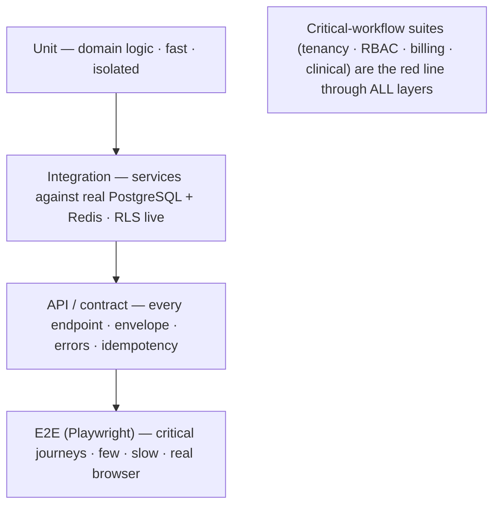
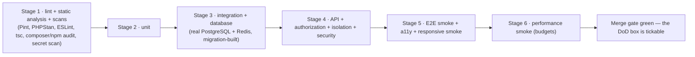

# TESTING_STRATEGY.md — Swasthya Testing Strategy

> **Status:** Working baseline · **Owner:** Principal Architect (strategy ratified with the team)
> **Version:** 1.0
> **Document chain:** This document operationalizes `MASTER_RULES.md` §16 (testing rules) and §40 (definition of done), `SECURITY.md` §34 (security testing), `TENANCY.md` §21 (failure modes to test), `API_CONTRACTS.md` (contract tests), and `DESIGN_SYSTEM.md` (a11y/responsive checks). It defines **how Swasthya proves itself** — a strategy, not an implementation. No tests are implemented here.

---

## 0. Testing Philosophy

1. **Tests are release gates, not chores.** A test that exists is enforced; a workflow without a test does not ship (`MASTER_RULES.md` P.9).
2. **Test behavior, not implementation.** Tests assert what the system does for its users — not how functions call each other. Refactors must not break tests unless behavior changes.
3. **The pyramid is the shape.** Fast, many unit tests; fewer integration; fewer still API/contract; a handful of end-to-end journeys. The expensive layers prove the cheap layers' assumptions; they do not duplicate them.
4. **The critical-workflow suite is the red line** through every layer: tenancy, authorization, billing, and clinical safety have *mandatory* tests at every layer that touches them (Section 4).
5. **Tests run on the real stack.** Real PostgreSQL (RLS is a runtime property, not a mock), real Redis, real schema from migrations — never SQLite in-memory, never mocked ORM (`MASTER_RULES.md` §16.2).
6. **Flaky tests are a defect.** Fixed immediately or quarantined — re-running a flaky test until green is prohibited (`MASTER_RULES.md` §16.5).
7. **Test data is synthetic.** Factories and fixtures only; production data never enters test environments, and test data never pretends to be real (`SECURITY.md` §28; `MASTER_RULES.md` P.1).

---

## 1. The Testing Pyramid

| Layer | What it proves | Speed | Count | Fails on |
|---|---|---|---|---|
| **Unit** | Domain rules, value objects, status machines, money math, calculations | ms | Most (~70 %) | Broken business rule |
| **Integration** | Services, repositories, RLS behavior, jobs, transactions against the real stack | s | Many (~20 %) | Broken contract between layers |
| **API / contract** | Every endpoint: auth, tenancy, validation, envelope, errors, pagination, idempotency, concurrency | s | Medium (~7 %) | Contract violation |
| **E2E** | Real user journeys in a real browser against a seeded environment | min | Few (~3 %) | Broken journey |

**Layering rules:**

- A rule testable at a lower layer is tested there first (a money rule is a unit test, not an E2E assertion).
- Every layer above unit adds *integration realism*, not coverage of the same rule again — except for the **critical workflows**, which are deliberately re-proven end-to-end (Section 4).
- E2E covers the journeys, not the matrix; the matrix (roles × actions) lives in API/authorization tests where it is fast and exhaustive.

---

## 2. Test Environment and Tooling

- **Backend:** Pest/PHPUnit — unit, feature/API, database, authorization, isolation, security suites. Factories for all entities (`DATABASE.md` §3).
- **Frontend:** Vitest + Testing Library (unit/component), Playwright (E2E + responsive + accessibility scans).
- **Contract:** OpenAPI-schema validation in API tests — every response is validated against the generated spec, so the contract cannot drift.
- **Databases in CI:** real PostgreSQL + Redis as service containers; one fresh test database per parallel worker; schema built by running the migrations (this *is* the migration test — Section 3.15).
- **Seeding:** factories + explicit fixtures per test; never production data; deterministic where determinism matters (time is injected, not read from the wall clock, in every test that asserts on time).
- **CI:** GitHub Actions stages (Section 6); every PR runs the full gate; nightly runs the heavy suites; quarterly runs the DR/restore drills.

---

## 3. Test Types

### 3.1 Unit Tests

- **Purpose:** prove domain rules in isolation — no database, no HTTP.
- **Scope:** money arithmetic (minor units, tax basis points), status machines (valid/invalid transitions), validation rules, date/timezone logic, prescription dose rendering, stock quantity math, idempotency-key hashing, audit payload versioning.
- **Where:** PR gate, fastest layer.
- **Rule:** a unit-testable rule found only in an integration test is a review finding.

### 3.2 Integration Tests

- **Purpose:** prove services and repositories work against the real stack — including **RLS behavior**, transactions, and jobs.
- **Scope:** service-level use cases (book appointment, dispense, post charge), repository queries (indexes, tenant scoping), job execution (context re-establishment), transaction rollback behavior, optimistic-lock conflicts.
- **Key assertion classes:** every query executed against PostgreSQL; `SET LOCAL app.tenant_id` is applied and *held* for the transaction; a failed transaction leaves no partial writes.
- **Where:** PR gate.

### 3.3 API Tests

- **Purpose:** every endpoint, exactly as a client sees it.
- **Scope:** status codes per contract, envelope shape, error taxonomy, pagination/filtering/sort, `If-Match`/`ETag` concurrency, `Idempotency-Key` semantics (first use, replay, reuse-conflict), headers (`X-Audit-Event-Id`, `X-Request-Id`, rate-limit headers), and **response-schema validation against OpenAPI**.
- **Matrix coverage:** each endpoint's validation cases (valid, invalid types, unknown fields, out-of-range).
- **Where:** PR gate.

### 3.4 Database Tests

- **Purpose:** the schema and its guarantees, proven at the database layer.
- **Scope:** constraints (NOT NULL, CHECK, FK), tenant-safe composite FKs (a cross-tenant reference *must* fail), RLS policies (Section 3.6), partial unique indexes (active-scope uniqueness), partitioning (new partition attach, query plan uses the partition), soft-delete behavior, cascade/restrict behavior (clinical history is never cascade-deleted).
- **Where:** PR gate (against a fresh migration-built database).

### 3.5 Authorization Tests

- **Purpose:** the authorization matrix — every role × every action × scope, asserted as allow/deny (`MASTER_RULES.md` §16.5).
- **Design:** data-driven from role/permission fixtures; one test case per (role, action, scope) combination; includes facility-boundary cases (same role, different facility → denied) and record-level cases (doctor → own patients only).
- **Proves:** policies are the only authority; no controller-level bypass; a permission that cannot be tested does not exist.
- **Where:** PR gate; regenerated when roles or permissions change.

### 3.6 Tenant Isolation Tests

- **Purpose:** prove cross-tenant access is impossible — the platform's core safety property (`TENANCY.md` §21).
- **Scope (the leakage suite):** forged tenant in body/header/query; cross-tenant read via crafted IDs; cross-tenant write via crafted FK; job payload tenant swap; cache-key collision; file-URL prefix traversal; realtime channel cross-subscription; RLS bypass attempts (owner/superuser paths); unscoped query (no tenant filter) returns nothing.
- **Proves:** each attempt fails at the layer it is aimed at — API denial, FK error, RLS empty set, etc. — with no data leaked.
- **Also:** an automated isolation probe run periodically against a live (staging) environment (`SECURITY.md` §8).
- **Where:** PR gate (automated suite) + scheduled isolation audit.

### 3.7 Security Tests

- **Purpose:** the security controls prove themselves (`SECURITY.md` §34).
- **Scope:** headers (CSP, HSTS, nosniff, frame-ancestors) present and correct; CORS rejection of disallowed origins; rate-limit behavior and 429 handling; lockout thresholds; token revocation (logout/password change/role change effective everywhere); MFA enforcement (no staff path without it); secret scanning in CI; dependency audits; SSRF egress allowlist; upload scanning (staged → scanned → available, quarantine on failure).
- **Where:** PR gate (automated suite) + scheduled DAST on staging + annual independent pentest.

### 3.8 End-to-End Tests

- **Purpose:** the critical journeys work in a real browser against a seeded, production-shaped environment.
- **Scope:** the journeys in Section 4 — login with MFA, register → book → check-in → encounter → prescribe → dispense → bill → pay, admission → discharge, lab order → verify → report. One journey per critical flow, asserted at the journey level (not re-asserting every unit rule).
- **Where:** PR gate (smoke subset) + nightly (full set).

### 3.9 Frontend Tests

- **Purpose:** the SPA's own behavior — components, state, and the client contract.
- **Scope:** component rendering and interaction (Testing Library, user-event), forms (validation messaging, busy states), the typed API client (mocked transport, asserted request/response mapping against OpenAPI types), state management (loading/error/success transitions), no-regression rendering.
- **Where:** PR gate.

### 3.10 Mobile Responsive Tests

- **Purpose:** mobile-first is a claim that must be proven (`DESIGN_SYSTEM.md` §4, §32).
- **Scope:** every critical screen at every breakpoint (base → xxl): no horizontal scroll at mobile widths; primary action reachable; touch targets ≥ 44 px; tables degrade to cards correctly; bottom nav/bottom sheets behave; safe-area handling; Devanagari text rendering without clipping.
- **Where:** PR gate (responsive smoke) + nightly (full matrix on real device viewports via Playwright).

### 3.11 Accessibility Tests

- **Purpose:** WCAG 2.1 AA is the floor (`DESIGN_SYSTEM.md` §30).
- **Scope:** automated axe scans on rendered screens (contrast, labels, landmarks, ARIA); keyboard-completeness walk of critical flows; focus visibility; screen-reader review of the critical workflows (manual, per release — automated scans cannot hear).
- **Where:** PR gate (automated) + per-release manual screen-reader review. An a11y regression blocks merge.

### 3.12 Performance Tests

- **Purpose:** the budgets hold (`ARCHITECTURE.md` §27; `DESIGN_SYSTEM.md` §14).
- **Scope:** API p95 latency per route class; database query budgets (N+1 detection via query counting in CI — a hot path with N+1 fails); frontend LCP/bundle budgets; TTFB; index-plan sanity on hot queries.
- **Where:** PR gate (smoke budgets) + nightly (full budgets); results trended.

### 3.13 Load Tests

- **Purpose:** the platform survives real hospital rhythms at national scale (`ARCHITECTURE.md` §27).
- **Scope:** peak-hour OPD rush (registration + booking + queue + billing concurrency); ER arrival spikes; lab result floods; notification campaigns; concurrent slot booking and bed assignment races (correctness under contention — one winner, no double-booking); queue saturation and backoff behavior.
- **Where:** nightly/scheduled (staging); results measured against SLOs; contention tests assert *correctness*, not just throughput.

### 3.14 Regression Tests

- **Purpose:** the whole suite is the regression net; nothing additional is built "for regression" as a separate category — regression coverage is the union of everything above.
- **Scope:** plus visual regression per component (baseline screenshots, change-reviewed, no snapshot sprawl) and cross-feature invariants (a billing change does not break pharmacy charging — asserted by the billing + API suites together).
- **Where:** every PR runs the net; the net is the merge gate.

### 3.15 Migration Tests

- **Purpose:** migrations are safe forward and backward (`MASTER_RULES.md` §30).
- **Scope:** fresh-database build from zero (CI does this on every run — the schema is always provably constructible); upgrade path from the previous release's schema (apply old → migrate → assert data preserved and constraints valid); expand/contract sequence (add nullable → backfill → tighten) without data loss; rollback/down where maintained; partition-maintenance migrations against populated tables.
- **Where:** PR gate (fresh build) + release gate (upgrade-path test on a staging snapshot).

### 3.16 Backup/Restore Tests

- **Purpose:** backups are proven, not assumed (`MASTER_RULES.md` §23.4).
- **Scope:** restore into a clean environment from the latest backup; assert data integrity (counts, checksums), **RLS policy re-application** (a restored DB with broken policies would be a data-leak event — `SECURITY.md` §29), and that the critical journeys run against the restored data.
- **Where:** quarterly restore drill (scheduled, with evidence recorded); automated where feasible, manual-drill evidence where not.

### 3.17 Disaster Recovery Tests

- **Purpose:** the platform comes back within RTO with RPO intact (`MASTER_RULES.md` §22).
- **Scope:** failover test (primary database/region) — cut over, verify reads/writes, verify RLS and audit integrity, verify the runbook works from documented steps (not tribal knowledge); region-loss simulation on staging; secrets/credential path verification after restore.
- **Where:** annual failover exercise + quarterly restore drills; results and evidence archived with the runbook.

---

## 4. Critical Workflows — Mandatory Automated Tests

The following workflows are **non-negotiable test subjects**. For each: the mandatory assertion set, and the layers that must cover it. These are the red line: they are re-proven at every layer that touches them, and a change that touches one without its tests green does not merge.

### 4.1 Login

- **Assert:** valid login issues scoped tokens; wrong password → uniform error + failure audit + lockout after threshold; lockout backoff and reset; MFA challenge required for staff and completed correctly; MFA failure locks; token expiry and refresh rotation; reuse of a rotated refresh token revokes the family; logout revokes everywhere; password change revokes everywhere; rate-limit headers and 429 on auth endpoints.
- **Layers:** API + security + E2E (journey).

### 4.2 RBAC

- **Assert:** every role × action × scope allow/deny is as specified; facility-boundary denials; record-level scoping; role change takes effect immediately (an in-flight token loses the revoked scope); the authorization matrix regenerates cleanly from fixtures; a permission without a test cannot exist.
- **Layers:** unit (matrix generation) + API (enforcement) + integration (policy + DB).

### 4.3 Tenant Isolation

- **Assert:** the full leakage suite (`TENANCY.md` §21): forged tenant fields ignored; cross-tenant reads/writes/FK creations fail; job tenant-swap rejected; cache/file/channel collisions impossible; RLS returns empty for unscoped queries; RLS policies active on every tenant table (a schema-level check asserts `FORCE ROW LEVEL SECURITY` on the whole tenant-scoped set).
- **Layers:** database + integration + API + security.

### 4.4 Patient Creation

- **Assert:** registration succeeds with valid data and issues a unique MRN; validation rejects bad input; **duplicate detection** surfaces candidates (never auto-merges); exact-MRN duplicate is flagged; merge flow requires confirmation, preserves full history, and is audited; MRN uniqueness per tenant holds under concurrency (parallel registrations — one MRN each, no collisions); identifier encryption at rest; consent capture versioning.
- **Layers:** unit (MRN rules, duplicates) + database (uniqueness under concurrency) + API (contract) + E2E (journey).

### 4.5 Appointment Creation

- **Assert:** booking against availability succeeds; **slot double-booking is impossible under concurrency** (parallel requests, one winner — the row-lock test); conflict returns `409` with availability context; check-in/cancel/reschedule transitions are valid and audited; cancellation reasons required; token issuance is race-safe; pagination/filter of the queue is correct.
- **Layers:** unit (state machine) + database (concurrency) + API (contract) + E2E (journey).

### 4.6 Clinical Encounter

- **Assert:** start → document → sign lifecycle; signing makes the record immutable; amendments are new audited versions (originals preserved); a signed encounter cannot be silently edited; diagnoses/prescriptions/orders attach correctly; the Identity Spine fields (patient, MRN) are correct at every step; concurrent edits conflict cleanly (`LOCK_CONFLICT`, no lost data); read access is audited.
- **Layers:** unit (state machine, amendment) + database (immutability, concurrency) + API (sign/amend contract) + E2E (journey).

### 4.7 Billing (charges, invoices, deposits, refunds)

- **Assert:** charge creation is idempotent (replay → same result, different payload → 409); posted charges are immutable (void is a status with reason and approver); invoice totals and tax (basis points) are exact (integer money — no float drift, property-tested); a posted charge is invoiced at most once; deposits track remaining balance; refunds reverse the original transaction and are approved; outstanding/aging is correct; daily reconciliation balances to zero (variance alerts).
- **Layers:** unit (money math, property tests) + database (idempotency storage) + API (contract incl. `Idempotency-Key`) + E2E (journey).

### 4.8 Payments

- **Assert:** capture/allocate across invoices is exact; allocation cannot exceed outstanding; the same payment cannot be double-allocated; idempotency holds end-to-end (a retried payment request returns the original result); refund flows; settlement reconciliation per cashier/day balances (variance is an alert, never silently absorbed); provider failure paths (gateway down → degraded, no money lost, retry safe).
- **Layers:** unit (allocation math) + database (uniqueness) + API (contract) + E2E (journey).

### 4.9 Audit Logs

- **Assert:** audited classes produce events (auth, clinical mutations, financial mutations, role changes, consent, exports, privileged actions, tenant lifecycle); every mutating API response returns `X-Audit-Event-Id` pointing at a real event; the trail is append-only (no update/delete path exists); hash-chain integrity (tamper attempt breaks the chain and is detected); payload versioning (old events stay interpretable); audit survives restore (DR drill asserts audit integrity).
- **Layers:** unit (hash chain, payload versions) + database (append-only enforced) + API (coverage per endpoint) + DR (restore drill).

### 4.10 Expansion criteria

Any new workflow is classified at design time: if it touches **tenancy, authorization, money, clinical safety, or irreversibility**, it joins the mandatory set with its assertion list written before code (`MASTER_RULES.md` §16.8; `DESIGN_SYSTEM.md` High-Risk Actions). Candidate additions as modules land: pharmacy dispensing (batch correctness, reversal), lab verification (entry ≠ verification, critical values), admission/discharge (bed races, discharge summary completeness), blood issue (dual verification), CDSS alerts (override reconstruction).

---

## 5. Coverage Policy and Quality Gates

- **Coverage floors** (line/branch, measured per module): critical modules (tenancy, authn/authz, billing, clinical) **≥ 90 %**; platform core ≥ 85 %; feature modules ≥ 75 %. An unreviewed drop in a critical module blocks merge.
- **Coverage is a floor, not a target:** the critical-workflow assertion lists (Section 4) matter more than percentage; a critical assertion missing is a blocker even at 100 %.
- **Flaky discipline:** a flaky test is fixed or quarantined within 24 h; quarantine is visible in CI; no retry-to-green (`MASTER_RULES.md` §16.5).
- **Mutation-style checks** (recommended) on the tenancy and authorization suites: inject faults (drop an RLS policy, flip an allow/deny) and require the suite to fail — proving the tests would catch the bug.
- **Test ownership:** the author owns the tests; the reviewer verifies they test the claim (a PR whose tests don't prove its description is incomplete — `MASTER_RULES.md` §40).
- **No test-only routes** in production code; seeding hooks are environment-gated and never reachable in production.

---

## 6. CI Pipeline

| Cadence | What runs |
|---|---|
| **Every PR** | Stages 1–6 (full gate); critical-workflow suites at every layer they touch |
| **Every merge to main** | Full gate re-run on the merged tree (no "green on PR, red on main") |
| **Nightly** | Full E2E set, full responsive + a11y matrix, full performance budgets, load tests |
| **Release** | Upgrade-path migration test against staging snapshot; release checklist (`MASTER_RULES.md` §39) |
| **Quarterly** | Restore drill (Section 3.16) + isolation audit (Section 3.6) |
| **Annually** | Failover/DR exercise (Section 3.17) + independent penetration test (`SECURITY.md` §32) |

---

## 7. Test Data Management

- **Factories only:** every entity has a factory (`DATABASE.md` §3); tests compose realistic data (a patient with an encounter with charges) through factories, not hand-written SQL.
- **Determinism:** time is injected; UUIDs are generated, not hard-coded where they must be unique; parallel workers get isolated databases so no test depends on another's data.
- **Never production data:** test and staging environments use synthetic data only (`MASTER_RULES.md` §28.5). Staging "realism" comes from structure (same topology, same migration path, seeded volume profiles), never from copying production rows.
- **Fixtures are versioned** with the code; a fixture change is a code change (reviewed, and it triggers the dependent suites).

---

## 8. Metrics and Reporting

The strategy is only as good as its signals. The platform team tracks:

| Metric | What it reveals |
|---|---|
| Pass/fail per stage, per PR | Gate health |
| Critical-module coverage | Safety of tenancy/authz/billing/clinical |
| Flake rate (quarantined/week) | Test hygiene — rising rate is a defect in the suite |
| E2E duration | Journey suite bloat |
| Load-test results vs. SLOs | National-scale readiness |
| Restore-drill outcome | Backup truth |
| Defect-escape rate (bugs reaching staging/prod per release) | Whether the net has holes |

A metric that nobody looks at is removed; a signal that a release sailed on a hole is a postmortem input, not a shrug (`MASTER_RULES.md` §39.3).

---

*This document is the quality contract for Swasthya: a pyramid that keeps tests fast, a red line of critical-workflow tests that makes tenancy, authorization, billing, and clinical safety unskippable, and gates at every cadence from PR to annual failover. It exists so that "production-grade" is a property the CI proves — not a claim the README makes.*
